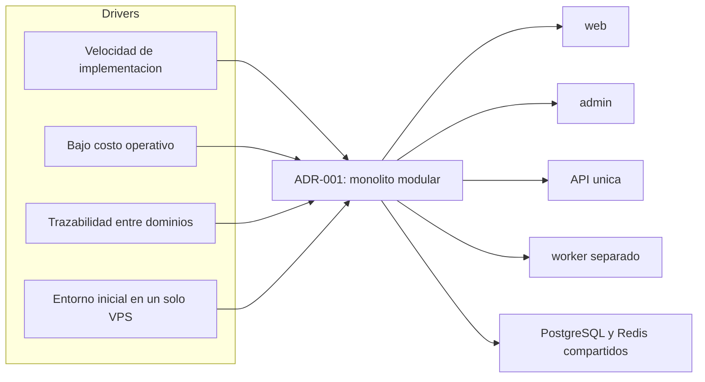

# ADR-001: Monolito Modular como Arquitectura Base

## Estado

Aprobado.

## Contexto

Huelegood necesita una plataforma comercial propia con múltiples capacidades de negocio estrechamente relacionadas:

- ecommerce
- CMS interno
- pagos Openpay y manuales
- sellers con comisiones
- mayoristas
- campañas y CRM básico
- fidelización
- auditoría

El proyecto operará inicialmente en un VPS existente con PostgreSQL, Redis, PM2 y Hestia/Nginx. El equipo necesita velocidad de implementación, trazabilidad y bajo costo operativo.

## Decisión

Se adopta una arquitectura de monolito modular compuesta por:

- dos frontends desacoplados por experiencia: `web` y `admin`
- una API central en NestJS con módulos de dominio
- un worker asíncrono como proceso separado del mismo sistema

No se implementarán microservicios puros en esta etapa.

## Diagrama de la decisión

## Razones

### A favor

- reduce complejidad de despliegue y observabilidad
- simplifica transacciones y consistencia entre pedidos, pagos, comisiones y puntos
- facilita trazabilidad y auditoría en una única base
- acelera entrega de valor para MVP y primeras iteraciones
- encaja con el tamaño operativo del proyecto y el entorno actual

### En contra aceptada

- un fallo severo en la base o el host afecta todo el sistema
- el crecimiento desordenado puede degradar mantenibilidad
- algunos límites de escalado horizontal llegan antes que en una arquitectura distribuida

## Alternativas consideradas

### Microservicios puros

Descartado por:

- sobrecosto operacional
- mayor complejidad de integración y monitoreo
- dificultad innecesaria para un dominio todavía en consolidación

### Plataforma externa de ecommerce/CMS

Descartado por restricción explícita:

- no usar WordPress, Medusa, Strapi ni CMS externo como núcleo

Además:

- compromete flexibilidad del dominio seller-first
- complica ajustar pagos manuales, comisiones y mayoristas al modelo de negocio propio

## Consecuencias

### Positivas

- una sola fuente de verdad
- backlog más ejecutable
- curva operativa razonable
- diseño coherente entre web, admin y API

### Negativas

- se requiere disciplina estricta de modularidad
- el worker no debe convertirse en un backend paralelo sin reglas
- la deuda técnica puede crecer rápido si se ignoran límites de módulo

## Guardrails derivados

- cada módulo es dueño de sus reglas y transiciones
- procesos asíncronos deben operar sobre contratos internos claros
- no introducir atajos que acoplen UI con tablas
- no modelar multi-tenant interno
- reevaluar esta ADR solo si métricas y operación demuestran un cuello de botella real
