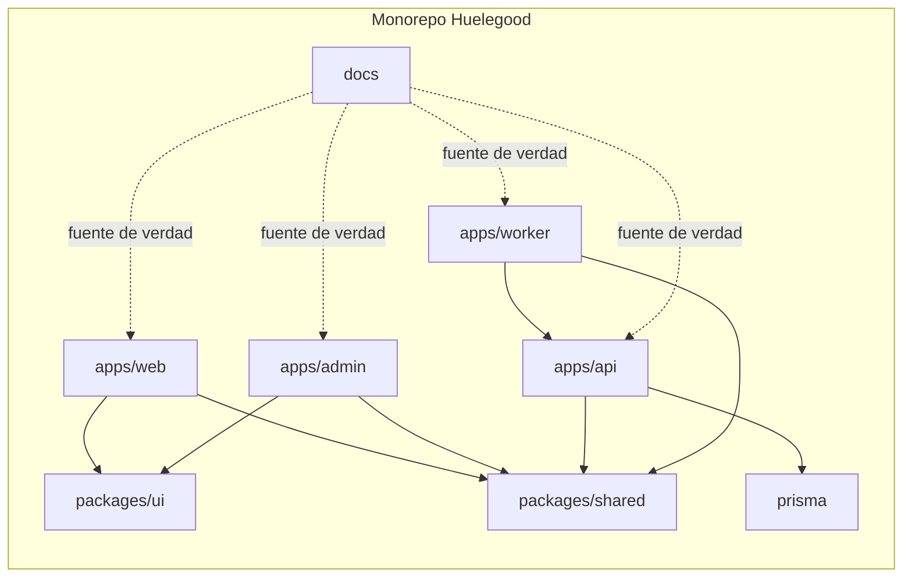
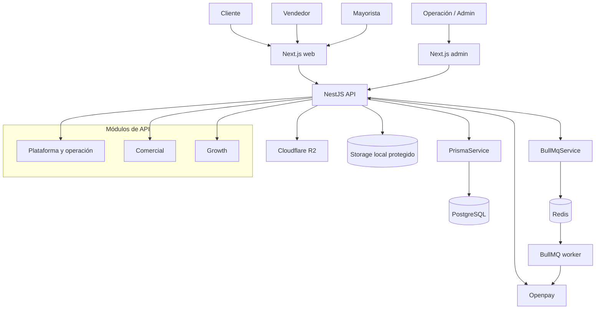
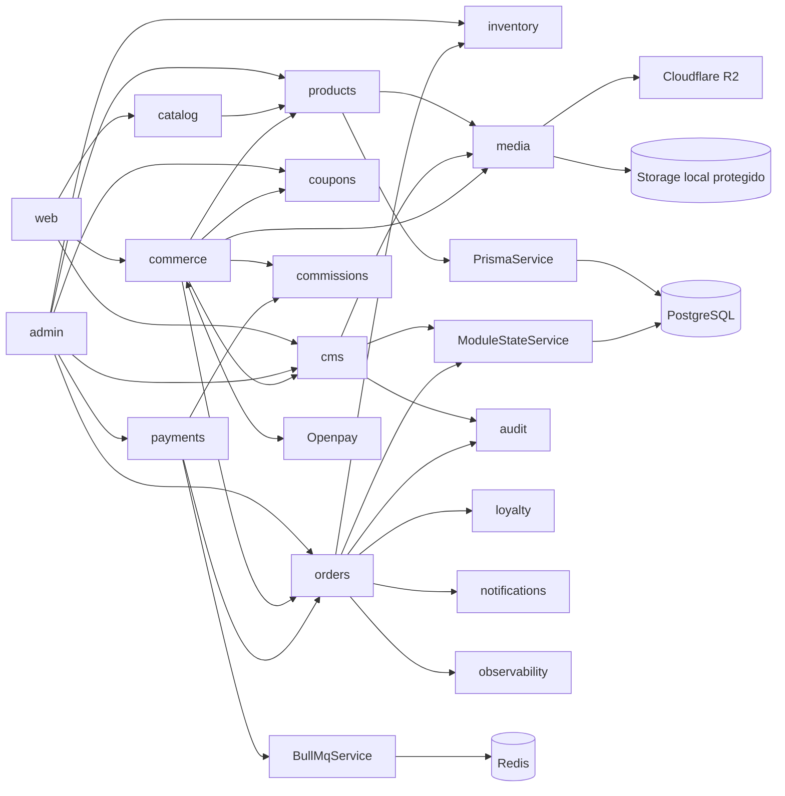
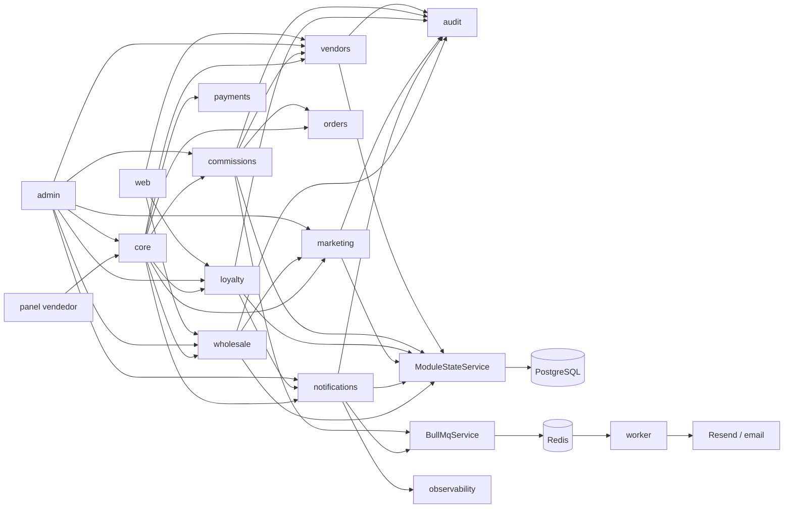
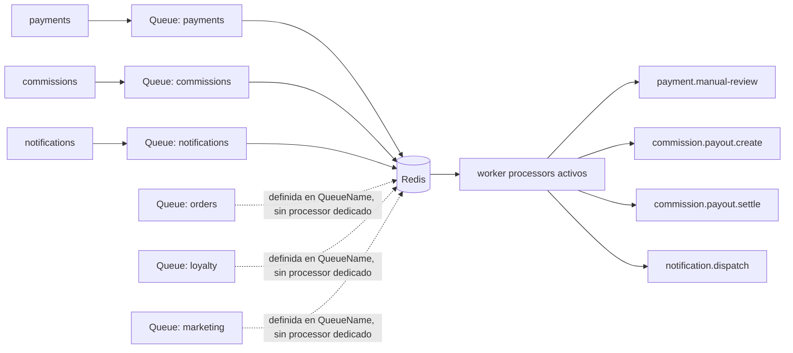
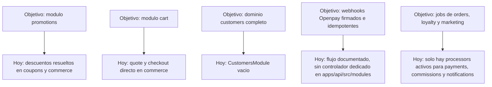

# Diagramas Mermaid de Arquitectura

## Propósito

Documentar en Mermaid la forma actual del monorepo y de los módulos reales de `apps/api/src/modules`, dejando explícitas las brechas pendientes entre la arquitectura objetivo y lo hoy implementado.

## Alcance y convenciones

- Este documento describe la forma actual del código, no una versión idealizada.
- `Prisma -> PostgreSQL` representa persistencia relacional directa.
- `ModuleStateService -> PostgreSQL` representa snapshots operativos persistidos en `module_snapshots`.
- `BullMQ -> Redis -> Worker` representa ejecución asíncrona.
- Las cajas con borde punteado representan capacidades previstas o parciales.

## Monorepo y procesos principales

## Runtime general

## Inventario actual de módulos del API

| Módulo | Capa | Estado | Diagrama principal |
| --- | --- | --- | --- |
| `health` | plataforma | implementado | plataforma y operación |
| `observability` | plataforma | implementado | plataforma y operación |
| `auth` | plataforma | implementado | plataforma y operación |
| `security` | plataforma | implementado | plataforma y operación |
| `audit` | plataforma | implementado | plataforma y operación |
| `customers` | plataforma | esqueleto | plataforma y operación |
| `media` | comercial | implementado | comercial |
| `products` | comercial | implementado | comercial |
| `catalog` | comercial | implementado | comercial |
| `cms` | comercial | implementado | comercial |
| `coupons` | comercial | implementado | comercial |
| `inventory` | comercial | implementado | comercial |
| `orders` | comercial | implementado | comercial |
| `payments` | comercial | implementado | comercial |
| `commerce` | comercial | implementado | comercial |
| `vendors` | growth | implementado | growth |
| `commissions` | growth | implementado | growth |
| `loyalty` | growth | implementado | growth |
| `marketing` | growth | implementado | growth |
| `notifications` | growth | implementado | growth |
| `wholesale` | growth | implementado | growth |
| `core` | growth | implementado | growth |

## Plataforma y operación

```mermaid
flowchart LR
  ops["PM2 / probes / operación"] --> health["health"]
  admin["admin"] --> observability["observability"]
  admin --> security["security"]
  admin --> audit["audit"]
  web["web"] --> auth["auth"]
  admin --> auth
  seller["panel vendedor"] --> auth

  health --> prisma["PrismaService"]
  audit --> prisma
  auth --> prisma
  auth --> session["Redis session store o memoria"]
  auth --> audit
  security --> audit
  observability --> bull["BullMqService"]
  bull --> redis[("Redis")]

  customers["customers"] -. módulo reservado .-> customersFuture["self-service de cliente, perfiles y direcciones"]
  prisma --> pg[("PostgreSQL")]
```

## Comercial

## Growth

## Colas activas y colas faltantes

## Faltantes para cerrar la arquitectura objetivo

## Lectura recomendada junto a este documento

- [modules.md](./modules.md)
- [overview.md](./overview.md)
- [solution-architecture.md](./solution-architecture.md)
- [api-v1-outline.md](../api/api-v1-outline.md)
