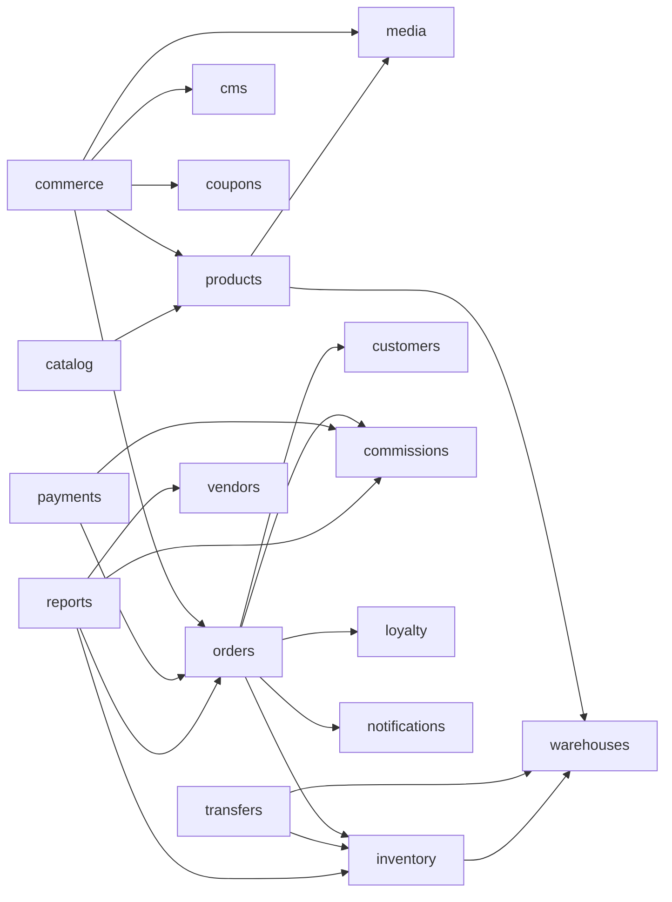

# Mapa De Modulos Vigente

Fecha de corte: 2026-04-22.

Este mapa describe los modulos reales del backend y las superficies que los consumen. Reemplaza mapas conceptuales previos.

## Capas

| Capa | Modulos | Regla |
| --- | --- | --- |
| Plataforma | `auth`, `security`, `audit`, `health`, `observability`, `customers` | Soporte transversal, identidad, salud, trazabilidad y normalizacion de clientes. |
| Comercial | `products`, `catalog`, `cms`, `media`, `coupons`, `commerce`, `orders`, `payments` | Venta, catalogo, checkout, pedidos, pagos y contenido. |
| Operacion | `warehouses`, `inventory`, `transfers`, `dispatch labels`, `core/reports` | Stock, origen logistico, transferencia, despacho y lectura gerencial. |
| Growth | `vendors`, `commissions`, `wholesale`, `loyalty`, `marketing`, `notifications` | Vendedores, comisiones, mayoristas, fidelizacion y comunicaciones. |

## Catalogo De Modulos

| Modulo | Estado | Duenio de | Persistencia | Consumido por |
| --- | --- | --- | --- | --- |
| `auth` | vigente | login, sesion, roles y guards | Prisma + store de sesion | web, admin, API |
| `security` | vigente | postura y controles operativos | lectura audit | admin |
| `audit` | vigente | acciones sensibles | PostgreSQL | todos |
| `health` | vigente | liveness/readiness/operational | PostgreSQL/Redis checks | deploy, monitoreo |
| `observability` | vigente | telemetria HTTP y colas | Redis/BullMQ | admin |
| `customers` | vigente parcial | cliente canonico, dedupe, conflictos | Prisma + snapshots | checkout, CRM, orders |
| `media` | vigente | assets publicos/privados | R2/local storage | CMS, products, checkout |
| `products` | vigente | productos, variantes, imagenes, almacenes default | Prisma | catalog, admin, commerce |
| `catalog` | vigente | read model publico | deriva de products | web |
| `cms` | vigente | settings, branding, contenido | ModuleState/PostgreSQL | web, admin |
| `coupons` | vigente | cupones y descuento actual | ModuleState/PostgreSQL | commerce |
| `commerce` | vigente | quote, checkout, evidencia y ubigeo | orquestador | web |
| `orders` | vigente | pedido, estados, trazabilidad comercial y fulfillment | ModuleState/PostgreSQL | pagos, reportes, despacho |
| `payments` | vigente | revision manual y bandejas de pago | orders + BullMQ | admin, worker |
| `warehouses` | vigente | almacenes, cobertura y prioridad | Prisma | products, inventory, transfers |
| `inventory` | vigente | stock por variante + almacen, reservas y ajustes | Prisma + ModuleState | orders, transfers, reports |
| `transfers` | vigente | movimiento fisico entre almacenes, incidencias y documentos | Prisma | admin, inventory |
| `core/reports` | vigente | reportes agregados | lectura de modulos fuente | admin, gerencia |
| `vendors` | vigente | postulaciones, vendedores y codigos | ModuleState/PostgreSQL | web, admin |
| `commissions` | vigente | reglas, atribucion y payouts | ModuleState/PostgreSQL + BullMQ | vendors, payments |
| `wholesale` | vigente | leads y quotes mayoristas | ModuleState/PostgreSQL | web, admin |
| `loyalty` | vigente | puntos, movimientos y canjes | ModuleState/PostgreSQL | orders |
| `marketing` | vigente | campanas, segmentos y templates | ModuleState/PostgreSQL | notifications |
| `notifications` | vigente | bandeja, logs y dispatch | ModuleState/PostgreSQL + BullMQ | worker |

## Reglas De Propiedad

- `orders` decide el estado comercial del pedido.
- `inventory` decide disponibilidad y mutaciones de stock.
- `transfers` decide el ciclo logistico entre almacenes.
- `payments` no confirma una venta por fuera de `orders`.
- `core/reports` no define reglas; solo lee criterios compartidos desde `packages/shared`.
- `products` define catalogo, no saldos.
- `warehouses` define nodos y cobertura, no ventas.
- `customers` normaliza identidad; no reescribe snapshots historicos de pedido.

## Dependencias Permitidas

## Dependencias No Permitidas

- `web` o `admin` leyendo PostgreSQL directamente.
- `worker` cambiando estados comerciales sin pasar por el modulo duenio.
- `cms` alterando reglas de pedido, pago, comision o inventario.
- `reports` recalculando estados validos con reglas propias.
- `transfers` corrigiendo balances a mano por fuera de `inventory`.
- `products` usando `product_variants.stockOnHand` como unica verdad de stock si existen balances por almacen.

## Brechas Declaradas

| Brecha | Estado |
| --- | --- |
| Migrar todos los snapshots heredados a tablas normalizadas | pendiente gradual |
| Webhooks Openpay productivos con firma e idempotencia completa | pendiente |
| Shipments/paquetes outbound como write-model propio separado de `orders` | pendiente |
| E2E browser automatizado para admin | pendiente |
| Print-ready dedicado para GRE/sticker | pendiente si Operacion lo prioriza |
