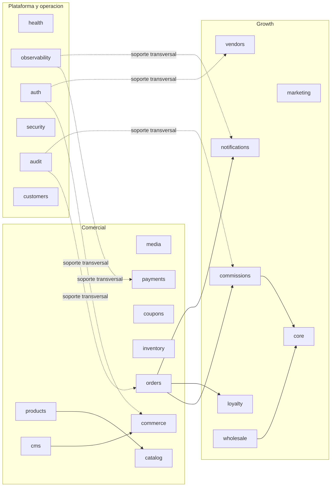

# Módulos del Sistema

## Criterio de modularidad

Huelegood separa capacidades por dominio funcional, pero la forma actual del backend ya no coincide 1:1 con el primer mapa conceptual. Hoy existe un corte real entre módulos funcionales, módulos de soporte operativo y módulos agregadores.

Los diagramas Mermaid alineados al código viven en [module-diagrams.md](./module-diagrams.md).

## Mapa actual de módulos implementados

| Módulo | Capa | Estado | Responsabilidad actual | Persistencia dominante | Integra con |
| --- | --- | --- | --- | --- | --- |
| `health` | plataforma | implementado | liveness, readiness y chequeos operativos | `Prisma -> PostgreSQL` | operación |
| `observability` | plataforma | implementado | telemetría HTTP y resumen de colas | `BullMQ -> Redis` | admin, worker |
| `auth` | plataforma | implementado | login, sesiones, contexto de usuario y `RolesGuard` | `Prisma`, `ModuleState`, store de sesión | auditoría, web, admin, seller |
| `security` | plataforma | implementado | postura de seguridad y resumen operativo | lectura sobre `audit` | admin |
| `audit` | plataforma | implementado | logs de auditoría y acciones administrativas | `Prisma -> PostgreSQL` | todos |
| `customers` | plataforma | implementado parcial | perfiles, direcciones y lectura operativa de historial reciente | `Prisma`, `ModuleState` | auth, pedidos, loyalty |
| `media` | comercial | implementado | uploads públicos y privados, listado reutilizable de assets, URLs y borrado de assets | `Cloudflare R2`, storage local | CMS, productos, checkout |
| `products` | comercial | implementado | CRUD admin de productos, categorías e imágenes | `Prisma -> PostgreSQL` | media, catálogo, checkout |
| `catalog` | comercial | implementado | read model público para storefront | delega en `products` | web |
| `cms` | comercial | implementado | contenido editable, branding, navegación y páginas | `ModuleState -> PostgreSQL` | media, auditoría, marketing |
| `coupons` | comercial | implementado | cupones y resolución de descuentos actual | `ModuleState -> PostgreSQL` | checkout |
| `inventory` | comercial | implementado | reporte y asignaciones operativas de inventario | `Prisma`, `ModuleState` | pedidos, admin |
| `orders` | comercial | implementado | agregado transaccional central y máquina de estados | `ModuleState -> PostgreSQL` | inventory, loyalty, notifications, audit |
| `payments` | comercial | implementado | revisión manual, colas operativas y lectura de pagos | delega en `orders` + `BullMQ` | commissions, worker |
| `commerce` | comercial | implementado | quote, checkout público y upload de evidencia | orquesta otros módulos | products, cms, coupons, orders, commissions, media |
| `vendors` | growth | implementado | postulaciones, vendedores, códigos y onboarding | `ModuleState -> PostgreSQL` | commissions, admin, web |
| `commissions` | growth | implementado | reglas, atribución, payout y conciliación | `ModuleState -> PostgreSQL`, `BullMQ` | vendors, orders, payments, worker |
| `loyalty` | growth | implementado | puntos, movimientos y canjes | `ModuleState -> PostgreSQL` | orders, notifications |
| `marketing` | growth | implementado | campañas, segmentos, templates y eventos | `ModuleState -> PostgreSQL` | wholesale, notifications |
| `notifications` | growth | implementado | bandeja, logs y encolado de dispatch | `ModuleState -> PostgreSQL`, `BullMQ` | orders, loyalty, marketing, worker |
| `wholesale` | growth | implementado | leads, quotes y tiers mayoristas | `ModuleState -> PostgreSQL` | marketing, audit |
| `core` | growth | implementado | dashboards, reportes y seller panel agregados | sin fuente propia | orders, payments, vendors, commissions, wholesale, marketing, notifications, loyalty |

## Capas reales del backend

- Plataforma y operación: `health`, `observability`, `auth`, `security`, `audit`, `customers`
- Comercial: `media`, `products`, `catalog`, `cms`, `coupons`, `inventory`, `orders`, `payments`, `commerce`
- Growth: `vendors`, `commissions`, `loyalty`, `marketing`, `notifications`, `wholesale`, `core`

## Diagrama de capas

## Reglas de interacción entre módulos

### Plataforma y operación

- `auth` centraliza autenticación, contexto y autorización por roles; no deben reaparecer checks ad hoc en controladores.
- `audit` registra acciones sensibles y sirve como dependencia transversal para trazabilidad.
- `observability` mide requests y colas; no debe convertirse en dueño del estado de negocio.
- `security` resume postura y controles, pero no reemplaza a `auth` ni a `audit`.
- `customers` ya expone perfil y direcciones del cliente, y cruza snapshots operativos de pedidos para lectura de historial; aún no cubre self-service completo ni un portal de cliente terminado.

### Comercial

- `products` es la fuente real de catálogo administrable; `catalog` sólo expone la vista pública derivada.
- `cms` debe editar la web sin redeploy para cambios no estructurales y resolver branding mediante `media`, no con assets hardcodeados.
- `media` separa activos públicos del storefront y activos privados operativos; para media pública el destino vigente es `Cloudflare R2`.
- `media` también debe exponer una biblioteca administrable para reutilizar assets ya existentes en R2 desde backoffice, en vez de obligar reuploads.
- `commerce` orquesta quote y checkout, pero no debe absorber la fuente de verdad de pedidos ni pagos.
- `orders` es el agregado transaccional central y conserva snapshots de compra, direcciones, descuentos y atribución comercial.
- `payments` administra revisión manual y asynchrony operativa, pero las transiciones finales deben respetar la máquina de estados de `orders`.
- `inventory` ajusta disponibilidad y allocations operativas; no debe saltarse la lógica de `orders`.

### Growth

- `vendors` modela la relación comercial seller-first; un vendedor no controla catálogo, stock ni pricing base.
- `commissions` monetiza la atribución una vez que la venta califica; payout y conciliación deben seguir reglas explícitas.
- `loyalty` asigna o revierte puntos según elegibilidad del pedido.
- `marketing` opera sobre campañas y segmentos tácticos; no sustituye un CRM enterprise.
- `notifications` entrega y traza comunicaciones, pero depende de eventos emitidos por módulos dueños.
- `wholesale` sigue siendo un funnel comercial de lead a quote, no un portal B2B autoservicio.
- `core` agrega vistas y reportes; no debe convertirse en un módulo donde se reescriba lógica de dominio.

## Capacidades objetivo aún no separadas como módulo

| Capacidad objetivo | Estado actual en código | Brecha a cerrar |
| --- | --- | --- |
| `promotions` | descuentos resueltos por `coupons` y `commerce` | falta un módulo autónomo para vigencias, audiencias, stacking y reglas promocionales más ricas |
| `cart` | quote y checkout directo en `commerce` | falta sesión persistente de carrito, aplicación incremental de códigos y lifecycle propio |
| `customers` completo | existe `CustomersModule` con CRUD admin parcial y lectura operativa | falta self-service real, sesiones de cliente y experiencia pública completa |
| webhooks Openpay | el flujo está documentado, pero no hay módulo/controlador dedicado | falta firma, idempotencia y trazabilidad explícita de webhooks |
| jobs `orders`, `loyalty`, `marketing` | las colas existen en `QueueName`, pero el worker sólo procesa `payments`, `commissions` y `notifications` | faltan producers y processors dedicados |

## Dependencias permitidas

- `catalog` depende de `products` para storefront público.
- `cms` y `products` dependen de `media` para resolver activos persistidos.
- `commerce` depende de `products`, `cms`, `coupons`, `orders`, `commissions` y `media` para construir y despachar un checkout.
- `orders` depende de `inventory`, `loyalty`, `notifications`, `audit` y `observability`.
- `payments` depende de `orders`, `commissions` y `BullMQ`.
- `commissions` depende de `orders`, `vendors`, `audit`, `ModuleState` y `BullMQ`.
- `wholesale` depende de `marketing` y `audit`.
- `core` depende de otros módulos para agregación, nunca al revés.

## Dependencias no deseadas

- `web` o `admin` leyendo tablas o snapshots sin pasar por la API.
- `cms` modificando reglas transaccionales de pedidos, pagos o comisiones.
- `commerce` convirtiéndose en fuente de verdad del pedido.
- `worker` escribiendo estados arbitrarios sin pasar por el módulo dueño.
- `core` alojando lógica de dominio que debería vivir en módulos fuente.
- branding público hardcodeado en frontend cuando el backoffice lo declara administrable.
