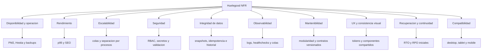

# Requerimientos No Funcionales

## Objetivo

Definir los requisitos no funcionales mínimos para que Huelegood sea operable, seguro y mantenible desde el inicio.

## Diagrama de atributos no funcionales

## Disponibilidad y operación

- El sistema debe poder desplegarse y recuperarse íntegramente dentro del VPS actual usando PM2 y Hestia/Nginx.
- La caída de `web` o `admin` no debe corromper datos transaccionales.
- El worker debe tolerar reinicios sin perder consistencia de jobs críticos.
- Debe existir backup periódico de PostgreSQL y de activos subidos.

## Rendimiento

### Web pública

- Tiempo objetivo de primera carga percibida en páginas de catálogo: `<= 2.5s` en condiciones móviles razonables.
- Páginas editoriales y de catálogo deben poder cachearse selectivamente.
- El render público debe priorizar SEO y velocidad de navegación.

### API

- Lecturas típicas de catálogo, carrito y listados admin: p95 `<= 300ms` sin contar latencia de red externa.
- Escrituras transaccionales internas: p95 `<= 700ms`, excluyendo confirmaciones de proveedores externos.
- Procesos dependientes de Openpay no deben bloquear indefinidamente la experiencia del usuario; se operan con timeout y reconciliación.

## Escalabilidad

- La arquitectura debe escalar primero por verticalización del VPS y separación de carga entre procesos.
- Las tareas diferidas deben salir del request-response cuando no afectan confirmación inmediata.
- El diseño de datos debe soportar crecimiento moderado sin rediseño temprano: índices, snapshots y auditoría acotada.

## Seguridad

- Autenticación segura para admin, vendedores y clientes.
- Autorización por permisos granulares para roles internos.
- Variables sensibles solo por entorno, nunca hardcodeadas.
- Validación estricta de archivos subidos en pagos manuales.
- Verificación de firma o mecanismo equivalente en webhooks de Openpay.
- Auditoría obligatoria para cambios sensibles: pagos, comisiones, promociones, CMS crítico, permisos.

## Integridad de datos

- Un pedido debe conservar snapshot de precios, descuentos, direcciones, código de vendedor y reglas aplicadas.
- No se deben calcular comisiones ni puntos sobre montos ambiguos o pedidos no elegibles.
- Los jobs asíncronos deben ser idempotentes.
- Las transiciones de estado deben registrarse en historial.

## Observabilidad

- Logs estructurados por servicio.
- Healthcheck para API y visibilidad básica del estado de colas.
- Trazabilidad de errores por proceso PM2.
- Correlación por `request_id` o `trace_id` en operaciones críticas recomendada desde la primera iteración.

## Mantenibilidad

- Límite modular claro en backend.
- Contratos de API versionados bajo `/api/v1`.
- Documentación y backlog deben ser la base de tickets y revisiones de arquitectura.
- No introducir dependencias pesadas si el valor no compensa la complejidad operacional.

## UX y consistencia visual

- La interfaz pública y el admin deben compartir tokens de diseño, semántica visual y componentes base.
- `shadcn/ui` debe usarse como base de primitivas reutilizables.
- `Tailwind CSS` debe concentrar el estilo de aplicación mediante tokens, no mediante utilidades arbitrarias dispersas.
- La experiencia debe proyectar una marca moderna, limpia, premium y consistente.

## Recuperación y continuidad

- Objetivo operativo inicial de recuperación: `RTO <= 4h`.
- Objetivo de pérdida de datos tolerable inicial: `RPO <= 24h` con backups nocturnos.
- Redis puede tratarse como almacenamiento efímero; PostgreSQL es la fuente de verdad.

## Compatibilidad

- El sistema debe operar correctamente en navegadores modernos de desktop y mobile.
- El admin debe ser usable en laptop y tablet, aunque optimizado para desktop.
- El storefront debe ser mobile-first en conversión.
