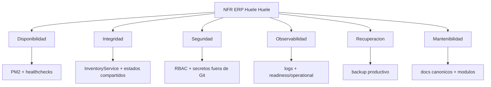

# Requerimientos No Funcionales Vigentes

Fecha de corte: 2026-04-22.

## Objetivos

- Operar en un VPS con PM2, Hestia y Nginx.
- Mantener integridad de pedidos, pagos, stock y transferencias.
- Evitar fuga de secretos, dumps, outputs y evidencias privadas.
- Asegurar recuperacion por backups productivos.
- Mantener documentacion canonica sin handoffs compitiendo.

## Matriz

| Atributo | Requerimiento | Evidencia/Control |
| --- | --- | --- |
| Disponibilidad | web/admin/api/worker supervisados por PM2 | `pm2 status`, healthchecks |
| Integridad | stock solo por `InventoryService` | tests ERP, invariantes de dominio |
| Seguridad | RBAC, guards y secretos por entorno | `auth`, `adminAccessRoles`, `.env` fuera de Git |
| Observabilidad | logs y healthchecks por servicio | `/health`, observability admin |
| Recuperacion | backups PostgreSQL/uploads | `scripts/backup-production.sh` |
| Performance | respuestas admin/store acotadas y paginables | filtros server-side |
| Mantenibilidad | modulos con duenos claros | [modules.md](./modules.md) |
| Despliegue | releases por timestamp y smoke checks | [deployment-strategy.md](../infra/deployment-strategy.md) |

## Diagrama

