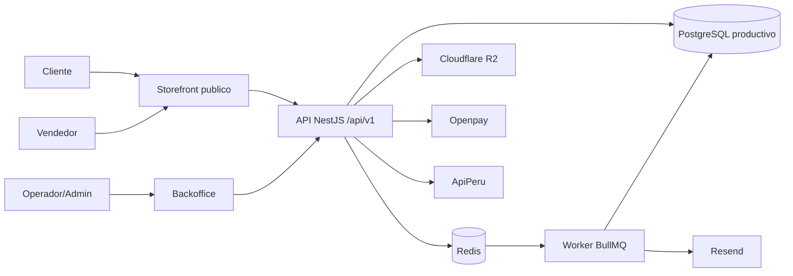
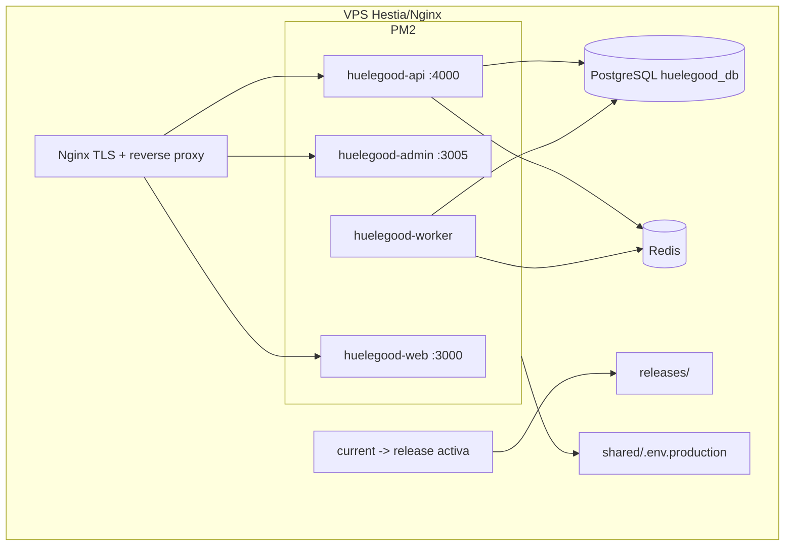
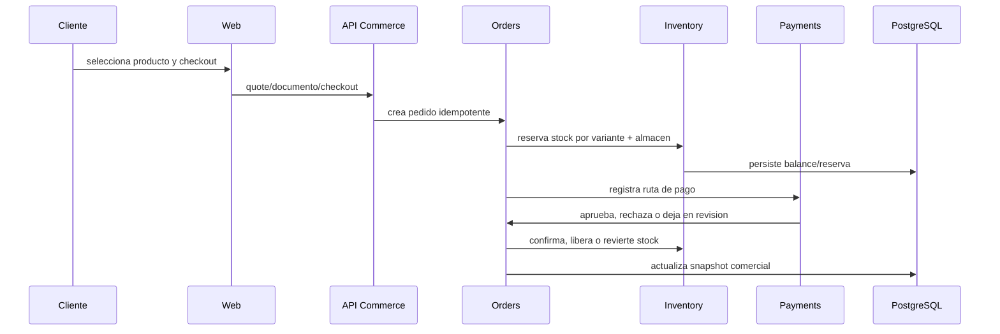
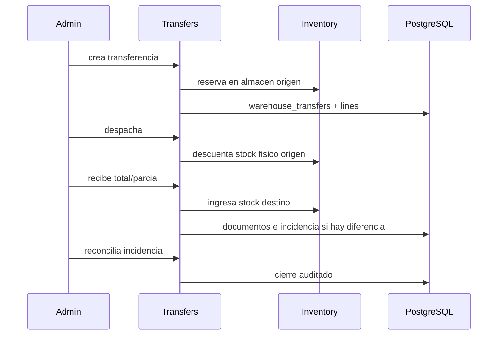
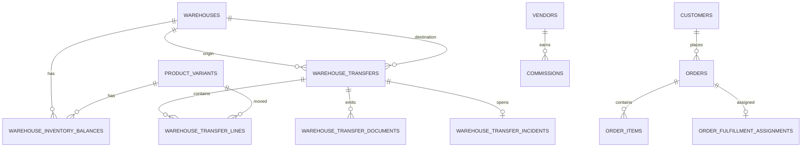

# Arquitectura General Vigente

Fecha de corte: 2026-04-22.

Este documento describe la arquitectura real del ERP Huele Huele despues de la homologacion local-produccion. Reemplaza el enfoque anterior de "arquitectura objetivo" por una fotografia operativa: lo que existe, como se despliega y que modulo es responsable de cada decision.

## Resumen

Huele Huele opera como un monolito modular distribuido en cuatro procesos:

- `huelegood-web`: experiencia publica.
- `huelegood-admin`: backoffice operativo.
- `huelegood-api`: API transaccional y reglas de negocio.
- `huelegood-worker`: jobs asincronos.

La separacion es por proceso de ejecucion, no por microservicio. Los modulos de dominio viven en la API y comparten PostgreSQL como fuente de verdad. Redis solo coordina colas y trabajos temporales.

## Vista De Contexto

## Contenedores

## Principios Vigentes

- LOCAL es la fuente de verdad del codigo.
- Produccion debe homologarse contra LOCAL sin reemplazar la BD productiva.
- PostgreSQL productivo nunca se sustituye por dumps locales.
- `orders` es el agregado comercial central.
- `inventory` es el unico modulo que muta stock operativo.
- `transfers` mueve stock fisico entre almacenes y no debe resolverse con edicion manual de saldos.
- `payments` orquesta revision manual, pero las transiciones comerciales finales pasan por `orders`.
- `core/reports` agrega lectura; no debe duplicar reglas de negocio.
- Los handoffs fechados son historicos, no fuente de verdad vigente.

## Flujo Comercial Principal

## Flujo Logistico Principal

## Datos Y Persistencia

Persistencia actual:

- Prisma/PostgreSQL: productos, variantes, almacenes, balances, transferencias, usuarios, media, auditoria, customer normalization y tablas operativas nuevas.
- `module_snapshots`: runtime heredado para algunos modulos comerciales que aun no terminaron migracion completa a tablas normalizadas.
- Redis/BullMQ: colas, no fuente de verdad.
- R2/storage local: archivos publicos y privados.

## Superficies De Riesgo

- La historia de Git local y `origin/main` estuvo divergida; la homologacion debe registrar el snapshot local actual en una rama/commit trazable.
- No versionar `outputs/`, dumps, `.env`, backups ni evidencia privada.
- Cualquier cambio de schema requiere backup productivo y `HUELEGOOD_RUN_DB_PUSH=1` solo durante ventana controlada.
- Las validaciones browser de admin siguen siendo el cierre operativo que complementa typecheck/build/tests.

## Lecturas Relacionadas

- [Diagramas del sistema](./system-diagrams.md)
- [Mapa de modulos](./modules.md)
- [Modelo de dominio](../data/domain-model.md)
- [API v1](../api/api-v1-outline.md)
- [Despliegue](../infra/deployment-strategy.md)
