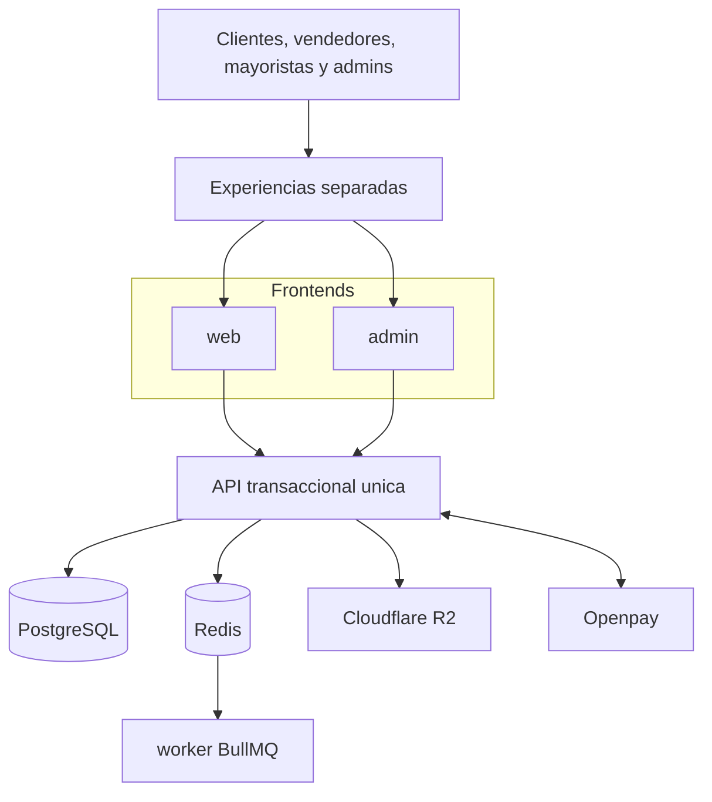

# Arquitectura Objetivo

## Propósito

Definir la forma objetivo del sistema Huelegood para que la implementación arranque sobre una base coherente, modular y operable en el VPS actual.

## Resumen ejecutivo

Huelegood se implementará como un monolito modular distribuido en cuatro procesos principales:

- `huelegood-web`: storefront público en Next.js
- `huelegood-admin`: backoffice en Next.js
- `huelegood-api`: API transaccional en NestJS
- `huelegood-worker`: worker asíncrono con BullMQ

Todos estos procesos comparten una misma plataforma de datos y operación:

- PostgreSQL existente en el VPS como base persistente principal
- Redis para colas, locks livianos y tareas asíncronas
- Prisma ORM como capa de acceso a datos
- Cloudflare R2 como storage objetivo de media pública del storefront
- PM2 como supervisor de procesos
- Hestia/Nginx como reverse proxy y terminación HTTP(S)

## Diagrama objetivo de alto nivel



## Contexto de negocio

Huelegood necesita vender, operar y escalar una marca comercial con foco en:

- venta directa al consumidor
- captación y conversión vía vendedores con código
- administración de pagos automáticos y manuales
- soporte a mayoristas y distribuidores
- campañas y CRM básico
- retención mediante puntos
- operación editorial y comercial sin depender de CMS externos

El sistema debe reflejar una operación `seller-first`, pero sin convertirse en un marketplace multi-tenant. El vendedor es un canal de adquisición y comisión, no un dueño de catálogo o inventario aislado.

## Decisiones arquitectónicas base

### 1. Monolito modular

Se adopta un monolito modular por:

- menor complejidad operativa en un único VPS
- mayor velocidad de implementación inicial
- trazabilidad más simple entre pedidos, pagos, comisiones y puntos
- menor costo de coordinación entre equipos y despliegues
- posibilidad de extraer capacidades a futuro si el volumen lo exige

### 2. Separación por experiencias, no por dominio físico

La solución tendrá dos frontends independientes:

- `web`: experiencia comercial pública
- `admin`: experiencia operativa y administrativa

Ambos consumirán la misma API y compartirán lenguaje visual, tokens y componentes base, aunque no necesariamente layout.

### 3. Backend transaccional único

NestJS concentra las reglas de negocio, validaciones, autorización, orquestación de pagos, campañas, comisiones y auditoría. El worker ejecuta procesos diferidos, pero no constituye un microservicio autónomo; es una extensión operacional del mismo backend.

### 4. Datos centralizados

La base PostgreSQL existente en el VPS será el origen de verdad. Redis se usa solo para procesamiento transitorio, colas y coordinación liviana.

## Vista lógica de alto nivel

La vista objetivo queda resumida en el diagrama anterior: frontends desacoplados por experiencia, una API única como dueña de las reglas sensibles, datos centralizados en PostgreSQL y procesamiento diferido a través de Redis y worker.

## Módulos funcionales mínimos

- Auth
- CMS interno
- Catálogo
- Media
- Promociones
- Carrito
- Pedidos
- Pagos
- Clientes
- Vendedores
- Comisiones
- Mayoristas
- Fidelización
- Marketing
- Notificaciones
- Auditoría

## Estructura lógica recomendada para implementación

La documentación no impone una herramienta específica de monorepo, pero sí una organización lógica recomendada:

```text
apps/
  web/
  admin/
  api/
  worker/
packages/
  ui/
  shared/
docs/
```

Notas:

- `packages/ui` es recomendable para concentrar componentes reutilizables basados en `shadcn/ui`.
- `packages/shared` debe mantenerse pequeño y estable: tipos, constantes, eventos y utilidades comunes.
- Si el equipo decide iniciar sin `packages/`, la consistencia visual y contractual igual debe mantenerse.

## Principios de implementación

- Un solo dominio comercial y una sola instancia lógica de negocio.
- Módulos con límites claros y contratos internos explícitos.
- Eventos internos para procesos asíncronos, no acoplamiento entre pantallas.
- Reglas sensibles centralizadas en API: pagos, comisiones, puntos, permisos, auditoría.
- Backoffice diseñado para operación real, no solo para configuración.
- Catálogo y media pública no deben depender de mocks compartidos si el backoffice declara que son administrables.

## Estado esperado tras esta documentación

Con esta base, el siguiente paso natural es construir el esqueleto técnico inicial del sistema y convertir el backlog MVP en tickets de implementación.
