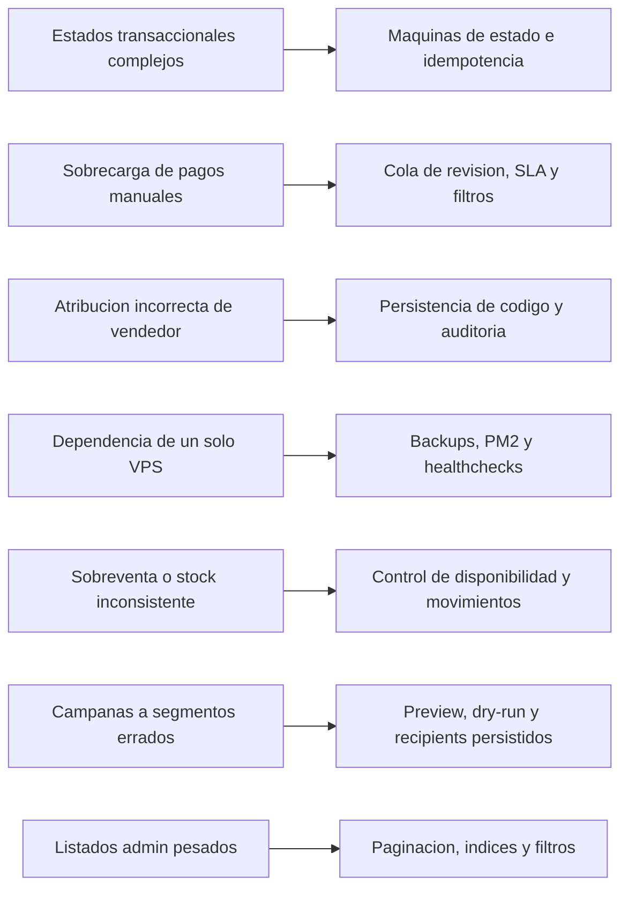

# Riesgos y Mitigaciones

## Objetivo

Identificar riesgos técnicos y operativos previsibles en Huelegood y dejar definidas medidas de mitigación antes de implementar.

## Diagrama de riesgos prioritarios

## Riesgos principales

| Riesgo | Impacto | Probabilidad | Mitigación propuesta |
| --- | --- | --- | --- |
| Complejidad de estados entre pedidos, pagos, comisiones y puntos | Alta | Alta | Definir máquinas de estado explícitas, historiales y eventos internos idempotentes |
| Sobrecarga operativa por pagos manuales | Alta | Media | Cola de revisión, UI de revisión con filtros y SLA, reglas de expiración y plantillas de respuesta |
| Atribución incorrecta de vendedor | Alta | Media | Persistir código aplicado en carrito y pedido, normalizar compatibilidad con cupones, auditar sobrescrituras |
| Comisiones sobre ventas canceladas o fraudulentas | Alta | Media | Crear etapas `attributed`, `approved`, `payable`, `paid`; no pagar comisiones antes de elegibilidad |
| Dependencia de un solo VPS | Alta | Media | Backups, monitoreo, PM2, healthchecks y plan claro de recuperación |
| Acoplamiento excesivo entre módulos | Media | Alta | Mantener límites por módulo, servicios dueños de reglas y eventos internos en vez de llamadas cruzadas arbitrarias |
| Sobreventa o stock inconsistente | Alta | Media | Controlar disponibilidad en variante, registrar `inventory_movements`, confirmar stock al crear pedido |
| Webhooks duplicados o tardíos de Openpay | Alta | Alta | Webhooks idempotentes, registro de transacciones, reconciliación programada |
| CMS interno creciendo sin gobernanza | Media | Media | Limitar bloques iniciales, versionar publicaciones y auditar cambios |
| Envío de campañas a segmentos incorrectos | Alta | Media | Segmentos versionados, preview de audiencia, corrida dry-run y `campaign_recipients` persistidos |
| Uso de UI inconsistente entre web y admin | Media | Alta | Design system con tokens compartidos, componentes base y revisión UI previa a merge |
| Deterioro del rendimiento por listados administrativos pesados | Media | Media | Paginación server-side, índices y filtros bien definidos desde el modelo de datos |

## Riesgos por dominio

### Pagos

- falso positivo en conciliación de pago manual
- desincronización entre estado Openpay y estado local
- carga de comprobantes inválidos o ilegibles

Mitigaciones:

- doble registro `payments` + `payment_transactions`
- validación de evidencia, tamaño, formato y trazabilidad del revisor
- endpoint de webhook separado y reconciliación programada

### Vendedores y comisiones

- reutilización no autorizada de códigos
- autoatribución indebida de pedidos
- reglas de comisión difíciles de entender por operaciones

Mitigaciones:

- una sola atribución activa por pedido
- historial de cambios de estado del vendedor
- reglas de comisión jerárquicas y auditablemente resueltas

### Fidelización

- asignación de puntos antes de tiempo
- doble abono por reintentos de jobs
- falta de reversa en cancelaciones

Mitigaciones:

- puntos disponibles solo cuando el pedido llegue a estado elegible
- jobs idempotentes con claves de negocio
- reversa obligatoria ante estados terminales negativos

### Marketing

- campañas enviadas a usuarios opt-out
- plantillas con datos erróneos o links rotos
- saturación de notificaciones

Mitigaciones:

- verificación de consentimiento y filtros previos a corrida
- `campaign_runs` y `campaign_recipients` persistidos
- rate limiting operativo desde worker

## Riesgos de implementación

| Riesgo | Mitigación |
| --- | --- |
| Empezar por pantallas sin cerrar modelo de datos | Implementar primero cimientos de dominio, API y estados |
| Copiar patrones de ecommerce genérico que no encajan con seller-first | Mantener reglas específicas para código de vendedor, comisiones y mayoristas desde el diseño |
| Introducir demasiadas dependencias UI | Basar la capa visual en `shadcn/ui` + `Tailwind CSS` y extender internamente |
| Sobreingeniería de infraestructura | Mantener operación en monolito modular y un solo VPS hasta que métricas exijan más |

## Señales tempranas a monitorear

- incremento de pedidos en `payment_under_review`
- discrepancias entre total pagado y total conciliado
- porcentaje alto de comisiones revertidas
- colas de notificaciones o campañas creciendo sin procesarse
- pantallas admin con tiempos de respuesta crecientes por encima del objetivo
