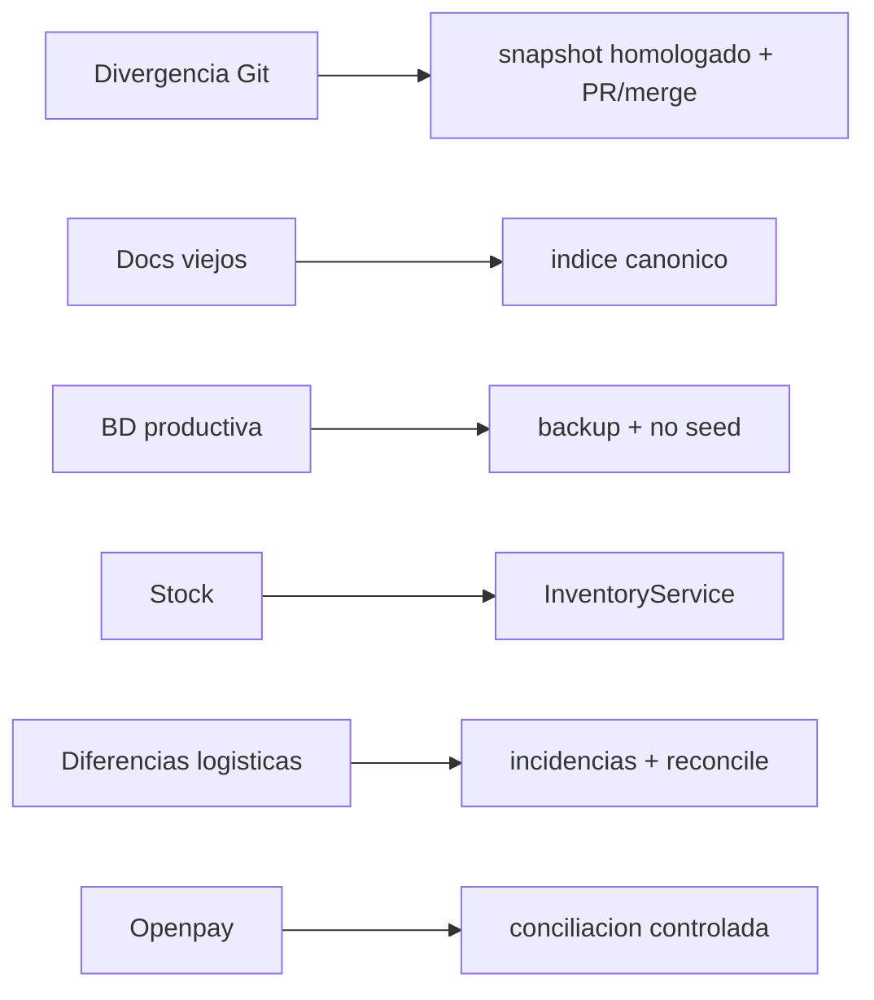

# Riesgos Y Mitigaciones Vigentes

Fecha de corte: 2026-04-22.

## Riesgos Prioritarios

| Riesgo | Impacto | Mitigacion |
| --- | --- | --- |
| Git local/remoto divergido | Alto | registrar snapshot homologado en rama/commit trazable; evitar force push sin decision explicita |
| Confusion por documentacion historica | Alto | `docs/README.md` define documentos vigentes; handoffs quedan como historicos |
| Reemplazo accidental de BD productiva | Critico | homologar solo codigo; backup antes de schema; no usar seed ni dumps locales en produccion |
| Stock inconsistente | Alto | todas las mutaciones pasan por `InventoryService`; pruebas ERP cubren pedidos y transferencias |
| Transferencias con diferencias fisicas | Alto | incidencias persistidas y reconciliacion formal |
| Openpay sin webhook productivo final | Medio | conciliacion manual controlada desde admin hasta abrir corte especifico |
| Snapshots heredados vs Prisma | Medio | migracion gradual, no duplicar reglas en reportes o UI |
| Falta de E2E browser admin | Medio | validacion manual obligatoria y pendiente de automatizar |

## Diagrama De Riesgo

## Senales A Monitorear

- pedidos en `payment_under_review` por encima de la capacidad diaria de revision;
- balances negativos por almacen;
- transferencias en `partial_received` sin reconciliar;
- colas BullMQ con crecimiento sostenido;
- errores API en checkout, pagos o inventario;
- diferencias entre release productiva y commit publicado.
