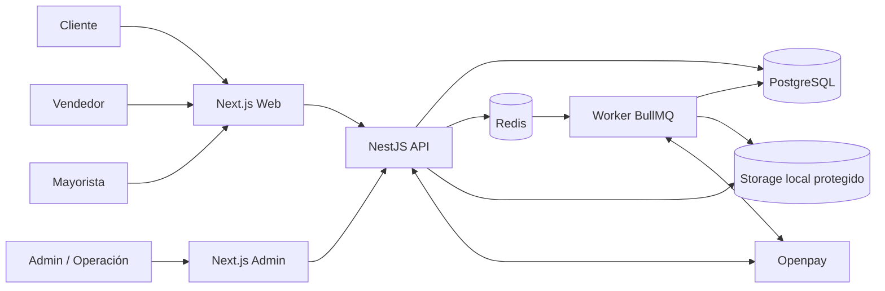

# Arquitectura de Solución

## Objetivo

Describir cómo se compone la solución Huelegood en runtime, cómo se distribuyen responsabilidades y cómo fluyen las operaciones críticas entre aplicaciones, API, base de datos, servicios externos y worker.

## Componentes principales

| Componente | Tecnología | Responsabilidad principal |
| --- | --- | --- |
| Web pública | Next.js | Catálogo, contenido CMS, carrito, checkout, cuenta cliente, captura de código de vendedor, captura de leads mayoristas |
| Admin | Next.js | Operación diaria, revisión de pagos manuales, gestión de catálogo, CMS, campañas, vendedores, comisiones, dashboards |
| API | NestJS | Regla de negocio, autenticación, autorización, contratos HTTP, orquestación transaccional, auditoría |
| Worker | Node.js + BullMQ | Procesos asíncronos, reintentos, notificaciones, reconciliaciones, campañas, postprocesamiento |
| Base de datos | PostgreSQL | Persistencia transaccional y reporting operacional |
| Cola | Redis + BullMQ | Jobs, reintentos, programación diferida, desacople temporal |
| Pasarela de pagos | Openpay | Cobro online y confirmaciones de pago |
| Reverse proxy | Hestia + Nginx | Enrutamiento por dominio, TLS, headers, compresión, logs HTTP |
| Supervisor | PM2 | Arranque, reinicio, logs y supervivencia de procesos |

## Diagrama de runtime

## Distribución de responsabilidades

### Web pública

- presentar propuesta de valor, catálogo y contenido editable
- manejar búsqueda, promociones visibles y CTA comerciales
- permitir carrito, checkout, login de cliente y recuperación de cuenta
- aceptar código de vendedor y conservar atribución comercial
- capturar leads de mayoristas y aplicaciones de vendedor
- exponer panel básico de vendedor si se prioriza en la fase correspondiente

### Admin

- operar catálogo, stock lógico y promociones
- revisar pagos manuales con evidencia
- administrar pedidos y seguimiento
- gestionar vendedores, reglas de comisión y liquidaciones
- crear páginas, banners, FAQs y bloques de contenido
- segmentar campañas y ejecutar comunicaciones
- revisar auditoría y acciones administrativas

### API

- única dueña de la lógica transaccional
- validación de permisos por rol
- aplicación de reglas comerciales
- persistencia y consistencia
- emisión de eventos internos
- exposición de endpoints públicos, privados, administrativos y webhooks

### Worker

- confirmación diferida de eventos Openpay
- revisión automatizable de estados temporales
- envío de notificaciones
- recálculo de puntos y comisiones
- ejecución de campañas
- tareas programadas de limpieza y expiración

## Mapa de integraciones

### Integraciones obligatorias

- `Openpay`: cobro online, recepción de eventos, conciliación y validación de estado
- `Redis/BullMQ`: colas internas
- `PostgreSQL`: persistencia principal

### Integraciones internas necesarias

- almacenamiento local de archivos en VPS para evidencias de pago, imágenes y activos de CMS
- correo transaccional a través del mecanismo disponible en el VPS o proveedor que se incorpore luego

Nota:

El correo y otros canales de notificación se modelan desde ahora, pero el proveedor específico puede definirse en implementación sin alterar el dominio.

## Fronteras del monolito modular

Cada módulo del backend debe tener:

- controlador o entrypoint HTTP
- servicio de aplicación
- servicios de dominio
- acceso a datos vía Prisma
- eventos internos emitidos después de commit
- políticas de autorización explícitas

No debe existir acceso directo a tablas de otro módulo desde pantallas front sin pasar por la API.

## Patrones operativos recomendados

### Escrituras transaccionales

- toda mutación crítica se ejecuta en la API
- si la mutación dispara trabajo asíncrono, el job se encola después de persistir el estado
- los jobs deben ser idempotentes y tolerantes a reintentos

### Lecturas

- storefront prioriza lecturas optimizadas para SEO, catálogo y conversión
- admin prioriza listados filtrables, paginados y auditables
- reporting pesado queda fuera del MVP; se usan vistas y consultas operativas acotadas

### Archivos

- activos públicos: imágenes de producto, banners y testimoniales
- activos privados: comprobantes de pago, evidencia operativa
- los activos privados no deben quedar accesibles por URL pública directa

## Diseño de colas y workers

Colas iniciales recomendadas:

| Cola | Uso |
| --- | --- |
| `payments` | webhooks Openpay, expiraciones, reconciliación |
| `orders` | post-pago, notificaciones de pedido, snapshots |
| `commissions` | atribución, recálculo, cierres y payout items |
| `loyalty` | asignación y reversa de puntos |
| `marketing` | ejecución de campañas y segmentación diferida |
| `notifications` | email y notificaciones internas |

## Seguridad de arquitectura

- autenticación centralizada
- autorización RBAC por rol y permiso
- logs de auditoría en operaciones sensibles
- endpoints de admin y webhook separados por guards y firmas
- secretos solo por variables de entorno
- paneles de admin fuera del dominio público principal

## Escalabilidad esperada

La solución está diseñada para crecer primero por separación de procesos y optimización vertical:

- escalar CPU/RAM del VPS
- separar worker del API dentro del mismo host si hace falta
- ajustar concurrencia de PM2
- optimizar queries e índices
- introducir caché selectiva

Antes de pensar en microservicios, deben agotarse estas medidas.
