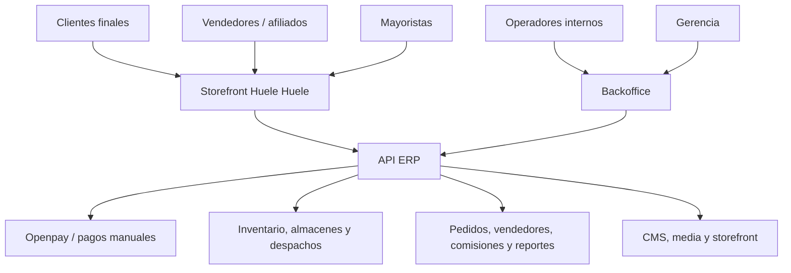
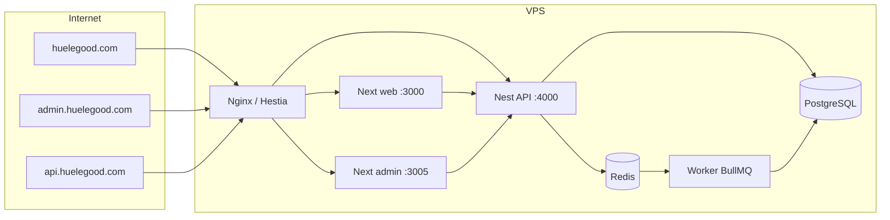
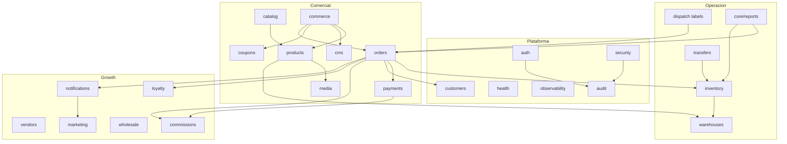
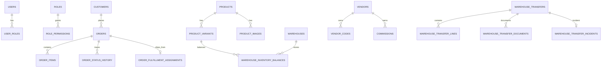
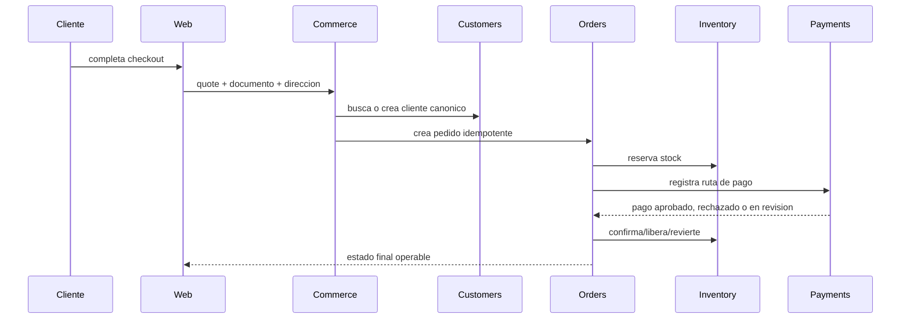
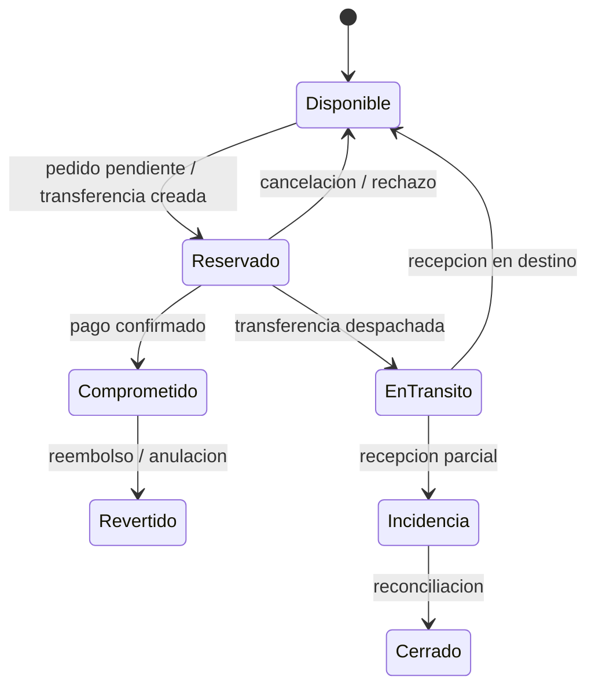
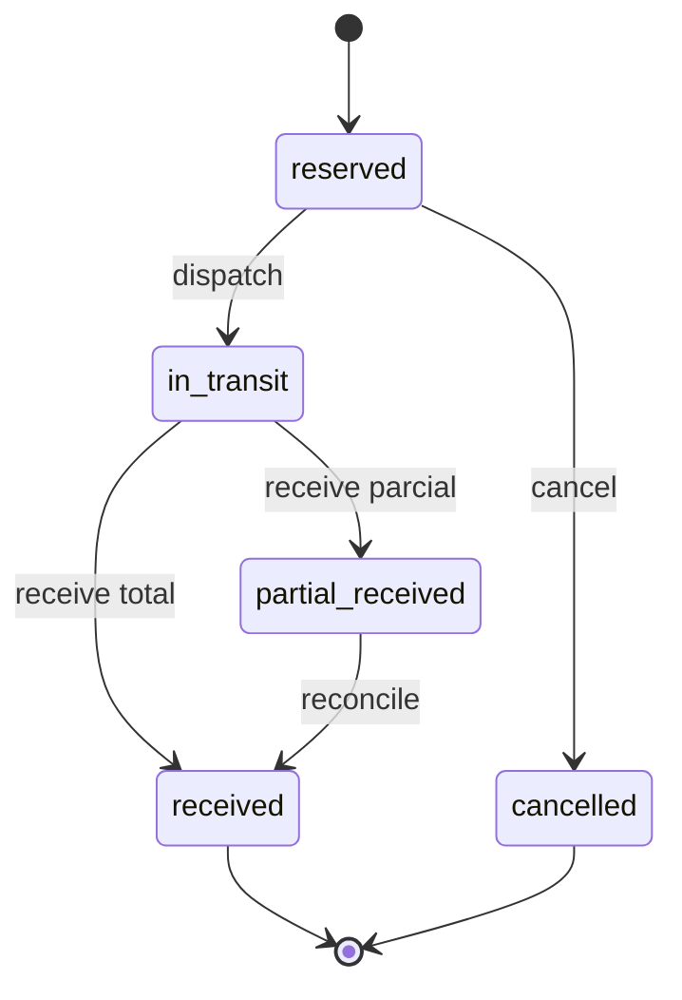
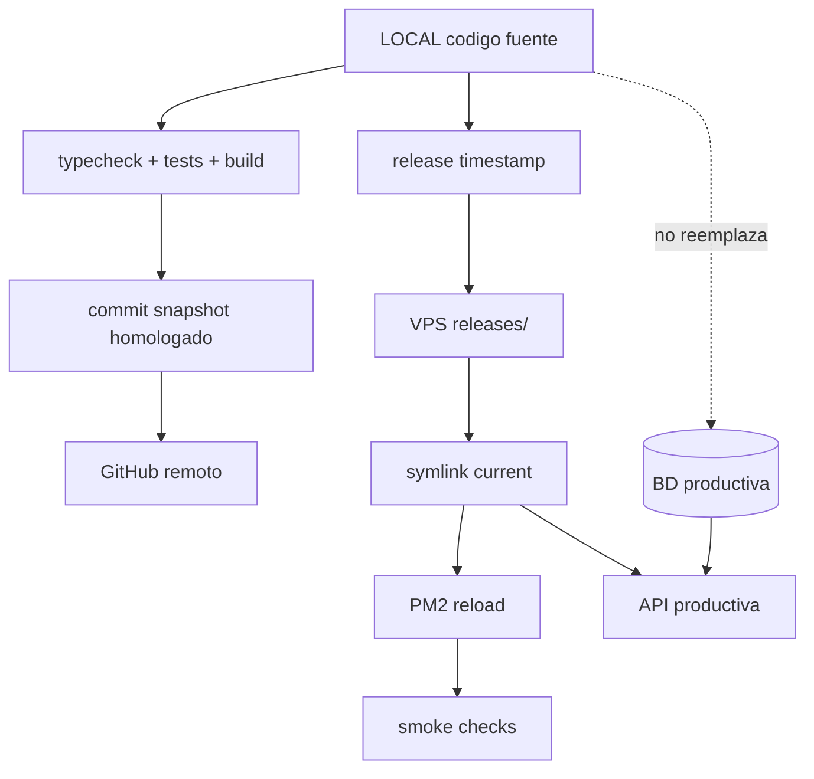

# Diagramas Del Sistema

Fecha de corte: 2026-04-22.

Estos diagramas son la referencia visual vigente. Si otro documento contiene diagramas anteriores y contradice esta pagina, prevalece esta pagina.

## 1. Contexto Comercial

## 2. Contenedores Tecnicos

## 3. Modulos Backend

## 4. Datos Principales

## 5. Checkout Y Pago

## 6. Inventario Por Almacen

## 7. Transferencias

## 8. Release Y Homologacion

