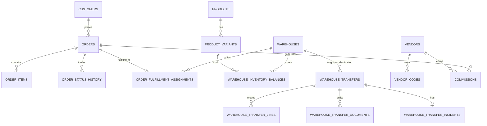

# Modelo De Dominio Vigente

Fecha de corte: 2026-04-22.

Este documento resume los agregados actuales y sus invariantes. El detalle fisico vive en `prisma/schema.prisma`; si hay diferencia, el schema y este documento deben actualizarse juntos.

## Contextos

| Contexto | Agregados principales |
| --- | --- |
| Identidad | `users`, `roles`, `permissions`, sesiones |
| Cliente | `customers`, direcciones, conflictos de identidad |
| Catalogo | `products`, `product_variants`, `product_images`, categorias |
| Operacion comercial | `orders`, `order_items`, `payments`, `manual_payment_requests`, `payment_evidences` |
| Inventario | `warehouses`, `warehouse_inventory_balances`, `inventory_movements` |
| Transferencias | `warehouse_transfers`, lineas, documentos e incidencias |
| Growth | `vendors`, `vendor_codes`, `commissions`, `commission_payouts` |
| Retencion | `loyalty_accounts`, movimientos, canjes |
| Marketing | segmentos, campanas, notificaciones |
| Plataforma | audit, health, observability, media |

## Agregados

### Cliente Canonico

`customers` representa la identidad operativa del comprador.

Reglas:

- `documentType + documentNumber` es la senial mas fuerte.
- `email` y `phone` son seniales secundarias.
- nombre y direccion no deben auto-fusionar clientes.
- las fusiones manuales reasignan referencias operativas, pero no reescriben snapshots historicos de pedidos.
- los conflictos se revisan en CRM.

### Producto Y Variante

`products` define la oferta. `product_variants` define el SKU vendible.

Reglas:

- el stock real opera por variante + almacen.
- `defaultWarehouseId` en variante es preferencia de salida, no obligacion permanente.
- productos internos no aparecen en catalogo publico.
- los bundles deben resolverse en inventario por sus componentes cuando corresponda.

### Almacen

`warehouses` representa un nodo fisico.

Reglas:

- puede tener ubigeo, prioridad, cobertura y coordenadas.
- solo almacenes activos pueden recibir asignaciones nuevas.
- cobertura y prioridad ayudan a sugerir origen; stock suficiente sigue siendo obligatorio.

### Balance De Inventario

`warehouse_inventory_balances` conserva saldo por `variantId + warehouseId`.

Campos semanticos:

- `stockOnHand`: unidades fisicas base.
- `reservedQuantity`: retenido temporalmente por pedido o transferencia.
- `committedQuantity`: venta confirmada o compromiso comercial.
- `availableStock`: derivado operativo, no campo de verdad independiente.

Reglas:

- ninguna venta debe saltarse `InventoryService`.
- ninguna transferencia debe editar dos saldos manualmente.
- si cambia el origen de fulfillment, la reserva debe recomponerse.

### Pedido

`orders` es el agregado transaccional central.

Contiene:

- snapshot de cliente.
- snapshot de direccion.
- lineas y totales.
- atribucion comercial.
- estado de pago.
- estado comercial.
- trazabilidad de fulfillment.

Reglas:

- el snapshot historico no se reconstruye desde cliente vivo.
- un pedido web usa idempotencia por request.
- estados reservables retienen stock.
- estados validos de venta alimentan reportes y comisiones.
- cancelacion, expiracion o reembolso liberan o revierten inventario.

### Pago

`payments`, `manual_payment_requests` y `payment_evidences` modelan la ruta de cobro.

Reglas:

- pago manual aprobado debe dejar actor, referencia, fecha y notas.
- evidencia privada no se versiona en Git.
- Openpay requiere idempotencia y webhook firmado cuando se active el flujo completo.

### Transferencia Entre Almacenes

`warehouse_transfers` mueve stock fisico entre dos almacenes.

Estados:

- `reserved`
- `in_transit`
- `partial_received`
- `received`
- `cancelled`

Documentos:

- `package_snapshot`
- `gre`
- `sticker`

Incidencias:

- `missing`
- `damage`
- `loss`
- `overage`
- `mixed`

Reglas:

- crear transferencia reserva en origen.
- despachar descuenta fisico en origen.
- recibir ingresa fisico en destino.
- recepcion parcial abre incidencia.
- reconciliar cierra incidencia sin editar balances a mano.
- `transferNumber` es el hilo operativo comun.

## Relaciones Principales

## Invariantes

- No existe multi-tenant en esta etapa.
- Redis no es fuente de verdad.
- `module_snapshots` es persistencia heredada; no debe crecer sin justificacion.
- Reportes, comisiones e inventario deben compartir la misma definicion de venta valida.
- `outputs/`, dumps, backups, storage privado y `.env` no se versionan.
- Produccion conserva su BD; homologar codigo no significa restaurar datos locales.
