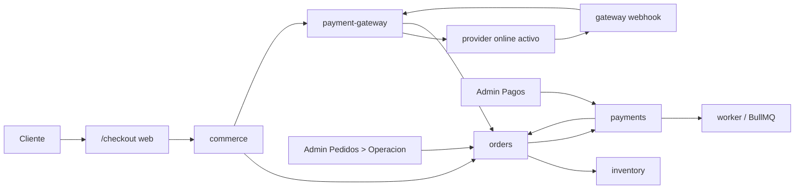
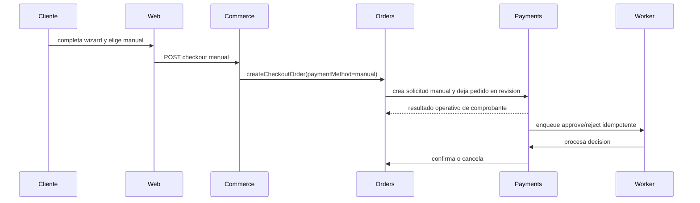
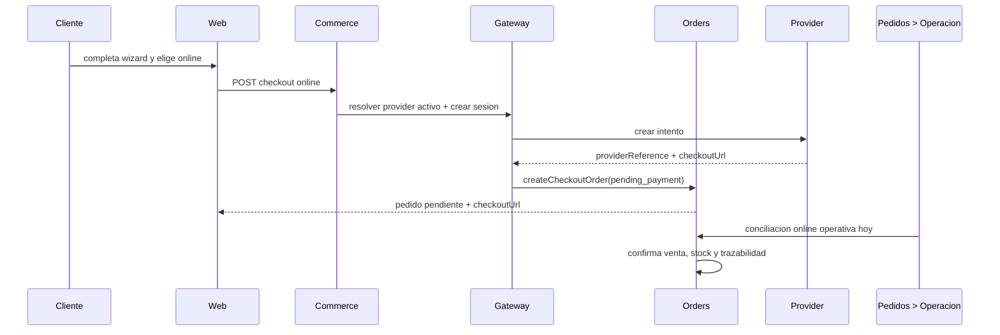
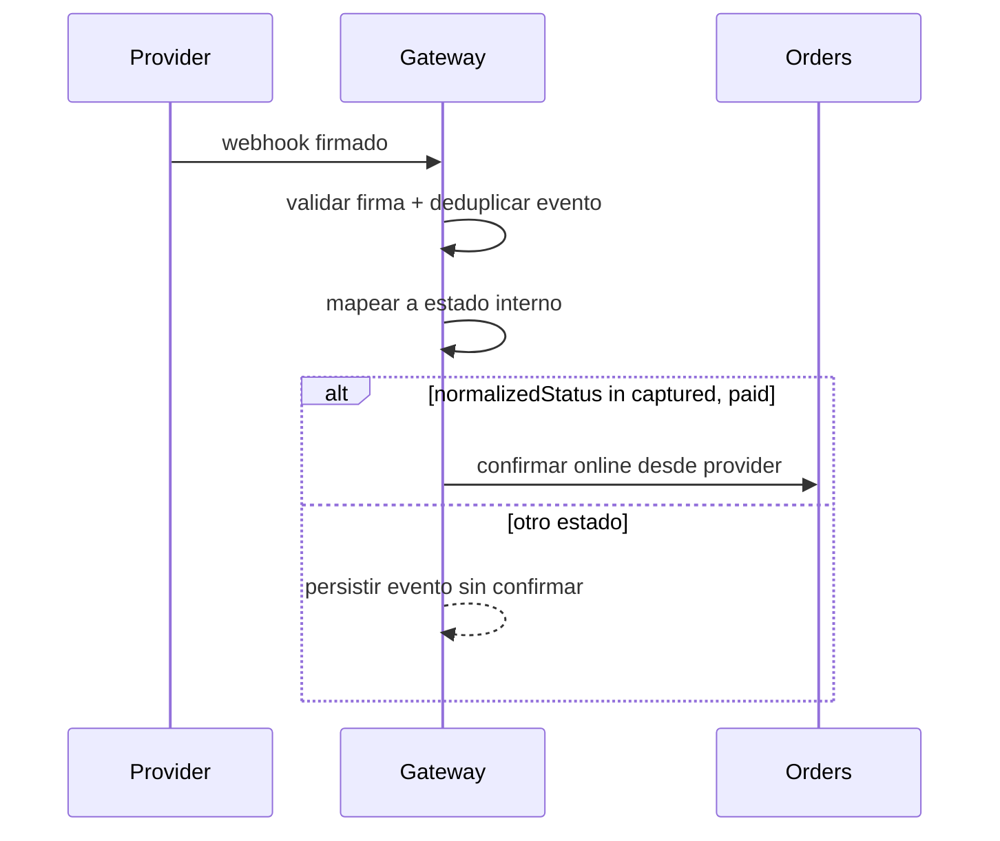

# 03.00 Arquitectura Canonica Brownfield

Fecha de corte: 2026-05-26.

## Objetivo

Definir la arquitectura canonica brownfield para el slice `checkout publico + pago manual + frontera canonica de payment gateway idempotente`, consolidando la operacion real del repo y fijando limites modulares antes de la implementacion.

## Fuentes consolidadas

- `docs/architecture/overview.md`
- `docs/architecture/modules.md`
- `docs/architecture/system-diagrams.md`
- `docs/infra/deployment-strategy.md`
- `docs/infra/pm2-services.md`
- `docs/flows/checkout-openpay.md`
- `docs/flows/manual-payments.md`
- `docs/ux/checkout-redesign.md`

## Estado Brownfield Actual

Huelegood sigue siendo un monolito modular distribuido en cuatro procesos:

- `huelegood-web`: checkout publico y storefront.
- `huelegood-admin`: backoffice operativo.
- `huelegood-api`: reglas transaccionales y contratos HTTP.
- `huelegood-worker`: colas BullMQ y procesos asincronos.

Para este slice ya existe una base funcional real:

- el checkout publico vive en `apps/web/components/checkout-workspace.tsx`;
- la capa store expone `quote`, `document-lookup`, `manual` y `openpay` desde `apps/api/src/modules/commerce`;
- `orders.service.ts` crea pedidos, aplica idempotencia por `clientRequestId`, reserva inventario y hoy tambien concentra la confirmacion online desde backoffice;
- `payments.service.ts` y `payments-workspace.tsx` gobiernan la cola de comprobantes manuales;
- `orders-workspace.tsx` ya actua como superficie operativa de conciliacion online futura.

La brecha brownfield es clara: el flujo online existe, pero todavia no tiene una frontera canonica separada para proveedor, webhook e idempotencia por evento externo.

## Decision Arquitectonica Del Slice

Se mantiene el monolito modular y se explicitan cuatro fronteras internas para checkout y pagos:

| Frontera | Duenio de | No duenio de | Superficies |
| --- | --- | --- | --- |
| `commerce` | quote, identidad documental, ubigeo, composicion del request publico | estado comercial final, revision manual, webhooks | `apps/api/src/modules/commerce/*` |
| `orders` | pedido, reserva/liberacion de stock, estado comercial, trazabilidad del pedido, confirmacion operativa online | comprobantes manuales, integracion directa con SDKs de proveedor | `apps/api/src/modules/orders/*`, `apps/admin/components/orders-workspace.tsx` |
| `payments` | solicitud manual, comprobantes, revision humana, cola de aprobacion/rechazo | confirmacion automatica online, UI operativa del estado comercial del pedido | `apps/api/src/modules/payments/*`, `apps/admin/components/payments-workspace.tsx` |
| `payment-gateway` | proveedor online activo, sesion de cobro, firma, webhook, mapeo de estados externos e idempotencia por evento | trazabilidad manual, ownership del pedido, UX de comprobantes | nuevo modulo canonico en `apps/api/src/modules/payment-gateway/*` |

## Invariantes Canonicos

1. Solo puede existir un provider online activo a la vez.
2. `manual payment` debe seguir visible hoy en el checkout publico.
3. `payments` es el dueno de comprobantes manuales y su bandeja operativa es `Pagos`.
4. `Pedidos > Operacion` es la vista canonica para trazabilidad comercial del pedido y para la conciliacion online operativa.
5. La confirmacion automatica futura del pago online solo puede ejecutarse cuando el gateway normalice el evento a `captured` o `paid`.
6. Estados como `authorized`, `pending`, `created` o equivalentes no confirman venta ni stock.
7. La UI publica nunca habla directo con el proveedor ni conoce secretos.
8. La idempotencia tiene dos capas:
   - cliente: `clientRequestId + requestHash`;
   - proveedor: `provider + providerEventId` o `provider + providerReference + normalizedStatus`.

## Flujo Canonico Del Slice

## Rutas Canonicas Por Escenario

### 1. Checkout manual visible hoy

### 2. Checkout online con provider activo

### 3. Automatizacion futura por webhook

## Persistencia Canonica Del Slice

La verdad comercial del pedido sigue en `orders`, pero el boundary online necesita persistencia propia minima:

- `payment_gateway_attempts`
  - `orderNumber`
  - `provider`
  - `providerReference`
  - `checkoutSessionId`
  - `clientRequestId`
  - `requestHash`
  - `status`
  - `checkoutUrl`
- `payment_gateway_events`
  - `provider`
  - `providerEventId`
  - `providerReference`
  - `externalStatus`
  - `normalizedStatus`
  - `payloadJson`
  - `receivedAt`
  - `processedAt`
  - `orderNumber`

Estas tablas nuevas existen para cerrar la brecha actual de idempotencia externa. No reemplazan el pedido ni la solicitud manual.

## Ownership Operativo

| Necesidad operativa | Vista canonica | Modulo duenio | Regla |
| --- | --- | --- | --- |
| revisar comprobante, aprobar o rechazar | `Pagos` | `payments` | no mueve online pending |
| registrar pago manual directo sin solicitud | `Pedidos > Operacion` | `orders` | solo para `paymentMethod=manual` |
| conciliar un cobro online ya validado por operacion | `Pedidos > Operacion` | `orders` | mantiene ruta `openpay_backoffice` o equivalente |
| procesar un webhook futuro | sin UI humana por defecto | `payment-gateway` -> `orders` | solo auto confirma en `captured/paid` |

## Riesgos Brownfield Y Controles

| Riesgo | Control canonico |
| --- | --- |
| Confirmar venta online desde dos rutas distintas | `Pedidos > Operacion` sigue siendo la unica vista manual para online; `Pagos` solo manual |
| Duplicar cobros por reintentos del checkout | `clientRequestId + requestHash` y reuso de order/attempt |
| Reprocesar webhooks duplicados | tabla `payment_gateway_events` con clave unica por proveedor y evento |
| Confirmar por estado prematuro (`authorized`) | normalizacion estricta: solo `captured/paid` confirman |
| Mezclar responsabilidades de `payments` y `orders` | boundary explicito por modulo y copy operativo alineado |

## Resultado Esperado De Fase 3

Fase 3 no cambia la topologia de runtime. Su salida es dejar:

- la frontera `payment-gateway` documentada y aprobada;
- ownership operacional sin ambiguedad entre `Pagos` y `Pedidos > Operacion`;
- la primera feature SDD lista para implementarse sobre rutas reales del monorepo;
- un camino claro para pasar del modelo actual de conciliacion manual a una automatizacion futura segura.
