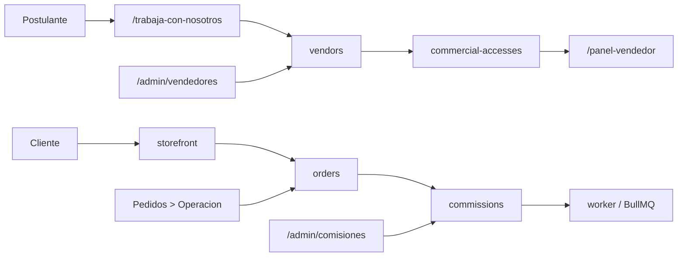

# 03.04 Arquitectura Canonica Brownfield Vendors Commissions

Fecha de corte: 2026-05-26.

## Objetivo

Definir la arquitectura canonica brownfield del slice seller-first vigente,
consolidando ownership, lock financiero y trazabilidad entre `vendors`,
`orders`, `commissions`, `payments` y `worker`.

## Fuentes consolidadas

- `docs/architecture/modules.md`
- `docs/flows/vendors-and-commissions.md`
- `docs/flows/vendor-application.md`
- `docs/flows/commercial-accesses.md`
- `apps/api/src/modules/orders/orders.service.ts`
- `apps/api/src/modules/vendors/vendors.service.ts`
- `apps/api/src/modules/commissions/commissions.service.ts`
- `apps/api/src/modules/payments/payments.service.ts`

## Estado Brownfield Actual

El canal seller-first ya opera sobre el monolito modular vigente:

- `vendors` gestiona postulaciones, perfiles, codigos y acceso comercial;
- `orders` persiste el `vendorCode` efectivo del pedido y hoy ya permite
  regularizarlo desde backoffice;
- `commissions` deriva la comision desde el pedido y administra elegibilidad,
  payout y reconciliacion por vendedor/periodo;
- `payments` dispara efectos posteriores a cobros, pero no es dueno de la
  atribucion comercial;
- `worker` ejecuta jobs de payout y settlement asincrono.

La tension brownfield principal es que la correccion tardia de `vendorCode`
puede arrastrar comisiones, payouts, snapshots y reportes si no se explicita
una frontera financiera clara.

## Decision Arquitectonica Del Slice

Se mantienen cinco fronteras internas explicitas para el canal seller-first:

| Frontera | Duenio de | No duenio de | Superficies |
| --- | --- | --- | --- |
| `vendors` | postulacion, perfil comercial, codigo, estado y acceso comercial | pedido, payout puntual, confirmacion de pago | `apps/api/src/modules/vendors/*`, `/admin/vendedores`, `/accesos` |
| `orders` | pedido, snapshot comercial, `vendorCode` efectivo, correccion de atribucion | reglas de comision, payout, rotacion del codigo maestro | `apps/api/src/modules/orders/*`, `Pedidos > Operacion` |
| `commissions` | regla, maduracion, bloqueo, payout, reversa | correccion primaria del pedido | `apps/api/src/modules/commissions/*`, `/admin/comisiones` |
| `payments` | cobro, revision manual y sync derivado tras pago | atribucion de vendedor, payout | `apps/api/src/modules/payments/*`, `/pagos` |
| `worker` | jobs asincronos de payout y settlement | decisiones primarias de atribucion o comision | `apps/worker/*` |

## Invariantes Canonicos

1. Un pedido solo puede tener un `vendorCode` efectivo.
2. `orders` es la unica puerta de correccion post-pedido.
3. `commissions` no corrige la atribucion primaria; recompone la consecuencia financiera.
4. `payments` no reescribe atribucion comercial.
5. El panel vendedor consume verdad derivada; no recalcula negocio.
6. La correccion de atribucion se congela cuando el pedido o la comision cruzan lock financiero.

## Lock Financiero Del Slice

La correccion de atribucion deja de ser una operacion normal cuando existe
compromiso financiero ya consolidado. El lock se considera cruzado si ocurre
cualquiera de estas condiciones:

- la comision ya esta en `payable`;
- la comision ya esta en `scheduled_for_payout`;
- la comision ya esta en `paid`;
- existe `payoutId` no cancelado asociado a la comision vigente;
- existe job de payout pendiente o en ejecucion para el vendor/periodo afectado;
- el pedido ya entro en reversa o cancelacion con impacto financiero cerrado.

## Flujo Canonico Del Slice

## Ownership Operativo

| Necesidad operativa | Vista canonica | Modulo duenio | Regla |
| --- | --- | --- | --- |
| revisar y aprobar postulacion | `/admin/vendedores` | `vendors` | no crea pedido ni payout |
| crear o vincular acceso comercial | `/accesos` o ficha de vendedor | `vendors` | no confirma venta |
| corregir `vendorCode` de pedido | `Pedidos > Operacion` | `orders` | solo antes del lock financiero |
| calcular o madurar comision | `/admin/comisiones` | `commissions` | depende de pedido confirmado |
| preparar y liquidar payout | `/admin/comisiones` + `worker` | `commissions` + `worker` | no cambia la atribucion primaria |

## Riesgos Brownfield Y Controles

| Riesgo | Control canonico |
| --- | --- |
| Limpiar el vendedor de un pedido con comision materializada | bloquear `A -> none` despues de materializacion |
| Reasignar pedido ya comprometido en payout | lock financiero explicito |
| Mover historia financiera cambiando el codigo maestro del vendedor | separar `vendors` de la regularizacion en `orders` |
| Mezclar atribucion, payout y cobro en una sola vista | ownership y superficies canonicas diferenciadas |
| Seller panel mostrando realidad distinta a comisiones/reportes | consumir solo verdad derivada de `orders` + `commissions` |

## Resultado Esperado De Fase 3

Fase 3 deja listo el lenguaje arquitectonico del slice seller-first:

- ownership explicito entre modulos;
- lock financiero aprobado como guardrail;
- trazabilidad clara para arquitectura, specs y futura implementacion;
- una base canonica para seguir homologando sin reabrir el negocio.
