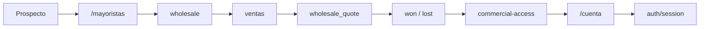

# 03.05 Arquitectura Canonica Brownfield Wholesale Leads Quotes

Fecha de corte: 2026-05-26.

## Objetivo

Definir la arquitectura canonica brownfield del slice mayorista vigente,
consolidando ownership, frontera comercial y trazabilidad entre `ventas`,
`wholesale`, `commercial-access` y `auth`.

## Fuentes consolidadas

- `docs/architecture/modules.md`
- `docs/flows/wholesale-flow.md`
- `docs/flows/commercial-accesses.md`
- `docs/api/api-v1-outline.md`
- `docs/product/roles-and-permissions.md`
- `apps/admin/lib/api.ts`
- `apps/web/components/account-workspace.tsx`
- `packages/shared/src/types/api.ts`

## Estado Brownfield Actual

El canal mayorista ya opera sobre el monolito modular vigente:

- `wholesale` captura leads y cotizaciones mayoristas;
- `Ventas` califica, cotiza y cierra la oportunidad;
- `commercial-access` crea o vincula accesos comerciales aprobados;
- `auth` resuelve la identidad y sesion de la cuenta reutilizada o creada;
- `/cuenta` ya es la entrada autenticada unica para relaciones comerciales.

La tension brownfield principal es no mezclar:

- una cotizacion `accepted`,
- un cierre comercial `won`,
- y un acceso mayorista activo.

## Decision Arquitectonica Del Slice

Se mantienen cuatro fronteras internas explicitas para el dominio mayorista:

| Frontera | Duenio de | No duenio de | Superficies |
| --- | --- | --- | --- |
| `ventas` | calificacion, deduplicacion, cotizacion, seguimiento y cierre | identidad tecnica, sesion, portal B2B | backoffice de leads y cotizaciones |
| `wholesale` | `wholesale_lead`, `wholesale_quote`, `wholesale_quote_items`, estados e `interestType` | order flow, acceso autenticado, comisiones seller-first | `apps/api` + admin |
| `commercial-access` | entitlement mayorista, vinculacion a cuenta, suspension/reactivacion del acceso | calificacion del lead, pricing, cierre comercial | `/accesos`, `/cuenta` |
| `auth` | identidad, login y sesion | decision comercial del lead, contenido de la cotizacion | `/auth`, `/cuenta` |

## Invariantes Canonicos

1. `wholesale` y `distributor` comparten modulo y funnel; cambia solo
   `interestType`.
2. Un lead duplicado se marca para revision; no se fusiona automaticamente.
3. Una cotizacion `accepted` no crea pedido ni acceso por si sola.
4. Solo `won` puede habilitar entitlement mayorista.
5. El entitlement se monta sobre una cuenta existente o reutilizada por email.
6. `/cuenta` expone resumen mayorista basico, no un portal B2B operativo.

## Frontera Comercial Del Slice

La conversion del funnel mayorista se considera cruzada solo cuando el lead ya
fue cerrado como `won` y backoffice decide crear o vincular el acceso
comercial.

### `accepted`

- expresa aceptacion de cotizacion;
- no crea pedido;
- no crea acceso;
- no cambia por si sola la identidad del usuario.

### `won`

- expresa cierre comercial real;
- habilita la relacion comercial aprobada;
- permite que backoffice cree o vincule el entitlement mayorista.

### `order`

- queda fuera de este slice;
- no nace automaticamente de `accepted` ni de `won`.

## Flujo Canonico Del Slice

## Ownership Operativo

| Necesidad operativa | Vista canonica | Modulo duenio | Regla |
| --- | --- | --- | --- |
| capturar lead mayorista | formulario publico | `wholesale` | no crea cuenta ni acceso |
| calificar y deduplicar | backoffice de leads | `ventas` + `wholesale` | revision humana |
| crear y enviar cotizacion | backoffice de quotes | `ventas` + `wholesale` | `tier` editable |
| cerrar oportunidad | backoffice de leads/quotes | `ventas` | `accepted` no basta |
| crear o vincular acceso comercial | `/accesos` o atajo desde lead | `commercial-access` | solo despues de `won` |
| mostrar resumen mayorista | `/cuenta` | `commercial-access` + `auth` | no es portal B2B completo |

## Riesgos Brownfield Y Controles

| Riesgo | Control canonico |
| --- | --- |
| Tomar `accepted` como pedido | separar `accepted`, `won` y `order` |
| Duplicar identidad por email | reutilizar la cuenta existente si ya existe |
| Dar acceso antes del cierre comercial | entitlement solo despues de `won` |
| Convertir `/cuenta` en portal B2B | limitarlo a resumen comercial basico |
| Mezclar mayorista con seller-first | no otorgar codigo de vendedor ni comisiones en este slice |

## Resultado Esperado De Fase 3

Fase 3 deja listo el lenguaje arquitectonico del slice mayorista:

- ownership explicito entre ventas, dominio mayorista y acceso comercial;
- frontera clara entre `accepted`, `won` y `order`;
- trazabilidad lista para specs y futura implementacion;
- una base canonica para seguir homologando sin reabrir el negocio.
