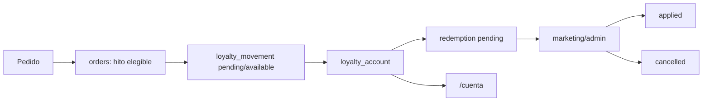

# 03.06 Arquitectura Canonica Brownfield Loyalty Points Redemptions

Fecha de corte: 2026-05-26.

## Objetivo

Definir la arquitectura canonica brownfield del slice loyalty vigente,
consolidando ownership y frontera operativa entre `loyalty`, `orders`,
`marketing`, `auth` y `customers`.

## Fuentes consolidadas

- `docs/flows/loyalty-flow.md`
- `docs/flows/checkout-openpay.md`
- `docs/product/roles-and-permissions.md`
- `docs/architecture/modules.md`
- `apps/api/src/modules/loyalty/loyalty.service.ts`
- `apps/api/src/modules/orders/orders.service.ts`
- `apps/admin/components/loyalty-workspace.tsx`
- `apps/web/components/account-workspace.tsx`
- `packages/shared/src/types/api.ts`

## Estado Brownfield Actual

El programa loyalty ya opera dentro del monolito modular vigente:

- `orders` dispara earn y reversas sobre pedidos;
- `loyalty` mantiene cuentas, movimientos, canjes y reglas;
- `/admin/loyalty` ya funciona como superficie operativa;
- `/cuenta` ya expone visibilidad del estado de puntos;
- el canje se maneja como solicitud operativa con estados propios.

La tension brownfield principal es no mezclar:

- elegibilidad transaccional del pedido;
- contabilidad del saldo de puntos;
- decision operativa del canje;
- autoservicio del cliente.

## Decision Arquitectonica Del Slice

Se mantienen cinco fronteras internas explicitas para el dominio loyalty:

| Frontera | Duenio de | No duenio de | Superficies |
| --- | --- | --- | --- |
| `orders` | hito elegible del pedido, earn inicial, settlement y reversal | reglas del programa, aprobacion del canje, identidad cliente | `apps/api` |
| `loyalty` | `loyalty_account`, `loyalty_movement`, `redemption`, `loyalty_rule`, saldo y ledger | estado primario del pedido, pagos, login | `apps/api` + admin |
| `marketing` | operacion del programa, resolucion de canjes, ajustes normales | confirmacion de pagos, identidad tecnica, checkout | `/admin/loyalty` |
| `auth` | identidad y sesion de la cuenta cliente | earn, canje, saldo y reglas del programa | `/auth`, `/cuenta` |
| `customers` | vinculo de la cuenta cliente y sus datos base | decisiones del ledger y del canje | `apps/api`, `/cuenta` |

## Invariantes Canonicos

1. Los puntos pertenecen a una cuenta cliente autenticada.
2. Existe una sola `loyalty_rule` activa de acumulacion a la vez.
3. `orders` decide cuando un pedido cruza el hito elegible del dominio.
4. `loyalty` conserva el ledger y el saldo.
5. Un canje `pending` reserva puntos de inmediato.
6. `/cuenta` expone lectura del programa, no autoservicio de canje.
7. La reversa por invalidez del pedido es automatica.

## Frontera Transaccional Del Slice

El programa loyalty no decide pagos ni estados primarios del pedido. Solo
reacciona a hitos del dominio transaccional.

### Earn

- nace cuando `orders` dispara la asignacion correspondiente
- puede quedar `pending` o `available` segun elegibilidad real

### Settlement

- ocurre cuando un earn `pending` queda listo para liberar saldo
- convierte saldo retenido en saldo `available`

### Reversal

- ocurre si el pedido asociado deja de sostener el earn
- no requiere aprobacion manual previa

## Frontera Operativa Del Canje

La conversion del saldo a beneficio se considera cruzada solo cuando
`marketing` o `admin` resuelven el `redemption`.

### `pending`

- reserva puntos de inmediato
- bloquea reutilizacion del mismo saldo
- no significa beneficio ya aplicado

### `applied`

- consume definitivamente la reserva
- deja trazabilidad del beneficio entregado

### `cancelled`

- libera la reserva
- devuelve los puntos a `available`

## Flujo Canonico Del Slice

## Ownership Operativo

| Necesidad operativa | Vista canonica | Modulo duenio | Regla |
| --- | --- | --- | --- |
| asignar puntos desde pedido | transaccional | `orders` + `loyalty` | depende de elegibilidad |
| liberar puntos pendientes | ledger | `orders` + `loyalty` | settlement solo al hito correcto |
| revertir puntos | ledger | `orders` + `loyalty` | automatica por invalidez del pedido |
| crear canje | operacion loyalty | `marketing` + `loyalty` | reserva inmediata |
| resolver canje | operacion loyalty | `marketing` + `admin` | `applied` o `cancelled` |
| mostrar saldo y estado | cuenta cliente | `loyalty` + `auth` + `customers` | lectura, no accion |

## Riesgos Brownfield Y Controles

| Riesgo | Control canonico |
| --- | --- |
| liberar puntos demasiado pronto | `orders` conserva el hito elegible |
| doble gasto por solicitudes concurrentes | reserva inmediata en `pending` |
| confundir canje con descuento de checkout | separar `redemption` del order flow |
| puntos sobre identidades ambiguas | cuenta autenticada como verdad canonica |
| mezclar loyalty con marketing avanzado | limitar el slice al programa vigente |

## Resultado Esperado De Fase 3

Fase 3 deja listo el lenguaje arquitectonico del slice loyalty:

- ownership explicito entre modulo loyalty, orders y operacion de marketing;
- frontera clara entre earn, settlement, reversal y redemption;
- trazabilidad lista para specs y futura implementacion;
- una base canonica para seguir homologando sin reabrir el negocio.
