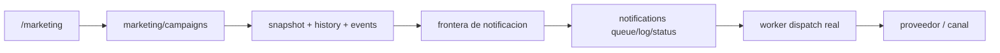

# 03.07 Arquitectura Canonica Brownfield Campaigns Marketing Automation

Fecha de corte: 2026-05-27.

## Objetivo

Definir la arquitectura canonica brownfield del slice vigente de campaigns,
consolidando ownership, lifecycle, frontera de snapshot y limite funcional
entre `marketing`, `notifications` y `worker`, sin redisenar el runtime real
ni convertir el modulo en un automation engine amplio.

## Fuentes consolidadas

- `docs/product/roles-and-permissions.md`
- `docs/product/roadmap.md`
- `docs/product/requirements-impact-plan-2026-03.md`
- `docs/architecture/modules.md`
- `apps/api/src/modules/marketing/marketing.service.ts`
- `apps/api/src/modules/marketing/marketing.controller.ts`
- `apps/api/src/modules/notifications/notifications.service.ts`
- `apps/admin/components/marketing-workspace.tsx`
- `apps/worker/src/main.ts`
- `packages/shared/src/domain/enums.ts`
- `packages/shared/src/types/api.ts`

## Estado Brownfield Actual

El runtime de campaigns ya opera dentro del monolito modular vigente:

- `marketing` persiste `segments`, `templates`, `campaigns` y `events` dentro
  de su snapshot brownfield;
- `/marketing` ya expone el workbench operativo para crear campanas, elegir
  catalogos y definir `channel`, `goal` y `scheduledAt`;
- `createCampaign()` ya exige `name`, `goal`, `segmentId`, `templateId` y
  compatibilidad entre `template.channel` y `campaign.channel`;
- sin `scheduledAt`, la campana nace `running/running`;
- con `scheduledAt`, la campana nace `scheduled/queued`;
- al crear la campana se congelan `segmentName`, `templateName`,
  `bodyPreview` y `recipients`;
- `marketing` registra auditoria, historial y eventos del dominio, pero no
  procesa el envio tecnico por proveedor;
- `notifications` conserva la cola, el registro de notificaciones y el estado
  tecnico `pending/sent/delivered/failed`;
- `worker` procesa el `NotificationDispatchJobData` y marca el resultado real
  de envio o fallo.

La tension brownfield principal es no mezclar en este slice:

- la orquestacion comercial de una campana;
- el authoring completo de `segments` y `templates`;
- y el dispatch tecnico real del mensaje.

## Decision Arquitectonica Del Slice

Se mantienen tres ownerships fuertes y dos dependencias read-only explicitas
para el dominio vigente:

| Frontera | Papel canonico | No abarca | Superficies |
| --- | --- | --- | --- |
| `marketing/campaigns` | agregado principal del slice; crea campanas, define `goal`, `channel`, `scheduledAt`, congela snapshot, registra `history` y `events` | cola tecnica, provider dispatch, estado tecnico de notificacion | `apps/api` + `/marketing` |
| `segments` | catalogo read-only de audiencia consumido al crear campanas | authoring completo, lifecycle propio del catalogo, dispatch | snapshot `marketing` + `/marketing` |
| `templates` | catalogo read-only de plantillas consumido al crear campanas | editor/versionado/aprobacion, lifecycle propio del catalogo, dispatch | snapshot `marketing` + `/marketing` |
| `notifications` | cola, `notification` record, logs y estado tecnico de entrega | objetivo comercial, seleccion de audiencia, snapshot de campana | `apps/api` + BullMQ |
| `worker` | dispatch asincrono real e integracion con proveedores por canal soportado | ownership de cola, authoring de campanas, seleccion de catalogos | `apps/worker` |

## Agregado Canonico Del Slice

El slice se canoniza como un agregado operativo acotado:

| Componente | Regla canonica | Observacion brownfield |
| --- | --- | --- |
| `campaigns` | agregado principal con `status`, `runStatus`, `goal`, `channel` y `scheduledAt` | la regla de nacimiento real hoy solo abre `scheduled` o `running` |
| `segments` | dependencia read-only para resolver audiencia y `recipients` | expone `active/inactive`, pero ese estado no bloquea la creacion en este corte |
| `templates` | dependencia read-only para resolver canal y `bodyPreview` | expone `active/draft`, pero el hard gate real es la compatibilidad de canal |
| `campaign snapshot` | congela `segmentName`, `templateName`, `bodyPreview` y `recipients` al crear | cambios posteriores del catalogo no reescriben la campana creada |
| `events` y `history` | trazabilidad operativa del dominio `marketing` | el resultado tecnico de entrega vive fuera del agregado `campaigns` |

## Invariantes Canonicos

1. `campaigns` es el agregado principal del slice.
2. `segments` y `templates` son dependencias read-only `as-is`; este corte no
   abre authoring completo para ninguno.
3. La validacion minima real de creacion exige existencia de `segmentId`,
   existencia de `templateId` y compatibilidad entre `template.channel` y
   `campaign.channel`.
4. Sin `scheduledAt`, la campana nace `running/running`.
5. Con `scheduledAt`, la campana nace `scheduled/queued`.
6. El boundary de snapshot se cruza al crear la campana y congela
   `segmentName`, `templateName`, `bodyPreview` y `recipients`, ademas de los
   IDs referenciados y la configuracion operativa de la corrida.
7. `marketing` conserva auditoria, historial y eventos de campana, pero no
   conserva el estado tecnico final del envio por proveedor.
8. `notifications` es el owner de cola, logs y estado tecnico de entrega.
9. `worker` es el owner del dispatch real por canal soportado.
10. Journeys, automation multi-step, CRM ampliado y analytics avanzados quedan
   fuera de este corte.

## Lifecycle Y Frontera Funcional Del Slice

### Nacimiento de campana

1. `marketing` selecciona `segmentId`, `templateId`, `channel`, `goal` y
   opcionalmente `scheduledAt`.
2. El runtime valida la existencia de los IDs y la compatibilidad de canal.
3. `campaigns` crea el registro operativo y congela el snapshot del catalogo
   consumido.
4. La campana nace:
   - `running/running` si no hay `scheduledAt`;
   - `scheduled/queued` si `scheduledAt` viene informado.

### Vida operativa de la campana

- `campaigns` conserva el estado comercial y operativo de la campana:
  `draft`, `scheduled`, `running`, `completed`, `cancelled`.
- `runStatus` expresa la corrida operativa del agregado:
  `queued`, `running`, `completed`, `failed`.
- `history` y `events` documentan decisiones y actividad del dominio
  `marketing`.

### Frontera `marketing -> notifications -> worker`

La frontera funcional del slice queda separada en tres escalones:

1. `marketing` termina en la orquestacion de la campana y en la intencion
   downstream de comunicacion.
2. `notifications` materializa esa intencion como cola, notificacion y estado
   tecnico de entrega.
3. `worker` procesa la cola y ejecuta el dispatch real por el canal soportado.

## Boundary Del Snapshot

El boundary de snapshot queda fijado en la creacion de la campana. Cruza hacia
`campaigns` solo el contexto operativo necesario para esa corrida:

- `segmentId`
- `segmentName`
- `templateId`
- `templateName`
- `bodyPreview`
- `recipients`
- `channel`
- `goal`
- `scheduledAt`

No cruza al snapshot de la campana:

- el authoring futuro de `segments`;
- el authoring futuro de `templates`;
- la cola tecnica o los logs de `notifications`;
- el estado `sent/delivered/failed` del envio real.

## Riesgos Brownfield Y Controles

| Riesgo | Control canonico |
| --- | --- |
| confundir `segments` o `templates` con subdominios completos de authoring | tratarlos como catalogos read-only dependientes del agregado `campaigns` |
| mezclar `runStatus` de campana con estado tecnico de entrega | dejar `pending/sent/delivered/failed` dentro de `notifications` |
| reescribir retroactivamente una campana por cambios de catalogo | congelar snapshot operativo al crear la campana |
| empujar el dispatch tecnico dentro de `marketing` | mantener la frontera `marketing -> notifications -> worker` |
| sobredocumentar validaciones que el runtime aun no hace | fijar como hard gate solo existencia de IDs y compatibilidad de canal |

## Resultado Esperado De Fase 3

Fase 3 deja listo el lenguaje arquitectonico del slice campaigns:

- ownership explicito entre `marketing`, `notifications` y `worker`;
- `campaigns` fijado como agregado principal con lifecycle brownfield real;
- `segments` y `templates` dejados como dependencias read-only `as-is`;
- boundary de snapshot y frontera funcional de dispatch documentados sin
  redisenar el runtime.
