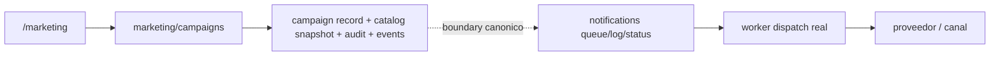

# 03.08 Arquitectura Canonica Brownfield Campaigns Marketing Automation

Fecha de corte: 2026-05-27.

## Objetivo

Definir la arquitectura canonica brownfield del slice vigente de campaigns,
consolidando ownership, modelo de estados soportado, boundary de snapshot y
limite funcional entre `marketing`, `notifications` y `worker`, sin
redisenar el runtime real ni convertir el modulo en un automation engine
amplio.

## Fuentes consolidadas

- `docs/product/roles-and-permissions.md`
- `docs/product/roadmap.md`
- `docs/product/requirements-impact-plan-2026-03.md`
- `docs/architecture/modules.md`
- `apps/api/src/modules/marketing/marketing.service.ts`
- `apps/api/src/modules/marketing/marketing.controller.ts`
- `apps/api/src/modules/notifications/notifications.service.ts`
- `apps/admin/components/marketing-workspace.tsx`
- `apps/worker/src/main.ts`
- `packages/shared/src/domain/enums.ts`
- `packages/shared/src/types/api.ts`

## Estado Brownfield Actual

El runtime de campaigns ya opera dentro del monolito modular vigente:

- `marketing` persiste `segments`, `templates`, `campaigns` y `events` dentro
  de su snapshot brownfield;
- `/marketing` ya expone el workbench operativo para crear campanas, elegir
  catalogos y definir `channel`, `goal` y `scheduledAt`;
- `createCampaign()` ya exige `name`, `goal`, `segmentId`, `templateId` y
  compatibilidad entre `template.channel` y `campaign.channel`;
- sin `scheduledAt`, la campana nace `running/running`;
- con `scheduledAt`, la campana nace `scheduled/queued`;
- `createCampaign()` persiste la campaign con su registro operativo, congela
  datos del catalogo consumido, registra auditoria y agrega eventos del
  dominio dentro de `marketing`;
- en el runtime visible hoy, ese flujo termina en `marketing`: no hay llamada
  directa a `NotificationsService` ni enqueue de dispatch real desde
  `createCampaign()`;
- `notifications` existe como modulo separado y conserva la cola, el registro
  de notificaciones y el estado tecnico `pending/sent/delivered/failed` en sus
  propios flujos;
- `worker` procesa `NotificationDispatchJobData` ya encolado y marca el
  resultado real de envio o fallo.

La tension brownfield principal es no mezclar en este slice:

- la orquestacion comercial de una campana;
- el authoring completo de `segments` y `templates`;
- y el dispatch tecnico real del mensaje.

## Decision Arquitectonica Del Slice

Se mantienen tres ownerships fuertes y dos dependencias read-only explicitas
para el dominio vigente:

| Frontera | Papel canonico | No abarca | Superficies |
| --- | --- | --- | --- |
| `marketing/campaigns` | agregado principal del slice; crea campanas, define `goal`, `channel`, `scheduledAt`, congela snapshot, registra `history` y `events` | cola tecnica, provider dispatch, estado tecnico de notificacion | `apps/api` + `/marketing` |
| `segments` | catalogo read-only de audiencia consumido al crear campanas | authoring completo, lifecycle propio del catalogo, dispatch | snapshot `marketing` + `/marketing` |
| `templates` | catalogo read-only de plantillas consumido al crear campanas | editor/versionado/aprobacion, lifecycle propio del catalogo, dispatch | snapshot `marketing` + `/marketing` |
| `notifications` | cola, `notification` record, logs y estado tecnico de entrega cuando una intencion de comunicacion cruza ese boundary | objetivo comercial, seleccion de audiencia, snapshot de campana | `apps/api` + BullMQ |
| `worker` | dispatch asincrono real e integracion con proveedores para jobs ya encolados | ownership de cola, authoring de campanas, seleccion de catalogos | `apps/worker` |

## Agregado Canonico Del Slice

El slice se canoniza como un agregado operativo acotado:

| Componente | Regla canonica | Observacion brownfield |
| --- | --- | --- |
| `campaigns` | agregado principal con `status`, `runStatus`, `goal`, `channel` y `scheduledAt` | el nacimiento visible hoy solo abre `scheduled` o `running` |
| `segments` | dependencia read-only para resolver audiencia y `recipients` | expone `active/inactive`, pero ese estado no bloquea la creacion en este corte |
| `templates` | dependencia read-only para resolver canal y `bodyPreview` | expone `active/draft`, pero el hard gate real es la compatibilidad de canal |
| `campaign record` | persiste atributos propios de la campana: `id`, `name`, `segmentId`, `templateId`, `channel`, `status`, `runStatus`, `goal`, `scheduledAt`, `createdAt`, `updatedAt` | el write model visible hoy nace dentro de `marketing` |
| `catalog snapshot` | congela `segmentName`, `templateName`, `bodyPreview` y `recipients` al crear | cambios posteriores del catalogo no reescriben la campana creada |
| `events` y `history` | trazabilidad operativa del dominio `marketing` | el resultado tecnico de entrega vive fuera del agregado `campaigns` |

## Invariantes Canonicos

1. `campaigns` es el agregado principal del slice.
2. `segments` y `templates` son dependencias read-only `as-is`; este corte no
   abre authoring completo para ninguno.
3. La validacion minima real de creacion exige `name`, `goal`, existencia de
   `segmentId`, existencia de `templateId` y compatibilidad entre
   `template.channel` y `campaign.channel`.
4. En el runtime visible hoy, `createCampaign()` persiste campaign record,
   catalog snapshot, auditoria y eventos dentro de `marketing`; no llama
   directamente a `NotificationsService` ni encola dispatch real desde ese
   flujo.
5. Sin `scheduledAt`, la campana nace `running/running`.
6. Con `scheduledAt`, la campana nace `scheduled/queued`.
7. El campaign record conserva atributos propios de la campana:
   `id`, `name`, `segmentId`, `templateId`, `channel`, `status`, `runStatus`,
   `goal`, `scheduledAt`, `createdAt` y `updatedAt`.
8. El catalog snapshot congela `segmentName`, `templateName`, `bodyPreview` y
   `recipients` al crear.
9. `marketing` conserva auditoria, historial y eventos de campana, pero no
   conserva el estado tecnico final del envio por proveedor.
10. `notifications` es el owner de cola, logs y estado tecnico de entrega
    cuando ese boundary se cruza por otro flujo o integracion explicita.
11. `worker` es el owner del dispatch real para jobs ya encolados.
12. Journeys, automation multi-step, CRM ampliado y analytics avanzados quedan
   fuera de este corte.

## Modelo De Estados Soportado Y Frontera Funcional Del Slice

### Nacimiento visible hoy

1. `marketing` selecciona `segmentId`, `templateId`, `channel`, `goal` y
   opcionalmente `scheduledAt`.
2. El runtime valida la existencia de los IDs y la compatibilidad de canal.
3. `campaigns` crea el campaign record, congela el catalog snapshot, registra
   auditoria y agrega eventos del dominio en `marketing`.
4. La campana nace:
   - `running/running` si no hay `scheduledAt`;
   - `scheduled/queued` si `scheduledAt` viene informado.

### Estados expuestos por el contrato compartido

- `campaigns` expone el conjunto de estados de campana:
  `draft`, `scheduled`, `running`, `completed`, `cancelled`.
- `runStatus` expone el conjunto de estados de corrida:
  `queued`, `running`, `completed`, `failed`.
- En este corte no se sobreafirma que todas esas transiciones esten cableadas
  por el flujo visible de creacion; lo que si se evidencia hoy es el
  nacimiento en `running/running` cuando no hay `scheduledAt` y en
  `scheduled/queued` cuando `scheduledAt` viene informado.
- `history` y `events` documentan decisiones y actividad del dominio
  `marketing`.

### Boundary canonico `marketing -> notifications -> worker`

La frontera funcional del slice queda documentada como desacople canonico, no
como handoff runtime ya cableado desde `createCampaign()`:

1. `marketing` termina hoy en la persistencia de la campana, su snapshot, la
   auditoria y los eventos del dominio.
2. `notifications` es el bounded context que debe absorber cola,
   notificacion y estado tecnico cuando una intencion de comunicacion cruza
   ese boundary por un flujo o integracion explicita.
3. `worker` procesa los jobs ya encolados por `notifications` y ejecuta el
   dispatch real por el canal soportado.

## Boundary Del Snapshot

El boundary de snapshot queda fijado en la creacion de la campana y se divide
en dos capas coherentes dentro del registro persistido:

### Atributos propios de la campana

- `id`
- `name`
- `segmentId`
- `templateId`
- `channel`
- `status`
- `runStatus`
- `goal`
- `scheduledAt`
- `createdAt`
- `updatedAt`

### Datos congelados del catalogo consumido

- `segmentName`
- `templateName`
- `bodyPreview`
- `recipients`

No cruza al catalog snapshot de la campana:

- el authoring futuro de `segments`;
- el authoring futuro de `templates`;
- la cola tecnica o los logs de `notifications`;
- el estado `sent/delivered/failed` del envio real.

## Riesgos Brownfield Y Controles

| Riesgo | Control canonico |
| --- | --- |
| confundir `segments` o `templates` con subdominios completos de authoring | tratarlos como catalogos read-only dependientes del agregado `campaigns` |
| mezclar `runStatus` de campana con estado tecnico de entrega | dejar `pending/sent/delivered/failed` dentro de `notifications` |
| reescribir retroactivamente una campana por cambios de catalogo | congelar snapshot operativo al crear la campana |
| presentar `createCampaign()` como handoff ya cableado a cola | documentar esa frontera como boundary canonico y explicitar que hoy el flujo termina en `marketing` |
| empujar el dispatch tecnico dentro de `marketing` | mantener la frontera `marketing -> notifications -> worker` como desacople arquitectonico |
| sobredocumentar validaciones que el runtime aun no hace | fijar como hard gate `name`, `goal`, existencia de IDs y compatibilidad de canal |

## Resultado Esperado De Fase 3

Fase 3 deja listo el lenguaje arquitectonico del slice campaigns:

- ownership explicito entre `marketing`, `notifications` y `worker`;
- `campaigns` fijado como agregado principal con modelo de estados soportado y
  nacimiento visible hoy bien acotado;
- `segments` y `templates` dejados como dependencias read-only `as-is`;
- boundary de snapshot y frontera funcional de dispatch documentados sin
  redisenar el runtime.
