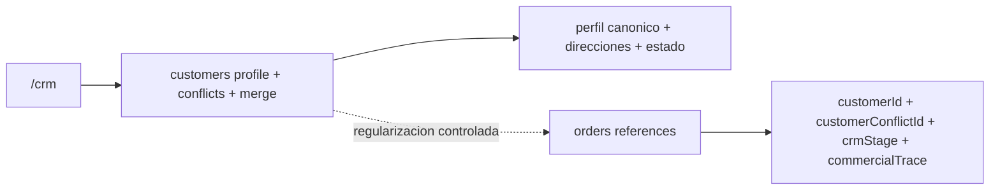

# 03.09 Arquitectura Canonica Brownfield Customers Identity Conflicts

Fecha de corte: 2026-05-28.

## Objetivo

Definir la arquitectura canonica brownfield del slice vigente de customers,
consolidando ownership, invariantes de identidad, merge operativo y limite
funcional entre `customers`, `/crm` y `orders`, sin redisenar el runtime real
ni convertir el modulo en CRM ampliado.

## Fuentes consolidadas

- `docs/product/roles-and-permissions.md`
- `docs/product/roadmap.md`
- `docs/product/requirements-impact-plan-2026-03.md`
- `docs/architecture/modules.md`
- `apps/admin/app/crm/page.tsx`
- `apps/admin/components/crm-workspace.tsx`
- `apps/api/src/modules/customers/customers.controller.ts`
- `apps/api/src/modules/customers/customers.service.ts`
- `apps/api/src/modules/orders/orders.service.ts`
- `packages/shared/src/domain/enums.ts`
- `packages/shared/src/types/api.ts`

## Estado Brownfield Actual

El runtime de customers ya opera dentro del monolito modular vigente:

- `/crm` ya expone el workbench operativo para listar clientes, abrir
  conflictos, crear, editar, fusionar y eliminar de forma excepcional;
- `customers` ya persiste perfil vivo, estado, direcciones y opt-in del
  cliente en Prisma;
- `customers.service.ts` ya resuelve conflictos con `assign_existing`,
  `merge` e `ignore`;
- `mergeCustomersInternal()` ya valida documentos canonicos distintos,
  conserva un destino activo y marca la fuente como fusionada;
- `resolveCustomerFromOrderSnapshot()` ya puede materializar o regularizar
  clientes desde pedidos;
- `orders` ya conserva `customerId`, `customerConflictId`, `crmStage` y
  `commercialTrace` dentro de su propio dominio;
- `ordersService.applyCustomerResolution()` y
  `ordersService.reassignMergedCustomer()` ya regularizan referencias canonicas
  cuando el runtime lo requiere.

La tension brownfield principal es no mezclar en este slice:

- el perfil canonico del cliente;
- la identidad nacida de pedidos y conflictos;
- y el seguimiento comercial que sigue viviendo en `orders`.

## Decision Arquitectonica Del Slice

Se mantienen dos ownerships fuertes y una relacion de contexto explicita para
el dominio vigente:

| Frontera | Papel canonico | No abarca | Superficies |
| --- | --- | --- | --- |
| `customers` | agregado principal del slice; gobierna perfil canonico, estado, direcciones, conflictos y merge | `crmStage`, seguimiento comercial, campaigns, wholesale, loyalty | `apps/api` + `/crm` |
| `/crm` | workbench visible del slice; opera clientes, conflictos, detalle y merge | pipeline comercial amplio, timeline comercial, ownership de pedidos | `apps/admin` |
| `orders` | conserva snapshots historicos, `customerId`, `customerConflictId`, `crmStage` y `commercialTrace`; regulariza referencias cuando aplica | perfil vivo del cliente, ownership de identidad, merge como dominio propio | `apps/api` |

## Agregado Canonico Del Slice

El slice se canoniza como un agregado operativo acotado:

| Componente | Regla canonica | Observacion brownfield |
| --- | --- | --- |
| `customers` | agregado principal con perfil, estado, direcciones y opt-in | el write model visible hoy vive en Prisma y se opera desde `/crm` |
| `customer conflicts` | capa de resolucion de identidad con `open`, `resolved`, `ignored` y `merged` | nace de pedidos y de regularizacion del runtime |
| `merge` | consolidacion manual con destino canonico activo y fuente fusionada | el runtime ya regulariza referencias operativas donde corresponde |
| `recentOrders` | lectura contextual de pedidos recientes dentro del detalle | aporta contexto sin mover ownership de `orders` |
| `synthetic customers` | clientes validos materializados o regularizados desde pedidos | el runtime no exige cuenta limpia preexistente para toda identidad |

## Invariantes Canonicos

1. `customers` es el agregado principal del slice.
2. `/crm` es la superficie visible del slice y no debe venderse como CRM
   ampliado.
3. La prioridad de identidad es `documento`, luego `email/telefono`, luego
   `nombre + direccion`.
4. Los conflictos usan `open`, `resolved`, `ignored` y `merged`.
5. La resolucion operativa admite `assign_existing`, `merge` e `ignore`.
6. El merge deja un destino activo y una fuente fusionada.
7. No se puede fusionar si ambos clientes ya tienen documentos canonicos
   distintos.
8. `orders` puede regularizar referencias canonicas (`customerId`,
   `customerConflictId`) sin por eso convertirse en owner del perfil.
9. `crmStage` y `commercialTrace` permanecen fuera del ownership de
   `customers`.
10. `deleteCustomer` es una capacidad excepcional y se bloquea en casos
    incompatibles con pedidos, roles compartidos o uso como destino canonico.
11. Clientes sinteticos o regularizados desde pedidos siguen siendo parte
    valida del dominio actual.

## Boundary De Identidad Y Referencias

La frontera funcional del slice queda documentada como ownership canonico de
`customers` con regularizacion operativa controlada en `orders`:

### Perfil vivo del cliente

- vive en `customers`
- se corrige desde `/crm`
- incluye estado, direcciones, documento, contacto y opt-in

### Referencias operativas del pedido

- viven en `orders`
- incluyen `customerId`, `customerConflictId`, `crmStage` y
  `commercialTrace`
- pueden ajustarse por `applyCustomerResolution()` o
  `reassignMergedCustomer()` cuando la identidad canonica cambia

### Lo que no cruza a `customers`

- ownership de `crmStage`
- seguimiento comercial del pedido
- timeline comercial transversal
- campaigns, wholesale o loyalty

## Modelo De Estados Soportado Y Frontera Funcional Del Slice

### Customer status

- `active`
- `inactive`
- `pending`
- `suspended`

### Customer conflict status

- `open`
- `resolved`
- `ignored`
- `merged`

### Frontera funcional visible hoy

1. `/crm` opera clientes, conflictos, merge y detalle.
2. `customers` persiste perfil y decide identidad canonica.
3. `orders` expone pedidos recientes como contexto y regulariza referencias
   cuando una resolucion o fusion lo exige.
4. `crmStage` sigue dentro del pedido y no se gobierna desde este slice.

## Riesgos Brownfield Y Controles

| Riesgo | Control canonico |
| --- | --- |
| confundir `/crm` con CRM comercial amplio | fijar `/crm` como workbench de perfil e identidad, no de pipeline comercial |
| absorber `crmStage` dentro de `customers` | dejar `crmStage` y `commercialTrace` dentro de `orders` |
| fusionar clientes con evidencia documental incompatible | bloquear merge cuando ambos clientes ya tienen documentos canonicos distintos |
| interpretar regularizacion de referencias como reescritura arbitraria de historia | documentar `applyCustomerResolution()` y `reassignMergedCustomer()` como regularizacion controlada |
| presentar `deleteCustomer` como limpieza normal del modulo | dejarlo como capacidad excepcional con restricciones fuertes |
| tratar clientes sinteticos como anomalía fuera del dominio | canonizarlos como parte valida del runtime actual |

## Resultado Esperado De Fase 3

Fase 3 deja listo el lenguaje arquitectonico del slice customers:

- ownership explicito entre `customers`, `/crm` y `orders`;
- prioridad de identidad, conflictos y merge fijados sin redisenar el
  runtime;
- frontera entre perfil canonico y referencias de pedido documentada sin
  absorber `crmStage`;
- clientes sinteticos y eliminacion excepcional tratados con el mismo nivel de
  claridad que el resto del dominio.
