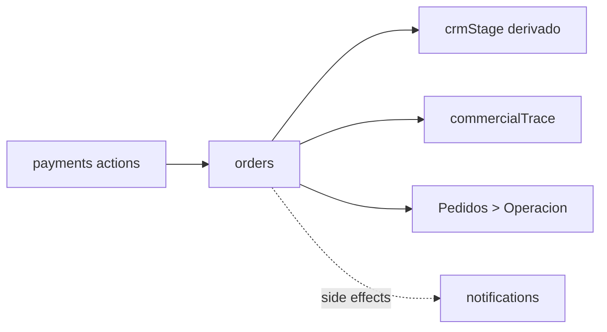

# 03.10 Arquitectura Canonica Brownfield CRM Stage Order Follow-Up

Fecha de corte: 2026-05-28.

## Objetivo

Fijar la frontera canonica del seguimiento operativo derivado del pedido
dentro de `orders`, consolidando ownership, invariantes de derivacion de
`crmStage`, semantica de `commercialTrace` y limites del tab
`Pedidos > Operacion` sin convertir el slice en CRM manual ni absorber
fulfillment, dispatch o notifications como ownership principal.

## Fuentes consolidadas

- `docs/product/roles-and-permissions.md`
- `docs/product/roadmap.md`
- `docs/product/requirements-impact-plan-2026-03.md`
- `docs/architecture/modules.md`
- `apps/admin/app/pedidos/page.tsx`
- `apps/admin/components/orders-workspace.tsx`
- `apps/api/src/modules/orders/orders.service.ts`
- `packages/shared/src/domain/admin-access.ts`
- `packages/shared/src/domain/enums.ts`
- `packages/shared/src/types/api.ts`
- `apps/api/test/erp-sales-flow.test.ts`

## Estado Brownfield Actual

El runtime del seguimiento comercial derivado del pedido ya opera dentro del
monolito modular vigente:

- `orders` ya persiste `crmStage` y `commercialTrace` como parte del pedido;
- `resolveInitialCrmStage()` y `resolveOperationalCrmStage()` ya derivan la
  etapa CRM desde `orderStatus` y `paymentStatus`;
- `resolveCommercialTrace()` y `syncCommercialTrace()` ya consolidan la ruta
  comercial visible del pedido;
- la confirmacion manual directa, la aprobacion/rechazo de solicitud manual,
  la conciliacion Openpay desde backoffice y la confirmacion del provider ya
  dejan rutas comerciales diferentes en el runtime;
- `Pedidos > Operacion` ya expone `SummaryTile` de `Etapa CRM`,
  `Seguimiento`, `OperationGuideCard` y `CommercialTraceCard`;
- las pruebas de `erp-sales-flow` ya cubren rutas como `manual_direct`,
  `manual_request`, `openpay_backoffice` y `openpay_provider`.

La tension brownfield principal es no mezclar en este slice:

- el seguimiento operativo derivado del pedido;
- el puente comercial de confirmacion o rechazo;
- y los side effects tecnicos de notificacion que ocurren alrededor de ese
  flujo.

## Decision Arquitectonica Del Slice

El slice se canoniza dentro de `orders` como una frontera funcional
acotada entre derivacion de etapa, traza comercial y side effects
secundarios:

| Frontera | Papel canonico | No abarca | Superficies |
| --- | --- | --- | --- |
| `orders` | agregado principal del slice; gobierna `crmStage`, `commercialTrace` y el lifecycle derivado del seguimiento | CRM manual, customers, fulfillment, dispatch | `apps/api` + `Pedidos > Operacion` |
| `Pedidos > Operacion` | superficie visible principal para leer etapa, seguimiento y traza comercial | timeline CRM completo, tablero global, ownership de despacho | `apps/admin` |
| `payments` | frontera que dispara confirmacion o rechazo comercial | ownership del seguimiento posterior | `apps/api` + acciones backoffice |
| `notifications` | side effect tecnico secundario de confirmaciones y rechazos | ownership funcional del slice | `apps/api` |

## Agregado Canonico Del Slice

El slice se canoniza como una extension operativa del pedido:

| Componente | Regla canonica | Observacion brownfield |
| --- | --- | --- |
| `crmStage` | estado derivado del pedido | no es editable manualmente |
| `commercialTrace` | puente comercial que resume ruta e hito | no es timeline CRM completo |
| `CommercialTraceCard` | visualizacion canonica del puente comercial | ya existe en `Pedidos > Operacion` |
| `OperationGuideCard` | lectura contextual de la ruta de cobro actual | complementa la operacion, no redefine ownership |
| `confirmedAt` | hito fuerte de confirmacion comercial | alimenta parte de la lectura operativa |

## Invariantes Canonicos

1. `orders` es el agregado principal del slice.
2. `crmStage` es derivado y no se edita manualmente.
3. `crmStage` solo usa `ready_for_followup`, `followup` y `closed`.
4. `commercialTrace` explica la ruta y el hito comercial del pedido.
5. `commercialTrace` usa `manual_direct`, `manual_request`,
   `openpay_backoffice` y `openpay_provider`.
6. `commercialTrace` usa `pending`, `confirmed` y `rejected`.
7. `commercialTrace.pending` forma parte del runtime canonico.
8. `Ventas` es owner operativo principal del seguimiento.
9. `OperadorPagos` solo empuja transiciones de cobro y conciliacion.
10. Si el pedido cae, se cancela o el pago falla/rechaza, `crmStage` se
    limpia y `commercialTrace` conserva el cierre comercial.
11. `notifications` solo aparece como side effect tecnico secundario.

## Boundary De Etapa, Traza Y Side Effects

La frontera funcional del slice queda documentada como un ownership fuerte de
`orders` con lectura visible en `Pedidos > Operacion`:

### Etapa CRM derivada

- vive en `orders`
- se calcula por `resolveInitialCrmStage()` y
  `resolveOperationalCrmStage()`
- resume el punto operativo/comercial del pedido

### Traza comercial

- vive en `orders`
- se consolida por `resolveCommercialTrace()` y `syncCommercialTrace()`
- conserva ruta, estado, actor, referencia, nota y evidencia cuando aplica

### Side effects secundarios

- pueden encolar email o registrar eventos de notificacion
- no cambian el ownership del slice
- no convierten a `notifications` en agregado principal

## Modelo De Estados Soportado Y Frontera Funcional Del Slice

### CRM stage

- `ready_for_followup`
- `followup`
- `closed`

### Commercial trace status

- `pending`
- `confirmed`
- `rejected`

### Frontera funcional visible hoy

1. `Pedidos > Operacion` muestra `Etapa CRM`, `Seguimiento`,
   `OperationGuideCard` y `CommercialTraceCard`.
2. Las acciones de cobro y conciliacion actualizan el pedido, no un pipeline
   CRM aparte.
3. El seguimiento se deriva del lifecycle del pedido y de su confirmacion.
4. El slice no abre notas, tareas, timeline comercial ni dashboard separado.

## Riesgos Brownfield Y Controles

| Riesgo | Control canonico |
| --- | --- |
| confundir el slice con CRM manual | fijar `crmStage` como derivado y `commercialTrace` como puente, no como timeline |
| absorber customers dentro del seguimiento | dejar clientes y conflictos fuera del ownership del slice |
| tratar notifications como owner funcional | canonizar notifications solo como side effect secundario |
| mezclar el tab operacion con fulfillment o dispatch | dejar esas herramientas fuera del ownership visible del slice |
| perder evidencia del rechazo cuando el pedido cae | limpiar `crmStage` pero conservar `commercialTrace.rejected` |
| negar la ruta `openpay_provider` aunque el runtime ya la reconoce | canonizar las cuatro rutas comerciales actuales |

## Resultado Esperado De Fase 3

Fase 3 deja listo el lenguaje arquitectonico del slice de seguimiento
derivado del pedido:

- ownership explicito de `orders`, `Ventas` y `OperadorPagos`;
- invariantes claros de `crmStage` y `commercialTrace`;
- frontera documentada entre seguimiento operativo y side effects tecnicos;
- exclusion explicita de CRM manual, customers, fulfillment y dispatch.
