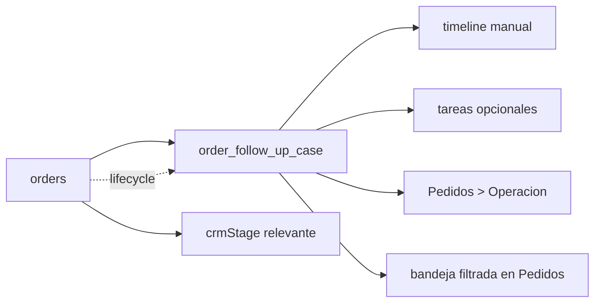

# 03.11 Arquitectura Canonica Brownfield CRM Manual Ampliado

Fecha de corte: 2026-05-28.

## Objetivo

Fijar la frontera canonica del seguimiento manual ampliado sobre pedidos
dentro de `orders`, consolidando ownership, invariantes del
`order_follow_up_case`, timeline manual, tareas opcionales y lifecycle de
cierre o reapertura sin mover el dominio a `customers` ni absorber
campaigns, fulfillment o mensajeria real.

## Fuentes consolidadas

- `docs/product/roles-and-permissions.md`
- `docs/product/roadmap.md`
- `docs/product/requirements-impact-plan-2026-03.md`
- `docs/architecture/modules.md`
- `apps/admin/app/pedidos/page.tsx`
- `apps/admin/components/orders-workspace.tsx`
- `apps/api/src/modules/orders/orders.service.ts`
- `packages/shared/src/domain/admin-access.ts`
- `packages/shared/src/domain/enums.ts`
- `packages/shared/src/types/api.ts`

## Estado Brownfield Actual

El runtime vivo ya soporta seguimiento derivado del pedido dentro de
`orders` y lo expone en `Pedidos > Operacion`, pero todavia no canoniza una
entidad manual explicita para trabajo humano estructurado sobre pedidos ya
elegibles.

El hueco brownfield que este slice cierra es:

- operar un caso manual serio por pedido;
- mantener un timeline humano acotado e inmutable;
- exigir `nextStep` y `followUpAt` como disciplina minima;
- y hacerlo sin abrir CRM por cliente ni bandeja comercial transversal.

La tension principal es no mezclar:

- el lifecycle del pedido y su seguimiento derivado;
- el workbench manual del caso sobre el pedido;
- y otros dominios como `customers`, campaigns o notifications.

## Decision Arquitectonica Del Slice

El slice se canoniza dentro de `orders` como una extension manual del pedido
ya elegible:

| Frontera | Papel canonico | No abarca | Superficies |
| --- | --- | --- | --- |
| `orders` | agregado principal del slice; gobierna `order_follow_up_case` y su lifecycle | CRM por cliente, campaigns, fulfillment, dispatch | `apps/api` + `Pedidos > Operacion` |
| `Pedidos > Operacion` | superficie visible principal del caso manual | dashboard global, CRM transversal, mensajeria real | `apps/admin` |
| bandeja filtrada dentro de `Pedidos` | lectura secundaria de casos abiertos | CRM separado o inbox global | `apps/admin` |
| `notifications` | side effect tecnico eventual si otra capa decide usar eventos | ownership funcional del workbench manual | `apps/api` |

## Agregado Canonico Del Slice

El slice se modela como un agregado manual subordinado al pedido:

| Componente | Regla canonica | Observacion brownfield |
| --- | --- | --- |
| `order_follow_up_case` | un solo caso por pedido | no hay multi-caso en este corte |
| `assignee` | responsable visible del caso | ownership operativo principal sigue en `ventas` |
| `nextStep` | siguiente accion obligatoria mientras el caso este abierto | guardrail de disciplina minima |
| `followUpAt` | fecha objetivo de seguimiento obligatoria mientras el caso este abierto | alimenta bandeja y criterio operativo |
| timeline manual | entradas inmutables por actividad humana | no es chat ni mensajeria real |
| tareas opcionales | checklist editable del caso | no convierte el slice en task manager global |

## Invariantes Canonicos

1. `orders` es el agregado principal del slice.
2. solo existe un `order_follow_up_case` por pedido.
3. el caso solo existe sobre pedidos con `crmStage` relevante.
4. `Ventas` es owner operativo principal del caso.
5. `Marketing` tiene acceso operativo secundario.
6. `nextStep` y `followUpAt` son obligatorios en `open` y
   `waiting_customer`.
7. las entradas del timeline son inmutables.
8. las tareas del caso son opcionales y editables.
9. todo cambio de estado deja `status_change`.
10. `Delivered` y `Completed` resuelven el caso automaticamente.
11. una caida comercial del pedido cancela automaticamente el caso.
12. la reapertura solo procede si el pedido sigue elegible.

## Boundary De Caso Manual, Timeline Y Lifecycle

La frontera funcional del slice queda documentada como ownership fuerte de
`orders` con lectura visible en `Pedidos > Operacion`:

### Caso manual

- vive dentro de `orders`
- se abre explicitamente por `ventas`
- no existe sin pedido ni sin `crmStage` relevante

### Timeline manual

- vive dentro del caso manual
- registra `note`, `call`, `whatsapp`, `email` y `status_change`
- conserva actor, nota y evidencia opcional
- no envía mensajes ni reemplaza otros dominios

### Lifecycle automatico

- depende del pedido
- resuelve o cancela el caso segun el lifecycle comercial u operativo
- mantiene trazabilidad sin borrar historia previa

## Modelo De Estados Soportado Y Frontera Funcional Del Slice

### Estado del caso manual

- `open`
- `waiting_customer`
- `resolved`
- `cancelled`

### Tipos de timeline

- `note`
- `call`
- `whatsapp`
- `email`
- `status_change`

### Estado de tareas

- `pending`
- `done`

### Frontera funcional visible hoy

1. `Pedidos > Operacion` sigue siendo el detalle principal del pedido.
2. El caso manual se monta como extension del pedido, no como vista paralela.
3. La bandeja secundaria vive dentro del modulo de `Pedidos`.
4. El slice no abre timeline por cliente, dashboards ni mensajeria real.

## Riesgos Brownfield Y Controles

| Riesgo | Control canonico |
| --- | --- |
| mover el workbench manual a `customers` | fijar el caso dentro de `orders` |
| abrir mas de un caso por pedido | canonizar un solo caso por pedido |
| degradar el caso a libreta de notas | exigir `nextStep` y `followUpAt` mientras este abierto |
| permitir historia mutable del seguimiento | dejar timeline inmutable |
| mezclar el slice con campaigns o notifications | fijar esos dominios fuera del ownership principal |
| abrir una app separada de CRM manual | defender `Pedidos > Operacion` y la bandeja secundaria dentro de `Pedidos` |

## Resultado Esperado De Fase 3

Fase 3 deja listo el lenguaje arquitectonico del slice manual sobre pedidos:

- ownership explicito de `orders`, `Ventas` y `Marketing`;
- invariantes claros de `order_follow_up_case`, timeline y tareas;
- frontera documentada entre seguimiento derivado y seguimiento manual;
- exclusion explicita de CRM por cliente, campaigns, fulfillment y
  mensajeria real.
