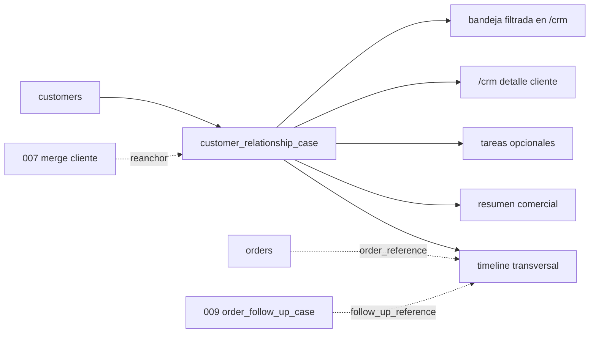

# 03.12 Arquitectura Canonica Brownfield CRM Transversal Por Cliente

Fecha de corte: 2026-05-28.

## Objetivo

Fijar la frontera canonica del workbench comercial transversal sobre
cliente canonico dentro de `customers` y `/crm`, consolidando ownership,
invariantes del `customer_relationship_case`, timeline transversal,
clasificacion comercial, origen canonico y reglas de merge o reapertura sin
mover el dominio a `orders` ni absorber campaigns, scoring o mensajeria
real.

## Fuentes consolidadas

- `docs/product/roles-and-permissions.md`
- `docs/product/roadmap.md`
- `docs/product/requirements-impact-plan-2026-03.md`
- `docs/architecture/modules.md`
- `apps/admin/app/crm/page.tsx`
- `apps/admin/components/crm-workspace.tsx`
- `apps/api/src/modules/customers/customers.controller.ts`
- `apps/api/src/modules/customers/customers.service.ts`
- `packages/shared/src/domain/admin-access.ts`
- `packages/shared/src/types/api.ts`

## Estado Brownfield Actual

El runtime vivo ya soporta detalle de cliente, direcciones, pedidos
recientes, conflictos de identidad y merge operativo dentro de `/crm`, pero
todavia no canoniza una entidad transversal explicita para trabajo comercial
activo sobre el cliente canonico.

El hueco brownfield que este slice cierra es:

- operar una relacion comercial activa sobre cliente canonico;
- distinguir `commercialOwner` de `assignee`;
- mantener timeline manual con referencias read-only a pedidos y a `009`;
- y hacerlo sin mezclar identidad, seguimiento por pedido, campaigns o
  pipeline amplio.

La tension principal es no mezclar:

- la identidad y el merge de `007`;
- el seguimiento manual por pedido de `009`;
- y el nuevo workbench comercial transversal sobre cliente.

## Decision Arquitectonica Del Slice

El slice se canoniza dentro de `customers` como extension comercial activa
del cliente canonico:

| Frontera | Papel canonico | No abarca | Superficies |
| --- | --- | --- | --- |
| `customers` | dominio ancla del slice; gobierna `customer_relationship_case` | seguimiento manual por pedido, campaigns, scoring | `apps/api` + `/crm` |
| `/crm` detalle de cliente | superficie visible principal del caso transversal | pipeline separado, app distinta, mensajeria real | `apps/admin` |
| bandeja filtrada dentro de `/crm` | lectura secundaria de clientes con seguimiento activo | dashboard global, inbox comercial | `apps/admin` |
| `orders` y `009` | contexto read-only del cliente | ownership funcional del caso transversal | `apps/api` + `apps/admin` |

## Agregado Canonico Del Slice

El slice se modela como un agregado comercial subordinado al cliente:

| Componente | Regla canonica | Observacion brownfield |
| --- | --- | --- |
| `customer_relationship_case` | un solo caso por cliente canonico | no hay multi-caso activo en este corte |
| `commercialOwner` | owner estable de la relacion comercial | distinto de `assignee` |
| `assignee` | responsable operativo del siguiente movimiento | puede cambiar sin cambiar el owner comercial |
| `classification` | lectura comercial simple del cliente | vive en `010`, no en `007` |
| `origin` | motivo canonico de apertura del caso | evita caja negra de notas |
| timeline transversal | entradas manuales inmutables + referencias automaticas | no duplica toda la historia de pedidos |
| tareas opcionales | checklist editable de apoyo | no convierte el slice en task manager global |

## Invariantes Canonicos

1. `customers` es el dominio ancla del slice.
2. solo existe un `customer_relationship_case` por cliente canonico.
3. el caso solo vive cuando hay trabajo comercial activo.
4. el caso puede existir aunque todavia no haya pedidos.
5. `Ventas` es owner operativo principal del caso.
6. `Marketing` tiene acceso operativo secundario.
7. `commercialOwner` y `assignee` son distintos.
8. `nextStep` y `followUpAt` son obligatorios en `open` y
   `waiting_customer`.
9. las entradas del timeline son inmutables.
10. las tareas del caso son opcionales y editables.
11. `classification` vive en este slice y es manual.
12. `origin` explica por que existe el caso.
13. `order_reference` y `follow_up_reference` son automaticos y read-only.
14. el merge de `007` reancla el caso al cliente canonico destino.
15. no pueden quedar dos casos activos para el mismo cliente canonico.

## Boundary De Caso, Timeline Y Referencias

La frontera funcional del slice queda documentada como ownership fuerte de
`customers` con lectura visible en `/crm`:

### Caso transversal

- vive sobre el cliente canonico
- se abre explicitamente por `ventas` o `marketing`
- no existe automaticamente para todos los clientes

### Timeline transversal

- vive dentro del caso transversal
- registra `note`, `call`, `whatsapp`, `email` y `status_change`
- conserva actor, nota y evidencia opcional
- recibe `order_reference` y `follow_up_reference` como contexto automatico

### Referencias read-only

- vienen de pedidos y de casos `009`
- no transfieren ownership al slice transversal
- no reescriben historia transaccional ni timeline de pedido

## Modelo De Estados Soportado Y Frontera Funcional Del Slice

### Estado del caso transversal

- `open`
- `waiting_customer`
- `dormant`
- `resolved`

### Tipos de timeline

- `note`
- `call`
- `whatsapp`
- `email`
- `status_change`
- `order_reference`
- `follow_up_reference`

### Clasificacion comercial

- `prospect`
- `active`
- `inactive`
- `key_account`

### Origen del caso

- `manual_outreach`
- `post_sale_followup`
- `reactivation`
- `service_issue`

### Estado de tareas

- `pending`
- `done`

### Frontera funcional visible hoy

1. `/crm` sigue siendo el detalle principal del cliente.
2. El caso transversal se monta como extension del cliente, no como app
   paralela.
3. La bandeja secundaria vive dentro del modulo `/crm`.
4. El slice no abre campaigns, scoring ni pipeline comercial amplio.

## Riesgos Brownfield Y Controles

| Riesgo | Control canonico |
| --- | --- |
| mover la clasificacion comercial a `007` | fijarla dentro de `customer_relationship_case` |
| mover el workbench transversal a `orders` | mantener el agregado en `customers` |
| dejar dos casos activos tras un merge | reanclar al cliente destino y prohibir duplicidad |
| duplicar toda la historia transaccional del cliente | mantener referencias read-only |
| abrir una UI paralela de CRM comercial | fijar `/crm` como superficie principal |
| mezclar este slice con campaigns o scoring | mantenerlos fuera del ownership principal |

## Resultado Esperado De Fase 3

Fase 3 deja listo el lenguaje arquitectonico del slice transversal por
cliente:

- ownership explicito de `customers`, `Ventas` y `Marketing`;
- invariantes claros de `customer_relationship_case`, timeline y tareas;
- frontera documentada entre identidad canonica, seguimiento por pedido y
  relacion comercial transversal;
- exclusion explicita de campaigns, scoring, pipeline amplio y mensajeria
  real.
