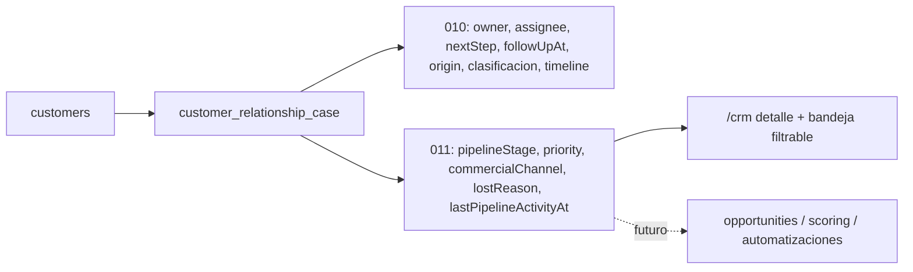

# 03.13 Arquitectura Canonica Brownfield Pipeline Comercial Amplio

Fecha de corte: 2026-05-29.

## Objetivo

Fijar la frontera canonica del pipeline comercial amplio como capa manual
sobre `customer_relationship_case` dentro de `customers` y `/crm`,
ampliando el workbench definido en `010` con `pipelineStage`, `priority`,
`commercialChannel`, `lostReason`, `lastPipelineActivityAt` y cierres
de ciclo comercial `won` o `lost` sin abrir `commercial_opportunity`,
scoring ni
automatizaciones comerciales.

## Fuentes consolidadas

- `docs/product/roles-and-permissions.md`
- `docs/product/roadmap.md`
- `docs/product/requirements-impact-plan-2026-03.md`
- `docs/architecture/modules.md`
- `docs/fase-3-arquitectura/03.12-crm-transversal-por-cliente.md`
- `docs/fase-3-arquitectura/adr/ADR-010-customers-crm-transversal-boundary.md`
- `apps/admin/app/crm/page.tsx`
- `apps/admin/components/crm-workspace.tsx`
- `apps/api/src/modules/customers/customers.controller.ts`
- `apps/api/src/modules/customers/customers.service.ts`
- `packages/shared/src/domain/admin-access.ts`
- `packages/shared/src/types/api.ts`

## Estado Brownfield Actual

El runtime vigente ya tiene el cliente canonico dentro de `/crm`, el merge
de identidad en `007`, el seguimiento manual por pedido en `009` y el caso
transversal por cliente fijado en `010`, pero todavia no canoniza el
lenguaje de pipeline comercial amplio sobre ese mismo caso.

El hueco brownfield que este slice cierra es:

- ordenar la operacion comercial activa por etapa amplia del caso;
- priorizar una cola comercial real sin inventar otra entidad;
- distinguir el canal principal del caso de la historia puntual del
  timeline;
- y cerrar un ciclo comercial como `won` o `lost` sin clausurar la
  relacion completa del cliente ni mezclarlo con forecast, scoring u
  oportunidades complejas.

La tension principal es no mezclar:

- la base transversal de `010`;
- el pipeline amplio manual que abre `011`;
- y las capacidades futuras de `commercial_opportunity`, scoring o
  automatizaciones posteriores.

## Decision Arquitectonica Del Slice

El slice se canoniza como una ampliacion del caso transversal ya aprobado
en `010`:

| Frontera | Papel canonico | No abarca | Superficies |
| --- | --- | --- | --- |
| `customers` | dominio ancla del pipeline amplio; extiende `customer_relationship_case` | `commercial_opportunity`, scoring, automatizaciones | `apps/api` + `/crm` |
| `/crm` detalle de cliente | superficie principal del pipeline sobre el mismo caso | CRM separado, ruta nueva, modulo paralelo | `apps/admin` |
| bandeja filtrada dentro de `/crm` | lectura secundaria de cola comercial por owner, assignee, etapa y prioridad | kanban complejo, dashboard nuevo, drag and drop | `apps/admin` |
| slice `010` | base del caso transversal: existencia del caso, `commercialOwner`, `assignee`, `nextStep`, `followUpAt`, `origin`, clasificacion y timeline base | `pipelineStage`, `priority`, `commercialChannel`, `lostReason`, `lastPipelineActivityAt` y cierre de ciclo `won` o `lost` | Fase 3 + runtime actual |
| slice `011` | capa de pipeline amplio sobre el mismo caso: agrega `pipelineStage`, `priority`, `commercialChannel`, `lostReason`, `lastPipelineActivityAt` y cierre de ciclo `won` o `lost` | `commercial_opportunity`, forecast, scoring, automatizaciones y multi-entidad comercial | Fase 3 + `/crm` |
| slices futuros | oportunidades, scoring y automatizaciones posteriores | ownership del pipeline amplio actual | ADR y corte especifico futuro |

## Agregado Canonico Del Slice

El agregado principal del slice sigue siendo el mismo caso comercial del
cliente:

| Componente | Regla canonica | Observacion brownfield |
| --- | --- | --- |
| `customer_relationship_case` | sigue siendo el agregado principal | `011` no crea una entidad paralela |
| `commercialOwner` | owner estable heredado de `010` | no cambia de dominio ni de nombre |
| `assignee` | responsable operativo del siguiente movimiento | sigue separado del owner comercial |
| `origin` | motivo u origen canonico de apertura del caso | dato heredado de `010`, estable salvo correccion excepcional |
| `status` | eje operativo heredado de `010` | no se fusiona con `pipelineStage` |
| `pipelineStage` | etapa comercial manual y no nula | vive sobre el mismo caso |
| `priority` | prioridad manual de la cola comercial | prepara orden operativo antes de scoring |
| `commercialChannel` | canal principal del ciclo comercial activo | amplifica el caso, no reemplaza `origin` y es corregible por decision operativa explicita |
| `lostReason` | motivo obligatorio al pasar a `lost` | se conserva en la traza historica |
| `lastPipelineActivityAt` | resumen de actividad comercial reciente | no reemplaza `followUpAt` |
| cierre `won` y `lost` | semantica manual de cierre de un ciclo comercial | no equivale a cierre tecnico automatico ni a cierre total de la relacion del cliente |

## Invariantes Canonicos

1. `customers` sigue siendo el dominio ancla del slice.
2. solo existe un `customer_relationship_case` por cliente canonico.
3. `011` amplía el caso de `010`; no lo reemplaza ni lo duplica.
4. el pipeline amplio vive sobre el mismo caso y se opera dentro de `/crm`.
5. `commercialOwner` sigue siendo el owner estable de la relacion.
6. `assignee` sigue siendo el responsable operativo del siguiente
   movimiento.
7. `status` y `pipelineStage` son ejes distintos del mismo caso.
8. `pipelineStage` es manual, no nulo y deja trazabilidad obligatoria al
   cambiar.
9. `won` y `lost` cierran solo un ciclo comercial dentro de
   `customer_relationship_case`; no clausuran por si solos la relacion
   completa del cliente.
10. mientras el caso siga en `open` o `waiting_customer`, `nextStep` y
    `followUpAt` siguen siendo obligatorios aunque el ciclo vigente haya
    quedado en `won` o `lost`.
11. mover el caso a `dormant` o `resolved` indica que ya no existe trabajo
    operativo inmediato y libera la obligacion activa de `nextStep` y
    `followUpAt` heredada de `010`.
12. `origin` sigue explicando por que existe el caso y debe permanecer
    estable salvo correccion excepcional del dato de apertura.
13. `commercialChannel` representa el canal principal del ciclo comercial
    activo; no crea subpipelines por canal y solo se corrige por decision
    operativa explicita.
14. `followUpAt` sigue siendo la unica fecha objetivo operativa del caso.
15. `lastPipelineActivityAt` resume actividad reciente del pipeline y no
    abre una agenda paralela.
16. pasar a `lost` exige `lostReason`.
17. pasar a `won` exige nota de cierre y evidencia o referencia.
18. el slice no abre `commercial_opportunity`, forecast, probabilidad,
    scoring ni automatizaciones comerciales.
19. la bandeja comercial de `011` sigue siendo tabla o lista filtrable,
    no kanban complejo.

## Boundary De Pipeline, Estado Y Cola Comercial

### Pipeline amplio sobre el caso transversal

- vive sobre `customer_relationship_case`
- reutiliza `commercialOwner`, `assignee`, `nextStep` y `followUpAt`
- agrega `pipelineStage`, `priority`, `commercialChannel`,
  `lostReason` y `lastPipelineActivityAt`
- mantiene el mismo timeline transversal como traza inmutable del caso
- cierra ciclos comerciales del mismo caso con `won` o `lost` sin cerrar
  por si solo la relacion completa del cliente

### `origin` vs `commercialChannel`

- `origin` viene heredado de `010` y explica por que se abrio
  `customer_relationship_case`
- `origin` es estable a traves de los ciclos comerciales del caso y solo
  debe corregirse si el motivo de apertura original fue capturado mal
- `commercialChannel` es agregado por `011` y expresa el canal principal
  con el que se opera el ciclo comercial activo
- `commercialChannel` no reemplaza ni renombra `origin`
- `commercialChannel` puede corregirse por decision operativa explicita si
  el canal principal vigente fue mal clasificado o cambia materialmente al
  abrir un nuevo ciclo dentro del mismo caso

### Estado operativo y etapa comercial

`010` sigue gobernando el estado operativo del caso:

- `open`
- `waiting_customer`
- `dormant`
- `resolved`

`011` agrega una dimension comercial distinta del mismo caso:

- `new`
- `contacted`
- `engaged`
- `nurturing`
- `won`
- `lost`

Reglas de convivencia:

- cambiar `pipelineStage` no cambia automaticamente `status`
- `won` y `lost` son cierres comerciales de un ciclo del pipeline, no
  cierres tecnicos del caso ni de la relacion completa del cliente
- la reapertura desde `lost` devuelve `pipelineStage` a `contacted`,
  limpia el `lostReason` vigente del estado actual y conserva la traza del
  cierre anterior
- tras `won` o `lost`, el sistema puede sugerir cambios en `status`, pero
  no imponerlos por su cuenta

### Regla canonica de cierre de ciclo y `status`

- `pipelineStage = won` puede convivir con `status = open` o
  `waiting_customer` si el caso sigue activo por trabajo posterior al
  cierre comercial, como handoff, evidencia pendiente o coordinacion de la
  relacion; en ese escenario `nextStep` y `followUpAt` siguen siendo
  obligatorios
- `pipelineStage = lost` puede convivir con `status = open` o
  `waiting_customer` solo si existe un movimiento activo inmediato del caso,
  como reactivacion, aclaracion final o cierre operativo pendiente; en ese
  escenario `lostReason`, `nextStep` y `followUpAt` siguen siendo
  obligatorios
- tras `won`, se sugiere `status = resolved` cuando ya no queda trabajo
  operativo inmediato sobre el caso
- tras `lost`, se sugiere `status = dormant` cuando el ciclo termino pero
  podria existir reactivacion futura sin trabajo inmediato, y se sugiere
  `status = resolved` cuando no queda trabajo pendiente ni expectativa
  concreta de reactivacion
- pasar el caso a `dormant` o `resolved` indica que el ciclo ya no exige
  `nextStep` ni `followUpAt` activos hasta una eventual reapertura
- mientras no exista `commercial_opportunity`, varios ciclos comerciales
  sucesivos del mismo cliente siguen trazados sobre un unico
  `customer_relationship_case`

### Cola comercial dentro de `/crm`

La lectura secundaria del slice sigue dentro del mismo modulo `/crm` y se
opera como tabla o lista filtrable por:

- `commercialOwner`
- `assignee`
- `pipelineStage`
- `priority`
- `commercialChannel`
- `status`
- `followUpAt`
- `lastPipelineActivityAt`

Ademas, la bandeja debe permitir vistas de:

- pendientes de hoy
- vencidos

## Frontera Explicita Con `010` Y Con Slices Futuros

| Corte | Si resuelve | No abre |
| --- | --- | --- |
| `010-crm-transversal-por-cliente` | existencia del `customer_relationship_case`, `commercialOwner`, `assignee`, `nextStep`, `followUpAt`, `origin`, clasificacion y timeline transversal | `pipelineStage`, `priority`, `commercialChannel`, `lostReason`, `lastPipelineActivityAt`, cierres `won` y `lost` |
| `011-pipeline-comercial-amplio` | `pipelineStage`, `priority`, `commercialChannel`, `lostReason`, `lastPipelineActivityAt` y cierre manual de ciclos `won` o `lost` sobre el mismo caso | `commercial_opportunity`, forecast, monto esperado, probabilidad, scoring, automatizaciones, kanban complejo |
| slices futuros | oportunidades complejas, scoring, automatizaciones y otras lecturas derivadas si negocio las aprueba | reescribir el dominio ancla de `customers` o sacar el pipeline amplio de `/crm` sin una nueva ADR |

En otras palabras:

- `010` fija el workbench comercial transversal del cliente.
- `011` fija el pipeline comercial amplio y sus ciclos `won` o `lost`
  sobre ese mismo workbench.
- futuras oportunidades, scoring o automatizaciones requieren un corte
  nuevo, no una extension informal de `011`.

## Riesgos Brownfield Y Controles

| Riesgo | Control canonico |
| --- | --- |
| abrir `commercial_opportunity` antes de tiempo | mantener el pipeline sobre `customer_relationship_case` |
| convertir `status` en unica etapa comercial | preservar `status` y `pipelineStage` como ejes separados |
| duplicar agenda con otra fecha comercial | mantener `followUpAt` como unica fecha objetivo y usar `lastPipelineActivityAt` solo como resumen |
| partir el pipeline por canal | filtrar por `commercialChannel` en un pipeline unificado |
| sacar la cola comercial de `/crm` | fijar detalle y bandeja dentro del mismo modulo |
| mezclar `011` con scoring o automatizaciones | dejar esas capacidades para slices posteriores con ADR propia |

## Resultado Esperado De Fase 3

Fase 3 deja listo el lenguaje arquitectonico del pipeline comercial amplio:

- `customers` y `/crm` quedan fijados como frontera canonica del slice;
- `customer_relationship_case` queda confirmado como agregado principal;
- `pipelineStage`, `priority`, `commercialChannel`, `lostReason` y
  `lastPipelineActivityAt` quedan documentados como ampliaciones de `011`;
- la frontera con `010` y con futuros slices de opportunities, scoring y
  automatizaciones queda explicita.
