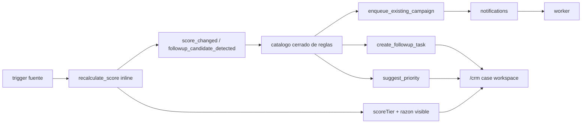

# 03.14 Arquitectura Canonica Brownfield Scoring Y Automatizaciones Comerciales

Fecha de corte: 2026-05-29.

## Objetivo

Fijar la frontera canonica del scoring determinista y de las automatizaciones
comerciales simples como capa derivada sobre `customer_relationship_case`
dentro de `customers` y `/crm`, extendiendo el workbench aprobado en `010` y
`011` con `scoreTier`, razon visible, eventos y reglas simples sin abrir
`commercial_opportunity`, journeys, IA opaca ni mutaciones automaticas de
`pipelineStage` o `status`.

## Fuentes consolidadas

- `docs/product/roles-and-permissions.md`
- `docs/product/roadmap.md`
- `docs/product/requirements-impact-plan-2026-03.md`
- `docs/architecture/modules.md`
- `docs/fase-3-arquitectura/03.08-campaigns-marketing-automation.md`
- `docs/fase-3-arquitectura/03.12-crm-transversal-por-cliente.md`
- `docs/fase-3-arquitectura/03.13-pipeline-comercial-amplio.md`
- `docs/fase-3-arquitectura/adr/ADR-006-campaigns-dispatch-boundary.md`
- `docs/fase-3-arquitectura/adr/ADR-010-customers-crm-transversal-boundary.md`
- `docs/fase-3-arquitectura/adr/ADR-011-customers-commercial-pipeline-boundary.md`
- `apps/admin/app/crm/page.tsx`
- `apps/admin/components/crm-workspace.tsx`
- `apps/api/src/modules/customers/customers.controller.ts`
- `apps/api/src/modules/customers/customers.service.ts`
- `apps/api/src/modules/marketing/marketing.service.ts`
- `apps/api/src/modules/notifications/notifications.service.ts`
- `apps/worker/src/main.ts`
- `packages/shared/src/domain/admin-access.ts`
- `packages/shared/src/types/api.ts`

## Estado Brownfield Actual

El runtime vigente ya soporta el cliente canonico en `/crm`, el
`customer_relationship_case` transversal de `010`, el pipeline amplio manual de
`011` y la frontera de campaigns/dispatch documentada en `006`, pero todavia no
canoniza una capa derivada y auditada de scoring comercial ni un catalogo
cerrado de reglas simples sobre el mismo caso.

El hueco brownfield que este slice cierra es:

- priorizar mejor la operacion comercial del caso con un tier visible y una
  razon corta;
- reaccionar a eventos fuente y derivados sin abrir un engine libre;
- ejecutar side effects simples, reversibles e idempotentes;
- y conservar la frontera donde `customers` gobierna el caso, `marketing`
  gobierna las reglas y `notifications/worker` solo ejecutan dispatch real
  cuando aplica.

La tension principal es no mezclar:

- el workbench base de `010`;
- el pipeline manual de `011`;
- la frontera de campaigns de `006`;
- y futuras oportunidades, scoring mas avanzado o journeys amplios.

## Decision Arquitectonica Del Slice

El slice se canoniza como capa derivada sobre el mismo caso comercial ya
aprobado:

| Frontera | Papel canonico | No abarca | Superficies |
| --- | --- | --- | --- |
| `customers` | dominio ancla del score y de la traza de automatizaciones sobre `customer_relationship_case` | `commercial_opportunity`, rule builder libre, journeys | `apps/api` + `/crm` |
| `/crm` detalle y bandeja | superficie visible del tier, razon, sugerencias y efectos simples | consola nueva, debug tecnico crudo, pipeline auto-movido | `apps/admin` |
| `marketing` | owner operativo del catalogo cerrado de reglas | ownership del caso, cierre de pipeline, dispatch directo | `apps/api` + backoffice |
| `notifications` + `worker` | frontera de cola y ejecucion real para side effects asincronos o campaigns encoladas | scoring, ownership del caso, authoring de campaigns | `apps/api` + `apps/worker` |
| slice `006` | catalogo de campaigns existentes y frontera de dispatch | authoring desde `/crm`, journeys sobre campañas | Fase 3 + runtime actual |
| slice `011` | `pipelineStage`, `priority`, `commercialChannel`, `status` y cierre manual del pipeline | score derivado y automatizacion simple | Fase 3 + `/crm` |

## Agregado Canonico Del Slice

El agregado principal sigue siendo el mismo caso comercial del cliente:

| Componente | Regla canonica | Observacion brownfield |
| --- | --- | --- |
| `customer_relationship_case` | sigue siendo el agregado principal | `012` no crea entidad comercial paralela |
| `scoreTier` | lectura derivada visible del caso | solo `cold`, `warm`, `hot` |
| puntaje interno | mecanismo tecnico de calculo | no se expone en UI principal |
| razon visible | explicacion corta del score | no expone formulas ni debug tecnico |
| triggers fuente | eventos brownfield que disparan recalculo o reglas | siguen siendo finitos y cerrados |
| eventos derivados | `score_changed` y `followup_candidate_detected` | no abren event engine amplio |
| catalogo de reglas | reglas simples con `active/inactive`, `order`, `cooldown`, filtros y accion | cerrado, no builder libre |
| side effects | sugerencias o acciones simples auditables | viven sobre el mismo caso |

## Invariantes Canonicos

1. `customers` sigue siendo el dominio ancla del slice.
2. `customer_relationship_case` sigue siendo el unico agregado comercial activo
   por cliente canonico.
3. `012` extiende `010` y `011`; no los reemplaza.
4. el score es determinista, auditable y read-only.
5. la UI principal solo expone `scoreTier` y una razon corta.
6. el puntaje interno no se muestra en `/crm`.
7. el score se recalcula por eventos; no por override manual.
8. las reglas del slice viven en un catalogo cerrado y predefinido.
9. cada regla tiene `active/inactive`, `order`, `cooldown`, trigger, filtros y
   accion.
10. la deduplicacion base usa
    `ruleId + customerRelationshipCaseId + actionType`.
11. bloquear un side effect por deduplicacion o `cooldown` no impide recalcular
    el score cuando corresponde.
12. las automatizaciones simples no cambian `pipelineStage`.
13. las automatizaciones simples no cambian `status`.
14. las automatizaciones simples no cambian `commercialOwner` ni `assignee`.
15. `priority` puede ser sugerida, pero no escrita automaticamente.
16. las tareas automaticas viven sobre el mismo caso transversal del cliente.
17. `enqueue_existing_campaign` solo reutiliza campaigns ya existentes del
    slice `006`.
18. el dispatch real sigue viviendo en `notifications/worker`.
19. el slice no abre `commercial_opportunity`, forecast, IA opaca ni journeys
    multi-step.

## Boundary De Score, Reglas Y Side Effects

### Score comercial derivado

- vive sobre `customer_relationship_case`
- usa triggers fuente finitos y eventos derivados simples
- recalcula de forma inline al procesar el evento
- expone `scoreTier` y razon visible
- no reemplaza `priority`, `pipelineStage`, `status` ni `followUpAt`

### Catalogo cerrado de reglas

- lo gobierna `marketing`
- cada regla es activable o inactivable
- cada regla tiene `order` de evaluacion determinista
- cada regla define `cooldown`
- cada regla aplica filtros simples del mismo caso:
  - `commercialChannel`
  - `pipelineStage`
  - `scoreTier`
  - `status`
- cada regla ejecuta solo acciones del catalogo permitido

### Acciones permitidas

- `recalculate_score`
- `suggest_priority`
- `create_followup_task`
- `enqueue_existing_campaign`

Reglas:

- `followup_candidate_detected` es evento derivado, no accion
- `suggest_priority` no escribe `priority` automaticamente
- `create_followup_task` opera sobre el caso transversal del cliente
- `enqueue_existing_campaign` usa la frontera ya aprobada en `006`

### Side effects asincronos

- se ejecutan por `worker` cuando requieren cola o dispatch
- deben dejar traza de ejecucion, omision o bloqueo
- siguen deduplicacion base y `cooldown`
- no deben abrir un ciclo comercial nuevo ni mutar el ownership del caso

## Eventos Canonicos Del Slice

### Triggers fuente

- `pipeline_stage_changed`
- `followup_due`
- `followup_overdue`
- `order_confirmed`
- `payment_confirmed`
- `case_reopened`

### Eventos derivados

- `score_changed`
- `followup_candidate_detected`

## Frontera Explicita Con `006`, `010` Y `011`

| Corte | Si resuelve | No abre |
| --- | --- | --- |
| `006-campaigns-marketing-automation` | campaigns simples, templates, segments y frontera `marketing -> notifications -> worker` | authoring desde `/crm`, scoring sobre caso |
| `010-crm-transversal-por-cliente` | existencia del caso, owner estable, assignee, next step, follow-up, timeline y tareas manuales | score derivado, reglas simples, side effects automatizados |
| `011-pipeline-comercial-amplio` | `pipelineStage`, `priority`, `commercialChannel`, `status`, `won/lost` y cola manual | score, eventos derivados y automatizaciones simples |
| `012-scoring-y-automatizaciones-comerciales` | score derivado, razon visible, reglas cerradas, eventos simples, sugerencias y side effects seguros | opportunities, journeys, IA opaca, cambio automatico de pipeline o status |

En otras palabras:

- `010` fija el workbench comercial transversal.
- `011` fija el pipeline manual amplio del mismo caso.
- `012` agrega score y automatizacion simple auditada sobre ese mismo caso.
- cualquier automation suite mayor requiere un slice nuevo.

## Riesgos Brownfield Y Controles

| Riesgo | Control canonico |
| --- | --- |
| abrir un builder libre de reglas demasiado pronto | mantener catalogo cerrado y activable |
| convertir el score en juicio manual opaco | dejarlo read-only y determinista |
| duplicar tareas o campaigns por reintentos | usar deduplicacion base y `cooldown` por regla |
| mover pipeline o status automaticamente | prohibir esas mutaciones desde `012` |
| sacar el consumo del score fuera de `/crm` | fijar detalle y bandeja del caso como superficie principal |
| romper la frontera de `006` | reutilizar solo campaigns existentes y dispatch via `notifications/worker` |

## Resultado Esperado De Fase 3

Fase 3 deja listo el lenguaje arquitectonico del scoring y las automatizaciones
simples:

- `customers` y `/crm` quedan fijados como frontera del score visible y de sus
  efectos;
- `marketing` queda fijado como owner del catalogo cerrado de reglas;
- `notifications/worker` quedan acotados a side effects asincronos y dispatch
  real;
- la separacion con `010`, `011`, `006` y con futuros journeys u
  opportunities queda explicita.
