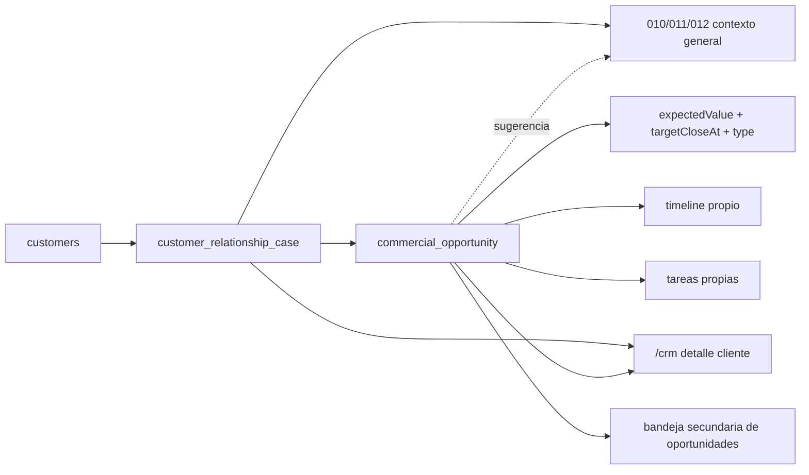

# 03.15 Arquitectura Canonica Brownfield Commercial Opportunities

Fecha de corte: 2026-05-29.

## Objetivo

Fijar la frontera canonica de `commercial_opportunity` como subentidad de
`customer_relationship_case` dentro de `customers` y `/crm`, formalizando la
negociacion concreta con valor esperado, lifecycle propio, referencias,
timeline y tareas puntuales sin reemplazar el caso transversal del cliente ni
abrir forecast, probabilidad o un modulo separado de opportunities.

## Fuentes consolidadas

- `docs/product/roles-and-permissions.md`
- `docs/product/roadmap.md`
- `docs/product/requirements-impact-plan-2026-03.md`
- `docs/architecture/modules.md`
- `docs/fase-3-arquitectura/03.12-crm-transversal-por-cliente.md`
- `docs/fase-3-arquitectura/03.13-pipeline-comercial-amplio.md`
- `docs/fase-3-arquitectura/03.14-scoring-y-automatizaciones-comerciales.md`
- `docs/fase-3-arquitectura/adr/ADR-010-customers-crm-transversal-boundary.md`
- `docs/fase-3-arquitectura/adr/ADR-011-customers-commercial-pipeline-boundary.md`
- `docs/fase-3-arquitectura/adr/ADR-012-customers-scoring-automation-boundary.md`
- `apps/admin/app/crm/page.tsx`
- `apps/admin/components/crm-workspace.tsx`
- `apps/api/src/modules/customers/customers.controller.ts`
- `apps/api/src/modules/customers/customers.service.ts`
- `packages/shared/src/domain/admin-access.ts`
- `packages/shared/src/types/api.ts`

## Estado Brownfield Actual

El runtime vigente ya soporta cliente canonico, `customer_relationship_case`,
pipeline amplio manual y score derivado dentro de `/crm`, pero todavia no
canoniza una unidad puntual de deal para separar la negociacion concreta del
caso general del cliente.

El hueco brownfield que este slice cierra es:

- distinguir relationship management general de deal execution puntual;
- modelar una negociacion concreta con valor esperado sin forecast ni
  probabilidad;
- mantener timeline y tareas propias del deal sin contaminar el timeline
  general del cliente;
- y conservar la frontera donde `customers` sigue gobernando el caso padre,
  mientras la oportunidad vive subordinada a el.

La tension principal es no mezclar:

- el caso transversal de `010`;
- el pipeline amplio de `011`;
- el scoring y las automatizaciones simples de `012`;
- y una futura suite de opportunities mas pesada.

## Decision Arquitectonica Del Slice

El slice se canoniza como extension puntual del caso comercial ya aprobado:

| Frontera | Papel canonico | No abarca | Superficies |
| --- | --- | --- | --- |
| `customers` | dominio ancla de `customer_relationship_case` y de `commercial_opportunity` | modulo separado de deals, forecast, probabilidad | `apps/api` + `/crm` |
| `/crm` detalle del cliente | superficie principal del caso y del deal puntual | app nueva, CRM separado, kanban complejo | `apps/admin` |
| bandeja secundaria de oportunidades | lectura filtrada de deals dentro del mismo modulo | modulo raiz independiente, multiples activas por caso | `apps/admin` |
| slice `010` | workbench transversal del cliente, owner estable, assignee, next step, follow-up, timeline base | negociacion concreta con valor esperado | Fase 3 + runtime actual |
| slice `011` | pipeline amplio del caso, `priority`, `commercialChannel`, cierres `won/lost` del caso | lifecycle puntual del deal | Fase 3 + `/crm` |
| slice `012` | score derivado y automatizaciones simples sobre el caso | apertura automatica de oportunidades o lifecycle del deal | Fase 3 + `/crm` |

## Agregado Canonico Del Slice

El agregado principal del dominio comercial sigue siendo el caso del cliente,
pero ahora con una subentidad puntual:

| Componente | Regla canonica | Observacion brownfield |
| --- | --- | --- |
| `customer_relationship_case` | sigue siendo el agregado comercial raiz | `013` no lo reemplaza |
| `commercial_opportunity` | subentidad del caso | modela un deal puntual |
| oportunidad activa | solo una por caso | se evita deal paralelo ambiguo |
| historico de oportunidades | multiples cerradas permitidas | conserva integridad de ciclos previos |
| `commercialOwner` | se hereda del caso por defecto | puede ajustarse en el deal |
| `assignee` | se hereda del caso por defecto | puede ajustarse en el deal |
| `commercialChannel` | se hereda del caso por defecto | puede corregirse si la negociacion concreta lo exige |
| timeline del deal | separado del timeline general del caso | evita mezclar relationship y negotiation |
| tareas del deal | minimas y propias | no reemplazan tareas del caso |

## Invariantes Canonicos

1. `customers` sigue siendo el dominio ancla del slice.
2. `customer_relationship_case` sigue siendo el agregado comercial principal.
3. `commercial_opportunity` vive subordinada al caso y no como agregado raiz.
4. solo puede existir una oportunidad activa por caso.
5. puede existir historico de oportunidades cerradas.
6. la oportunidad solo se abre si ya existe negociacion concreta con valor
   esperado.
7. la oportunidad puede abrirse manualmente o por conversion explicita desde
   el pipeline del caso.
8. la oportunidad no se abre automaticamente por scoring ni por eventos.
9. el lifecycle del deal es manual por `ventas`.
10. el lifecycle del deal usa `qualified`, `proposal`, `negotiation`, `won`
    y `lost`.
11. `expectedValue`, `currency` y `targetCloseAt` son obligatorios en
    `qualified`, `proposal` y `negotiation`.
12. `won` es cierre estable y no se reabre.
13. `lost` puede reabrirse y vuelve a `negotiation`.
14. el deal puede abrirse sin artefacto fuente obligatorio.
15. el deal puede guardar una referencia principal y referencias secundarias.
16. la oportunidad no usa probabilidad de cierre ni forecast en este corte.
17. abrir una oportunidad solo puede sugerir que el caso padre este al menos
    en `engaged`; no lo mueve automaticamente.

## Boundary Entre Caso Padre Y Deal Puntual

### Caso comercial general

- sigue contando la relacion comercial global con el cliente
- conserva `commercialOwner`, `assignee`, `nextStep`, `followUpAt`,
  `classification`, `origin`, `pipelineStage`, `priority` y score
- sigue siendo la superficie principal de contexto del cliente

### Oportunidad puntual

- modela una negociacion concreta con valor esperado
- tiene lifecycle propio
- tiene timeline propio
- tiene tareas propias minimas
- puede ajustar owner, assignee y canal si el deal concreto lo requiere

### Relacion suave con el pipeline del caso

- abrir la oportunidad puede sugerir que el caso este al menos en `engaged`
- la oportunidad `won` puede cerrar tambien el ciclo comercial general del
  caso
- la oportunidad `lost` no tumba automaticamente el caso padre
- el caso padre conserva la autoridad sobre su propio `status` y
  `pipelineStage`

## Modelo De Estados Soportado Y Frontera Funcional Del Slice

### Lifecycle de oportunidad

- `qualified`
- `proposal`
- `negotiation`
- `won`
- `lost`

### Tipos de oportunidad

- `storefront_recovery`
- `wholesale_deal`
- `vendor_activation`
- `reactivation`

### Lost reason

- `no_response`
- `price`
- `timing`
- `competition`
- `not_fit`
- `other`

### Frontera funcional visible hoy

1. el detalle del cliente sigue siendo la superficie principal
2. la oportunidad puntual vive dentro del mismo `/crm`
3. la bandeja secundaria de deals sigue en el mismo modulo
4. el slice no abre forecast, probabilidad ni modulo de opportunities aparte

## Riesgos Brownfield Y Controles

| Riesgo | Control canonico |
| --- | --- |
| convertir el deal en agregado raiz demasiado pronto | mantenerlo subordinado a `customer_relationship_case` |
| abrir multiples deals activos por el mismo caso | permitir solo una oportunidad activa por caso |
| mezclar timeline general y timeline puntual | separar trazas del caso y del deal |
| hacer que `won` sea reversible | tratar `won` como cierre estable |
| convertir `lost` en tumba definitiva | permitir reapertura controlada a `negotiation` |
| exigir quote u order desde el primer momento | permitir apertura sin artefacto obligatorio |

## Resultado Esperado De Fase 3

Fase 3 deja fijada la frontera arquitectonica del deal puntual:

- `customers` y `/crm` quedan como dominio y superficie canonicos del slice
- `commercial_opportunity` queda formalizada como subentidad del caso padre
- la negociacion concreta se separa del relationship management general
- `010`, `011` y `012` se preservan como contexto y no como deal puntual
