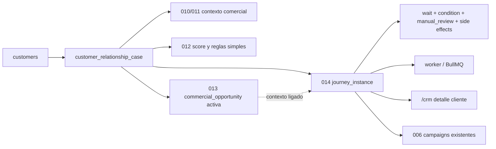

# 03.16 Arquitectura Canonica Brownfield Automatizacion Comercial Amplia

Fecha de corte: 2026-05-29.

## Objetivo

Fijar la frontera canonica de journeys comerciales multi-step sobre
`customer_relationship_case`, con binding estable a oportunidad activa cuando
aplique, templates cerrados, waits, pasos manuales y side effects seguros,
sin abrir inbox, builder libre ni chaining entre journeys.

## Fuentes consolidadas

- `docs/product/roles-and-permissions.md`
- `docs/product/roadmap.md`
- `docs/product/requirements-impact-plan-2026-03.md`
- `docs/architecture/modules.md`
- `docs/fase-3-arquitectura/03.12-crm-transversal-por-cliente.md`
- `docs/fase-3-arquitectura/03.13-pipeline-comercial-amplio.md`
- `docs/fase-3-arquitectura/03.14-scoring-y-automatizaciones-comerciales.md`
- `docs/fase-3-arquitectura/03.15-commercial-opportunities.md`
- `docs/fase-3-arquitectura/adr/ADR-012-customers-scoring-automation-boundary.md`
- `docs/fase-3-arquitectura/adr/ADR-013-customers-commercial-opportunity-boundary.md`
- `apps/admin/app/crm/page.tsx`
- `apps/admin/components/crm-workspace.tsx`
- `apps/api/src/modules/customers/customers.controller.ts`
- `apps/api/src/modules/customers/customers.service.ts`
- `apps/worker/src/main.ts`
- `packages/shared/src/types/api.ts`

## Estado Brownfield Actual

El runtime vigente ya soporta cliente canonico, caso comercial transversal,
pipeline amplio, score y automatizaciones simples, y deal puntual dentro de
`/crm`, pero todavia no canoniza una unidad explicita de journey multi-step
para coordinar esperas, hitos, campañas existentes y pasos manuales sin
abrir un workflow engine libre.

El hueco brownfield que este slice cierra es:

- orquestar secuencias comerciales multi-step sobre el mismo caso del
  cliente;
- permitir waits y reanudaciones diferidas sin perder ownership comercial;
- admitir pasos humanos bloqueantes dentro del mismo `/crm`;
- y conservar la frontera donde `customers` gobierna el caso, la oportunidad
  sigue subordinada, `marketing` gobierna templates y `worker` solo ejecuta
  timers y continuaciones.

## Decision Arquitectonica Del Slice

El slice se canoniza como una capa de journeys sobre el caso comercial ya
aprobado:

| Frontera | Papel canonico | No abarca | Superficies |
| --- | --- | --- | --- |
| `customers` | dominio ancla de `customer_relationship_case` y del binding de journey | builder libre, workflow engine generico | `apps/api` + `/crm` |
| `journey_template` | contrato cerrado del flujo | authoring libre por usuario final | marketing / backoffice |
| `journey_instance` | ejecucion concreta del template sobre un caso | orquestacion paralela libre o chaining | `/crm` + worker |
| `commercial_opportunity` | contexto ligado opcional del journey | agregado raiz del engine | `/crm` |
| `worker/BullMQ` | waits, timers y continuaciones diferidas | ownership del dominio comercial | `apps/worker` |
| `notifications/worker` | dispatch real de campañas existentes | lifecycle comercial del caso o del deal | `apps/worker` |

## Agregado Canonico Del Slice

El agregado principal del dominio comercial sigue siendo el caso del cliente,
pero ahora con una capa de ejecucion controlada:

| Componente | Regla canonica | Observacion brownfield |
| --- | --- | --- |
| `customer_relationship_case` | sigue siendo el ancla del engine | `014` no lo reemplaza |
| `journey_template` | define secuencia cerrada y elegibilidad | snapshot al instanciar |
| `journey_instance` | ejecuta un template sobre un caso | vive subordinada al caso |
| instancia no terminal | una sola por `template + case` | `paused` tambien ocupa unicidad |
| oportunidad activa | contexto ligado opcional | binding estable al deal original |
| `journeyAssignee` | responsable operativo de la instancia | heredado por defecto del caso |

## Invariantes Canonicos

1. `customers` sigue siendo el dominio ancla del slice.
2. `customer_relationship_case` sigue siendo el agregado comercial raiz.
3. `journey_instance` vive anclada al caso y no a la oportunidad como raiz.
4. solo puede existir una instancia no terminal por `template + case`.
5. el mismo caso puede tener varios journeys activos si son templates
   distintos.
6. cada instancia toma snapshot del template al arrancar.
7. el lifecycle de instancia usa `active`, `paused`, `completed` y
   `cancelled`.
8. el engine admite `wait`, `condition`, `create_followup_task`,
   `manual_review`, `suggest_priority`, `enqueue_existing_campaign` y
   `mark_journey_milestone`.
9. los pasos `manual_review` bloquean la continuacion del journey.
10. al resolverse un paso manual, la instancia reanuda automaticamente si no
    queda otra condicion pendiente.
11. el engine no puede disparar otro journey template.
12. el engine no muta automaticamente `pipelineStage`, `status` ni
    `opportunityStage`.
13. el engine no crea `commercial_opportunity` automaticamente.
14. la oportunidad ligada mantiene binding estable al deal original.
15. incompatibilidad fuerte cancela; incompatibilidad blanda pausa o desvia.
16. waits y timers viven en `worker/BullMQ`.
17. toda transicion y todo paso dejan traza en `/crm`.

## Boundary Entre Caso Padre, Journey Y Deal

### Caso comercial general

- sigue contando la relacion comercial global con el cliente
- conserva `status`, `pipelineStage`, `priority`, `scoreTier`, owner y
  assignee del caso
- sigue siendo la superficie principal del workbench

### Journey multi-step

- modela una secuencia cerrada sobre el caso
- tiene estado propio de ejecucion
- puede crear tareas, sugerir prioridad, marcar hitos y encolar campañas ya
  existentes
- puede requerir resolucion humana mediante `manual_review`

### Oportunidad activa ligada

- aporta contexto puntual de deal cuando el template lo requiere
- no sustituye el ancla del engine
- no recibe rebind silencioso a otro deal futuro

## Modelo De Estados Soportado Y Frontera Funcional Del Slice

### Estado de instancia

- `active`
- `paused`
- `completed`
- `cancelled`

### Templates canonicos

- `followup_recovery`
- `reactivation_nurture`
- `opportunity_progression`
- `post_loss_recovery`

### Tipos de paso

- `wait`
- `condition`
- `create_followup_task`
- `manual_review`
- `suggest_priority`
- `enqueue_existing_campaign`
- `mark_journey_milestone`

### Frontera funcional visible hoy

1. el detalle del cliente sigue siendo la superficie principal
2. la bandeja secundaria de journeys sigue dentro del mismo `/crm`
3. el worker procesa continuaciones diferidas
4. el slice no abre builder libre, chaining ni inbox comercial

## Riesgos Brownfield Y Controles

| Riesgo | Control canonico |
| --- | --- |
| duplicar journeys por template sobre el mismo caso | permitir solo una instancia no terminal por `template + case` |
| hacer que `paused` libere la unicidad | tratar `paused` como estado no terminal bloqueante |
| convertir el journey en builder libre | catalogo cerrado de templates y de tipos de paso |
| dejar que worker adquiera ownership comercial | limitarlo a waits, timers y continuaciones |
| rebindear una instancia a otro deal | binding estable a la oportunidad original |
| mutar pipeline o deal automaticamente | limitar acciones a side effects seguros |

## Resultado Esperado De Fase 3

Fase 3 deja fijada la frontera arquitectonica del journey comercial:

- `customers` y `/crm` quedan como dominio y superficie canonicos del slice
- el journey queda formalizado como capa de ejecucion sobre el caso padre
- la oportunidad ligada se conserva como contexto puntual, no como raiz
- `worker` y campañas existentes se reutilizan sin absorber ownership
