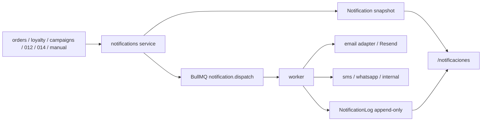

# 03.17 Arquitectura Canonica Brownfield Notifications Outbox Y Expansion De Canales

Fecha de corte: 2026-05-29.

## Objetivo

Fijar la frontera canonica de `notifications` como outbox saliente unificado
del brownfield, con `Notification` individual por `audience` y canal,
`NotificationLog` append-only, `worker` y adapters como frontera de delivery
real, y capacidad graduada por canal sin abrir inbox, inbound tecnico ni
consola humana de remediacion.

## Fuentes consolidadas

- `docs/product/roles-and-permissions.md`
- `docs/architecture/modules.md`
- `docs/flows/campaigns-and-notifications.md`
- `docs/fase-3-arquitectura/03.08-campaigns-marketing-automation.md`
- `docs/fase-3-arquitectura/03.14-scoring-y-automatizaciones-comerciales.md`
- `docs/fase-3-arquitectura/03.16-automatizacion-comercial-amplia.md`
- `docs/fase-3-arquitectura/adr/ADR-006-campaigns-dispatch-boundary.md`
- `docs/fase-3-arquitectura/adr/ADR-012-customers-scoring-automation-boundary.md`
- `docs/fase-3-arquitectura/adr/ADR-014-customers-commercial-journey-boundary.md`
- `apps/admin/app/notificaciones/page.tsx`
- `apps/admin/components/notifications-workspace.tsx`
- `apps/api/src/modules/notifications/notifications.controller.ts`
- `apps/api/src/modules/notifications/notifications.service.ts`
- `apps/worker/src/main.ts`
- `packages/shared/src/types/api.ts`
- `prisma/schema.prisma`

## Estado Brownfield Actual

El runtime vigente ya tiene una superficie visible de outbox en
`/notificaciones`, una API administrativa para listar, crear y leer logs, y
un `worker` con dispatch real visible para `email` via Resend. Tambien existen
canales `sms`, `whatsapp` e `internal` en contratos y UI, pero sin la misma
evidencia de provider y entrega que `email`.

El hueco brownfield que este slice cierra es:

- consolidar `notifications` como outbox saliente comun de flujos manuales,
  transaccionales, campaigns y journeys;
- separar con claridad snapshot funcional del mensaje y evidencia tecnica del
  dispatch;
- fijar la frontera entre productores aguas arriba, modulo `notifications`,
  `worker` y adapters por canal;
- y evitar que el outbox se deforme hacia inbox, replies o inbound tecnico.

Tambien hay una tension estructural visible: el schema Prisma historico de
`Notification` y `NotificationLog` no coincide por completo con el contrato
funcional vigente expuesto por `notifications.service` y `packages/shared`.
Para este corte, manda el canon funcional brownfield visible del runtime.

## Decision Arquitectonica Del Slice

El slice se canoniza como frontera tecnica de dispatch saliente dentro del
monorepo:

| Frontera | Papel canonico | No abarca | Superficies |
| --- | --- | --- | --- |
| productores aguas arriba | declaran la intencion de comunicar | delivery real y estado tecnico del envio | `orders`, `loyalty`, `campaigns`, `012`, `014` |
| `notifications` | materializa `Notification`, registra estado funcional y encola | inbox, conversacion, soporte manual | `apps/api` + `/notificaciones` |
| `NotificationLog` | evidencia tecnica append-only | edicion correctiva de eventos previos | API + lectura secundaria en `/notificaciones` |
| `worker/BullMQ` | ejecuta dispatch y continuaciones tecnicas | ownership del dominio comercial | `apps/worker` |
| adapters/provider | resuelven la entrega real por canal | contrato funcional del outbox | Resend hoy, otros canales progresivos |

## Agregado Canonico Del Slice

El agregado principal del slice es `Notification`.

| Componente | Regla canonica | Observacion brownfield |
| --- | --- | --- |
| `Notification` | unidad individual por destinatario/canal | no existe `batch` ni `envelope` superior |
| snapshot funcional | congela `channel`, `audience`, `subject`, `body`, `source`, `relatedType`, `relatedId`, `scheduledAt` | el destino ya va resuelto y textual |
| inmutabilidad | una unidad creada no se edita | corregir requiere crear otra |
| `NotificationLog` | timeline tecnico append-only | resume eventos tecnicos y funcionales relacionados |
| lifecycle | `pending`, `sent`, `delivered`, `failed` | `delivered` depende de capacidad real del canal |
| `scheduledAt` | metadata visible | no scheduler fuerte en este corte |

## Invariantes Canonicos

1. `notifications` sigue siendo el dominio ancla del outbox saliente.
2. `Notification` sigue siendo el agregado principal del slice.
3. una `Notification` representa una sola unidad por `audience` y canal.
4. el snapshot funcional del mensaje se materializa al dispararse.
5. `source` es obligatorio.
6. `relatedType` y `relatedId` se conservan cuando el flujo ya los resuelve,
   aunque hoy no operen como hard gate universal de UI o API manual.
7. `NotificationLog` es append-only y concentra la evidencia tecnica.
8. `notifications` registra, persiste y encola.
9. `worker` ejecuta el dispatch real.
10. `worker` reintenta sobre la misma unidad; no crea otra notificacion por
    intento tecnico.
11. `email` concentra hoy la evidencia fuerte de provider real.
12. `sms`, `whatsapp` e `internal` siguen dentro del canon con capacidad
    graduada.
13. `scheduledAt` no introduce scheduler real.
14. el slice no abre inbox, replies ni inbound tecnico.

## Boundary Entre Productores, Outbox, Worker Y Provider

### Productores aguas arriba

- definen la intencion del mensaje
- pueden aportar `source` y relacion de negocio
- no deben asumir ownership del delivery tecnico

### Outbox `notifications`

- crea la unidad funcional
- deja el snapshot congelado
- registra auditoria y dominio observable
- encola trabajo en `BullMQ`
- expone lectura administrativa en `/notificaciones`

### `worker/BullMQ`

- consume `notification.dispatch`
- busca la unidad fresca por `notificationId`
- ejecuta provider real cuando aplica
- marca `sent` o `failed`
- agrega detalle tecnico en logs y salida estructurada

### Provider/adapters

- `email` usa Resend cuando existe `RESEND_API_KEY`
- sin credencial, el worker registra `skipped/failed` segun el caso y deja
  evidencia
- `sms`, `whatsapp` e `internal` quedan como superficie contractual del canon
  y capacidad progresiva de adapter

## Persistencia Brownfield Y Canon Funcional

### Contrato funcional visible

- `NotificationSummary` y `NotificationInput` en `packages/shared`
- `notifications.service` como fachada principal del agregado
- persistencia/restauracion via `ModuleStateService`
- lectura administrativa desde `AdminNotificationsController`

### Persistencia historica del schema

- `prisma/schema.prisma` conserva una forma mas antigua basada en
  `recipientType`, `recipientId`, `payloadJson` y relacion opcional a
  `Template`
- esa forma no describe por si sola el contrato brownfield visible actual
- para el canon `015`, la verdad funcional la marca el servicio y la UI
  administrativa, no el schema legacy aislado

## Modelo De Estados Soportado Y Frontera Funcional Del Slice

### Estados funcionales

- `pending`
- `sent`
- `delivered`
- `failed`

### Canales canonicos

- `email`
- `sms`
- `whatsapp`
- `internal`

### Frontera funcional visible hoy

1. `/notificaciones` sigue siendo la superficie principal.
2. la UI permite alta manual y lectura de outbox + logs.
3. no existe consola manual de retry, resend o cancelacion.
4. no existe inbox ni conversacion por cliente.
5. no existe scheduler real diferido a partir de `scheduledAt`.

## Riesgos Brownfield Y Controles

| Riesgo | Control canonico |
| --- | --- |
| mezclar outbox con inbox | mantener `015` estrictamente outbound |
| confundir snapshot funcional con log tecnico | separar `Notification` de `NotificationLog` |
| asumir paridad total entre canales | fijar `email` como delivery fuerte y otros como graduados |
| leer Prisma legacy como verdad funcional unica | hacer prevalecer el contrato visible del servicio y la UI |
| duplicar ownership entre productor y worker | dejar a `notifications` como registro y a `worker` como delivery |
| interpretar `scheduledAt` como scheduler real | tratarlo solo como metadata visible |

## Resultado Esperado De Fase 3

Fase 3 deja fijada la frontera arquitectonica del outbox saliente:

- `notifications` queda formalizado como outbox tecnico-funcional comun
- `worker` queda como ejecutor de delivery y no como owner del mensaje
- la evidencia tecnica append-only queda separada del snapshot funcional
- el canon preserva la salida multicanal sin prometer inbox, inbound ni
  scheduler real
