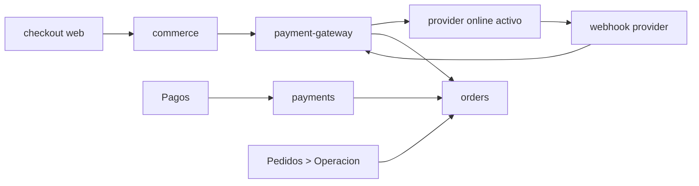

# ADR-001: Payment Provider Gateway Boundary

Fecha: 2026-05-26.

## Estado

Aprobado para la fase 3 canonica brownfield.

## Contexto

El repo ya soporta dos rutas de pago reales:

- `manual`, con comprobante y revision humana;
- `openpay`, con checkout online y conciliacion operativa posterior.

Hoy la logica online vive repartida entre `commerce.service.ts`, `orders.service.ts` y la UI de `Pedidos > Operacion`. La logica manual vive en `payments.service.ts`, `payments-workspace.tsx` y los jobs BullMQ de revision manual.

La mezcla actual deja tres tensiones:

1. el provider online esta hardcodeado a Openpay;
2. la idempotencia externa no tiene write model propio para eventos del proveedor;
3. el ownership entre `payments` y `orders` puede volver a mezclarse si la integracion online sigue creciendo dentro de los mismos archivos.

## Decision

Se introduce una frontera canonica `payment-gateway` dentro de `huelegood-api`.

### Responsabilidades de `payment-gateway`

- resolver el provider online activo;
- crear sesiones o intentos de cobro;
- firmar requests y validar webhooks;
- normalizar estados externos a un vocabulario interno estable;
- persistir intentos y eventos para idempotencia externa;
- emitir un comando interno hacia `orders` solo cuando corresponda.

### Responsabilidades que NO toma

- no revisa comprobantes manuales;
- no es la vista operativa del pedido;
- no decide reglas comerciales del pedido;
- no confirma inventario por cuenta propia;
- no expone secretos al frontend.

## Guardrails Derivados

1. Solo puede existir un provider online activo a la vez.
2. `manual payment` sigue visible hoy en `/checkout`.
3. `payments` mantiene ownership exclusivo de comprobantes manuales y bandeja `Pagos`.
4. `Pedidos > Operacion` mantiene ownership de trazabilidad comercial del pedido y de la conciliacion online operativa.
5. La confirmacion automatica futura solo corre para estados normalizados `captured` o `paid`.
6. Estados intermedios como `authorized` no cierran la venta.

## Diagrama De La Decision

## Alternativas Rechazadas

### 1. Mantener toda la logica online dentro de `orders`

Rechazada porque:

- sigue acoplando pedido y proveedor;
- hace mas dificil rotar el provider activo;
- no cierra bien la idempotencia externa.

### 2. Expandir `payments` para que tambien sea duenio de Openpay

Rechazada porque:

- mezcla comprobante manual y gateway online en un solo modulo;
- empuja la trazabilidad del pedido hacia `Pagos`, contradiciendo el canon actual;
- aumenta el riesgo de confirmar online desde la superficie equivocada.

### 3. Confirmar automaticamente desde cualquier estado exitoso del proveedor

Rechazada porque:

- `authorized` no garantiza captura/liquidacion final;
- puede confirmar stock y venta antes de tiempo;
- complica reversas y soporte.

### 4. Multi-provider simultaneo

Rechazada en este corte porque:

- sube costo de UI, soporte y QA;
- no existe requerimiento operativo vigente que lo justifique;
- distrae del objetivo real, que es formalizar una sola frontera online segura.

## Consecuencias

### Positivas

- el provider online deja de ser conocimiento transversal;
- la operacion manual y la online quedan separadas sin perder trazabilidad;
- la automatizacion futura por webhook se puede activar de forma controlada;
- se vuelve viable rotar Openpay por otro proveedor con menos impacto en `orders`.

### Negativas aceptadas

- requiere tablas o snapshots nuevos para intentos y eventos del gateway;
- introduce una capa mas dentro de la API;
- obliga a refactorizar parte del conocimiento de Openpay hoy embebido en `commerce` y `orders`.

## Consecuencias Operativas

- `Pagos` sigue mostrando comprobantes manuales y no debe exponer boton de confirmacion online.
- `Pedidos > Operacion` sigue mostrando la ruta activa del pedido (`manual_request`, `manual_direct`, `openpay_backoffice`, `openpay_provider` o equivalente).
- el worker no confirma ventas online por si solo; solo reintenta o procesa jobs canonicos emitidos por modulos duenios.

## Reglas De Reevaluacion

Esta ADR solo debe reevaluarse si ocurre una de estas condiciones:

- el negocio exige mas de un provider online activo al mismo tiempo;
- el volumen operativo demuestra que la frontera interna ya no basta;
- el sistema requiere separar pagos en un servicio por aislamiento regulatorio o de escalado real.
