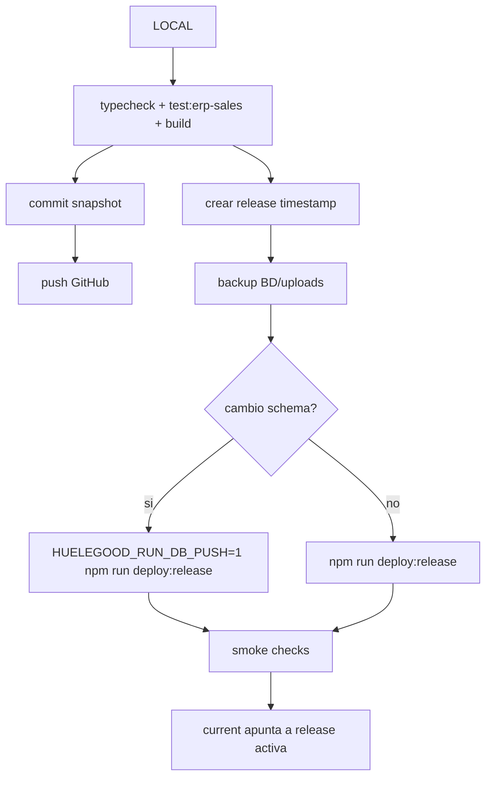

# Despliegue Y Homologacion

Fecha de corte: 2026-04-22.

Este documento define como mantener produccion igual al codigo local sin tocar la base de datos productiva.

## Regla Principal

LOCAL es la fuente de verdad del codigo. Produccion conserva su propia base de datos.

Homologar significa:

1. validar codigo local;
2. registrar snapshot en Git;
3. publicar release en VPS;
4. mantener `/home/huelehuele/apps/huelegood.com/shared/.env.production`;
5. no restaurar ni reemplazar PostgreSQL productivo con datos locales.

## Topologia Productiva

| Dominio | Proceso | Puerto |
| --- | --- | --- |
| `https://huelegood.com` | `huelegood-web` | `3000` |
| `https://admin.huelegood.com` | `huelegood-admin` | `3005` |
| `https://api.huelegood.com` | `huelegood-api` | `4000` |
| sin dominio publico | `huelegood-worker` | no aplica |

Infra:

- VPS: `192.99.43.76`.
- Runtime: Hestia + Nginx + PM2.
- Codigo: `/home/huelehuele/apps/huelegood.com/releases/<timestamp>`.
- Symlink activo: `/home/huelehuele/apps/huelegood.com/current`.
- Entorno productivo: `/home/huelehuele/apps/huelegood.com/shared/.env.production`.
- BD productiva: PostgreSQL local del VPS.

## Flujo De Release Seguro



## Comandos Locales De Validacion

```bash
npm run typecheck
npm run test:erp-sales
npm run build
```

## Scripts Productivos

- `scripts/release-production.sh`: instala dependencias, genera Prisma, construye apps, recarga PM2 y corre smoke checks.
- `scripts/backup-production.sh`: genera dump PostgreSQL y archiva uploads.
- `scripts/smoke-check.mjs`: valida web, admin y API.

## Base De Datos

Reglas:

- No copiar la BD local a produccion.
- No correr `prisma:seed` en produccion.
- Antes de cambios de schema, hacer backup.
- `prisma:push` productivo solo debe correr con `HUELEGOOD_RUN_DB_PUSH=1` y durante ventana controlada.
- Redis no se respalda como fuente de verdad.

## Variables De Entorno

Nunca versionar:

- `.env`
- `.env.local`
- `.env.production`
- dumps SQL
- backups
- evidencias de pago
- `outputs/`
- `storage/`

Variables minimas productivas:

- `DATABASE_URL`
- `REDIS_URL`
- `JWT_SECRET`
- `SESSION_SECRET`
- `NEXT_PUBLIC_APP_URL`
- `NEXT_PUBLIC_ADMIN_URL`
- `NEXT_PUBLIC_API_URL`
- `WEB_PORT`
- `ADMIN_PORT`
- `API_PORT`
- `OPENPAY_*`
- `APIPERU_*`
- `RESEND_*`
- `R2_*` si media publica usa Cloudflare R2.

## Smoke Checks

Publicos:

- `https://huelegood.com/health`
- `https://admin.huelegood.com/health`
- `https://api.huelegood.com/api/v1/health/liveness`
- `https://api.huelegood.com/api/v1/health/readiness`
- `https://api.huelegood.com/api/v1/health/operational`

Locales en VPS:

- `http://127.0.0.1:3000/health`
- `http://127.0.0.1:3005/health`
- `http://127.0.0.1:4000/api/v1/health/liveness`

## Rollback

Rollback de codigo:

1. apuntar `current` a la release anterior;
2. recargar PM2 con `--update-env`;
3. correr smoke checks.

Rollback de datos:

- solo con backup productivo;
- requiere decision explicita;
- no usar datos locales como rollback.

## Checklist De Homologacion Git

- excluir `outputs/`, `storage/`, `.env`, backups y builds.
- commitear snapshot local vigente.
- empujar a GitHub en rama trazable.
- si se decide que ese snapshot reemplaza `origin/main`, hacer merge/PR o fast-forward controlado; evitar force push sin ventana y confirmacion.
